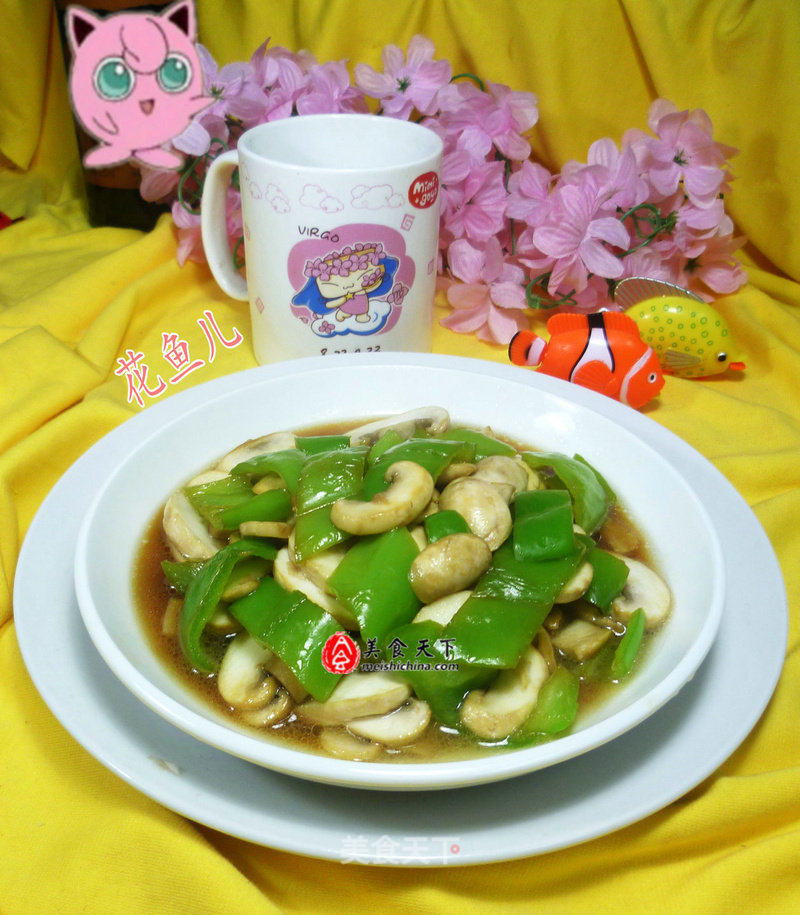

# 青椒炒蘑菇

## 📋 基本資訊 / Recipe Overview
- **料理名稱**：青椒炒蘑菇
- **原始標題**：青椒炒蘑菇
- **素食流派 / Diet**：全素 Vegan
- **料理分類 / Category**：家常蔬食 / 经典热菜
- **來源平台 / Source**：[美食天下 · 精華素食專區](https://home.meishichina.com/recipe-201631.html)

## 🌿 食材及佐料清單 / Ingredients
- 青椒 100克 (主料)
- 蘑菇 185克 (主料)
- 生抽 适量 (辅料)
- 盐 适量 (辅料)

## 🍳 烹飪步驟 / Step-by-Step Cooking Steps
1. 食材：青椒（已清洗）、蘑菇（已清洗）
2. 将已清洗好的青椒放在案板上切开，待用。
3. 将已清洗好的蘑菇放在案板上切开，待用。
4. 烧锅倒油烧热，下入切好的青椒翻炒一下。
5. 接着，合入切好的蘑菇翻炒翻炒至熟。
6. 然后，加适量的生抽。
7. 加适量的盐。
8. 调味炒匀，即可。
9. 出锅装盘。

---
*食譜歸檔時間：2026-08-20 · 來源：美食天下 (home.meishichina.com)*