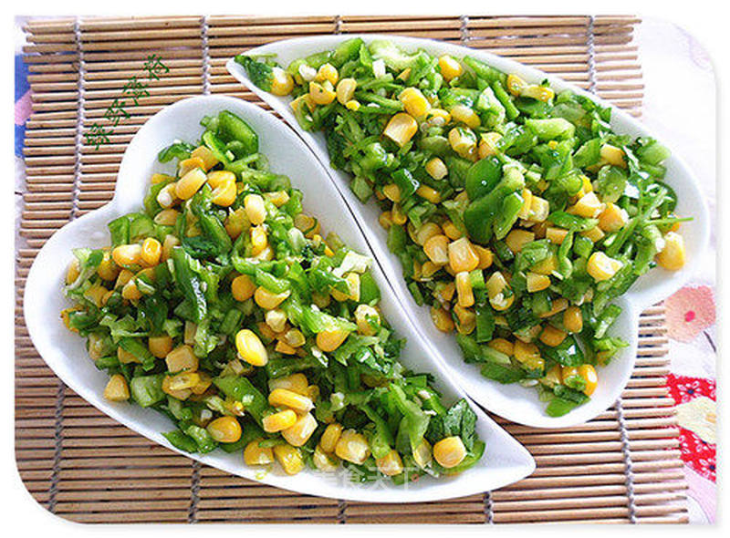

# 青椒甜玉米

## 📋 基本資訊 / Recipe Overview
- **料理名稱**：青椒甜玉米
- **原始標題**：青椒甜玉米
- **素食流派 / Diet**：全素 Vegan
- **料理分類 / Category**：家常蔬食 / 经典热菜
- **來源平台 / Source**：[美食天下 · 精華素食專區](https://home.meishichina.com/recipe-189650.html)

## 🌿 食材及佐料清單 / Ingredients
- 青椒 适量 (主料)
- 水果甜玉米 适量 (主料)
- 香菜 适量 (主料)
- 盐 适量 (辅料)
- 味精 适量 (辅料)
- 香油 适量 (辅料)

## 🍳 烹飪步驟 / Step-by-Step Cooking Steps
1. 主要原料
2. 将青椒洗净切碎丁。香菜切末。
3. 甜玉米焯水备用。
4. 焯好水的甜玉米放冷水里过凉。
5. 将青椒，甜玉米和香菜放盆里，加入盐味精，香油。
6. 所有原料拌匀即可。
7. 青椒甜玉米。

---
*食譜歸檔時間：2026-08-20 · 來源：美食天下 (home.meishichina.com)*