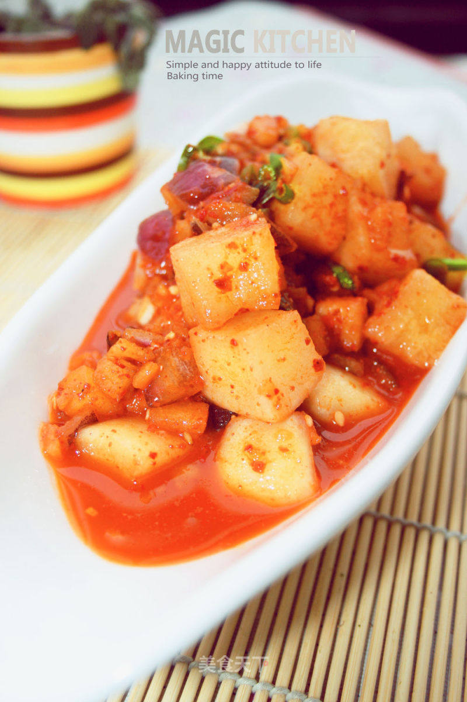

# 韩式辣萝卜块

## 📋 基本資訊 / Recipe Overview
- **料理名稱**：韩式辣萝卜块
- **原始標題**：【韩国电视剧里那爽口香脆的口感】韩式辣萝卜块
- **素食流派 / Diet**：全素 Vegan
- **料理分類 / Category**：家常蔬食 / 经典热菜
- **來源平台 / Source**：[美食天下 · 精華素食專區](https://home.meishichina.com/recipe-58868.html)

## 🌿 食材及佐料清單 / Ingredients
- 白萝卜 2个 (主料)
- 苹果 1个 (主料)
- 梨 1个 (主料)
- 洋葱 1个 (主料)
- 葱姜蒜 适中 (辅料)
- 粗辣椒末 一元的 (辅料)
- 细辣椒末 一元的 (辅料)
- 鱼露 30g (辅料)
- 糯米糊 适中 (辅料)
- 海米 一大把 (辅料)
- 白芝麻 一把 (辅料)
- 咸盐 3勺 (配料)
- 鸡精 2勺 (配料)
- 香油 1小勺 (配料)
- 细砂糖 4勺 (配料)

## 🍳 烹飪步驟 / Step-by-Step Cooking Steps
1. 准备好材料，白萝卜，梨，苹果，洋葱，糯米粉
2. 把白萝卜切块，这个块的大小适中，容易入口就好，切好的白萝卜块用咸盐腌制，注意要把每颗白萝卜都沾上咸盐。所以要把咸盐洒在白萝卜上，均匀翻制
3. 撒上咸盐得得白萝卜块上，放上保鲜膜，用重物压着。压2~3小时。让白萝卜里的水分腌出
4. 两三小时以后的白萝卜会腌制出很多水分，把水分倒掉。
5. 用清水洗两遍，再拿一个篦子控水。这样做是为了去除腥味，也可以使萝卜有淡淡的咸味，放入通风的地方，半小时，放白萝卜表面的水分风干些。
6. 在腌制萝卜的时候，可以准备其他的材料，苹果，梨要削皮，切成很小的丁，洋葱切丁。蒜姜切末。葱叶切细丝，葱身切末，海米泡好。
7. 糯米粉用凉水冲开。这样做糯米粉不容易起块。
8. 倒入锅中，煮成糯米糊，要不断均匀搅拌，要不容易糊锅。
9. 粗细两种辣椒末放在大碗里。加入鱼露。海米泡好切成末放入，再倒入少许的香油，让味道更香。
10. 放入洋葱，葱姜蒜末搅拌均匀。
11. 再放入苹果梨的小丁，加上1勺咸盐，两勺鸡精，四勺白砂糖。
12. 搅拌均匀。
13. 最后放入的是糯米糊。
14. 最后加入熟的白芝麻一起搅拌均匀。
15. 重新拿一个新的大的容器，其实最好的是腌菜的罐子，因为我家里没有，所以我拿了一个盆。里面干燥，不要有油，也不能有水，放入腌好的白萝卜。
16. 均匀搅拌。
17. 那保鲜膜封好，放置腌制一天味道很浓，要是夏天，你放在冰箱里，可以使他爽口。
18. 这样就做好了看看是不是和韩剧里一样呢？吃一口口感爽脆，真的是先天的一道美味。

---
*食譜歸檔時間：2026-08-20 · 來源：美食天下 (home.meishichina.com)*