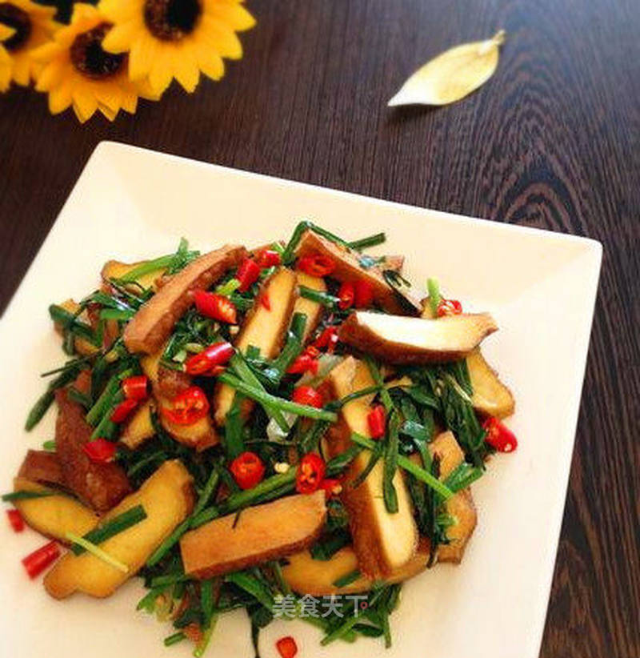

# 香干炒韭菜

## 📋 基本資訊 / Recipe Overview
- **料理名稱**：香干炒韭菜
- **原始標題**：香干炒韭菜
- **素食流派 / Diet**：全素 Vegan
- **料理分類 / Category**：家常蔬食 / 经典热菜
- **來源平台 / Source**：[美食天下 · 精華素食專區](https://home.meishichina.com/recipe-232571.html)

## 🌿 食材及佐料清單 / Ingredients
- 香干 150g (主料)
- 韭菜 100g (主料)
- 油 适量 (辅料)
- 盐 适量 (辅料)
- 素易鲜 适量 (辅料)
- 大葱 适量 (辅料)
- 姜 适量 (辅料)

## 🍳 烹飪步驟 / Step-by-Step Cooking Steps
1. 炒这道菜调料只有两种：盐和素易鲜。（素易鲜相当于鸡粉，但是专门炒素菜用的，味道很不错）
2. 韭菜洗净控干水分。香干洗净切丝备用。
3. 韭菜切段。
4. 大葱切成葱花、姜切末。
5. 热锅热油，放入切好的香干丝煸炒。
6. 炒至香干丝上焦，放入姜末和葱花炝锅。
7. 抢出香味，放入韭菜段煸炒。
8. 炒至韭菜变软关火。放入盐和素易鲜。
9. 拌匀，装盘即可。
10. 特别的简单，适合夏天的快手菜。

---
*食譜歸檔時間：2026-08-20 · 來源：美食天下 (home.meishichina.com)*