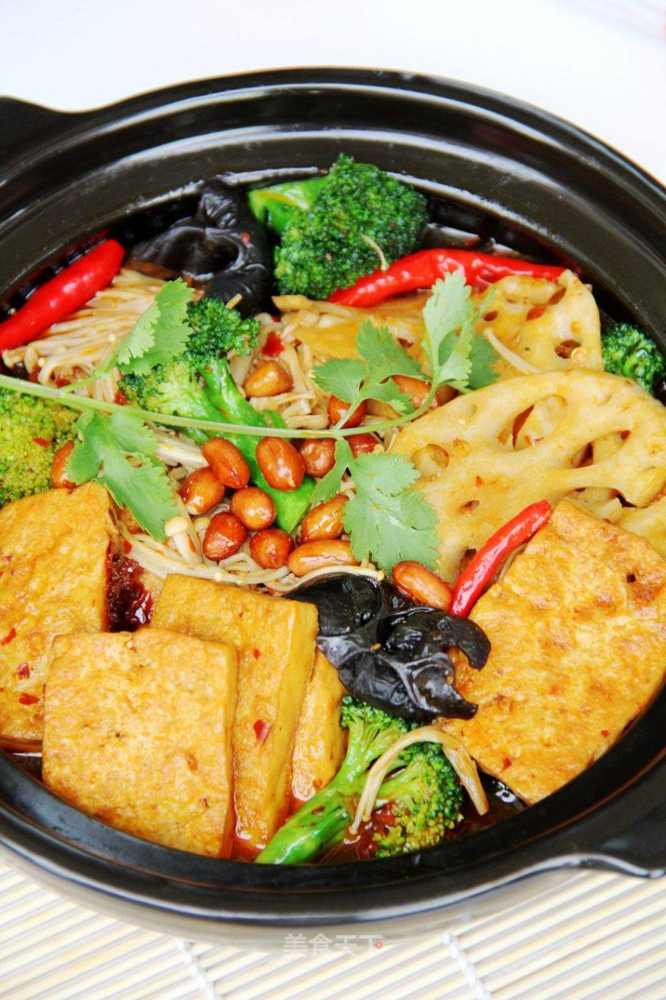

# 香辣砂锅豆腐

## 📋 基本資訊 / Recipe Overview
- **料理名稱**：香辣砂锅豆腐
- **原始標題**：香辣砂锅豆腐
- **素食流派 / Diet**：全素 Vegan
- **料理分類 / Category**：家常蔬食 / 经典热菜
- **來源平台 / Source**：[美食天下 · 精華素食專區](https://home.meishichina.com/recipe-94188.html)

## 🌿 食材及佐料清單 / Ingredients
- 豆腐 适量 (主料)
- 西兰花 适量 (辅料)
- 木耳 适量 (辅料)
- 金针菇 适量 (辅料)
- 莲藕 适量 (辅料)
- 火锅底料 适量 (配料)
- 食用油 适量 (配料)
- 盐 适量 (配料)
- 美极鲜 适量 (配料)
- 花生 适量 (配料)
- 香菜 适量 (配料)
- 辣椒 适量 (配料)

## 🍳 烹飪步驟 / Step-by-Step Cooking Steps
1. 准备好材料
2. 豆腐切块,不粘锅中放少量油,把豆腐煎至两面金黄
3. 炒锅烧热,放入火锅底料炒出香味
4. 把煎好的豆腐一起炒匀
5. 加入红辣椒、适量水,盐、美极鲜煮沸，转入砂锅慢炖10分钟
6. 在炖豆腐的同时，炒锅烧开水，放莲藕、西兰花、木耳焯熟后捞出
7. 放入金针锅焯熟后捞出
8. 把焯熟的莲藕、西兰花、木耳、金针锅放入砂锅中，拌匀后盖上盖焖5分钟后，放上炒好的花生，用香菜装饰即可

---
*食譜歸檔時間：2026-08-20 · 來源：美食天下 (home.meishichina.com)*