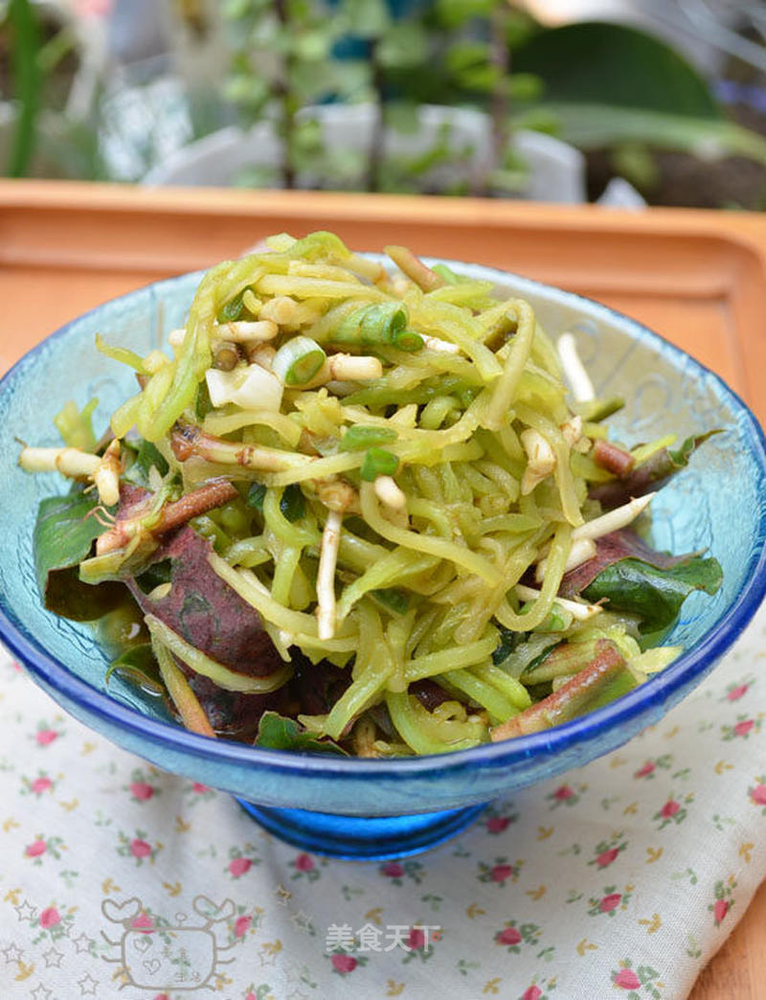

# 鱼腥草拌青笋

## 📋 基本資訊 / Recipe Overview
- **料理名稱**：鱼腥草拌青笋
- **原始標題**：鱼腥草拌青笋
- **素食流派 / Diet**：全素 Vegan
- **料理分類 / Category**：家常蔬食 / 经典热菜
- **來源平台 / Source**：[美食天下 · 精華素食專區](https://home.meishichina.com/recipe-125488.html)

## 🌿 食材及佐料清單 / Ingredients
- 鱼腥草 适量 (主料)
- 青笋 适量 (主料)
- 小葱 适量 (辅料)
- 盐 适量 (配料)
- 糖 适量 (配料)
- 生抽 适量 (配料)
- 辣椒油 适量 (配料)
- 香油 适量 (配料)
- 醋 适量 (配料)

## 🍳 烹飪步驟 / Step-by-Step Cooking Steps
1. 材料图，笋去皮，鱼腥草择洗干净。
2. 将鱼腥草折成小段，笋刨成丝，小葱切碎，加盐和糖。
3. 取一小碗，加生抽、醋、 辣椒油和香油调成汁。
4. 将味汁浇在准备好的菜上。
5. 拌均匀即可。
6. 稍腌后，鱼腥草叶子会变软，吃起来比较舒服。

---
*食譜歸檔時間：2026-08-20 · 來源：美食天下 (home.meishichina.com)*