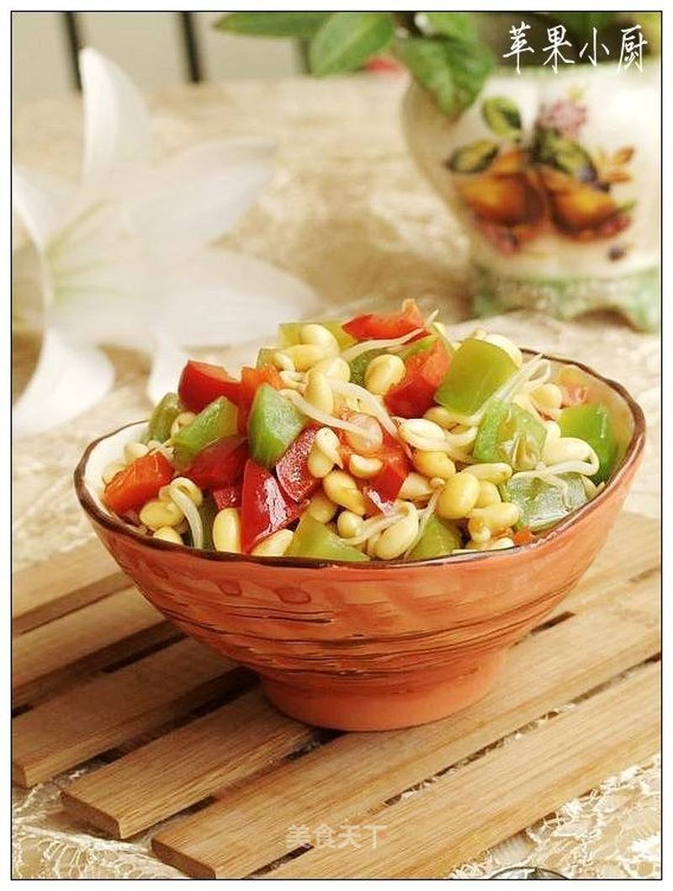

# 黄豆芽拌莴笋丁

## 📋 基本資訊 / Recipe Overview
- **料理名稱**：黄豆芽拌莴笋丁
- **原始標題**：黄豆芽拌莴笋丁
- **素食流派 / Diet**：全素 Vegan
- **料理分類 / Category**：家常蔬食 / 经典热菜
- **來源平台 / Source**：[美食天下 · 精華素食專區](https://home.meishichina.com/recipe-104968.html)

## 🌿 食材及佐料清單 / Ingredients
- 黄豆芽 适量 (主料)
- 莴笋 适量 (主料)
- 红椒 适量 (辅料)
- 酱油 适量 (配料)
- 芝麻油 适量 (配料)
- 盐 适量 (配料)
- 红油 适量 (配料)
- 醋 适量 (配料)

## 🍳 烹飪步驟 / Step-by-Step Cooking Steps
1. 黄豆芽加少许盐焯水煮熟煮透。
2. 莴笋去皮备用。
3. 切成小方丁。
4. 加入沸水中略焯。（我用的是焯过黄豆的水）
5. 捞出过凉。
6. 红甜椒切成小丁。
7. 加入红油。
8. 加入适量盐。
9. 少许淡色酱油。
10. 加入少许醋。
11. 少许芝麻油。
12. 拌匀即可。

---
*食譜歸檔時間：2026-08-20 · 來源：美食天下 (home.meishichina.com)*