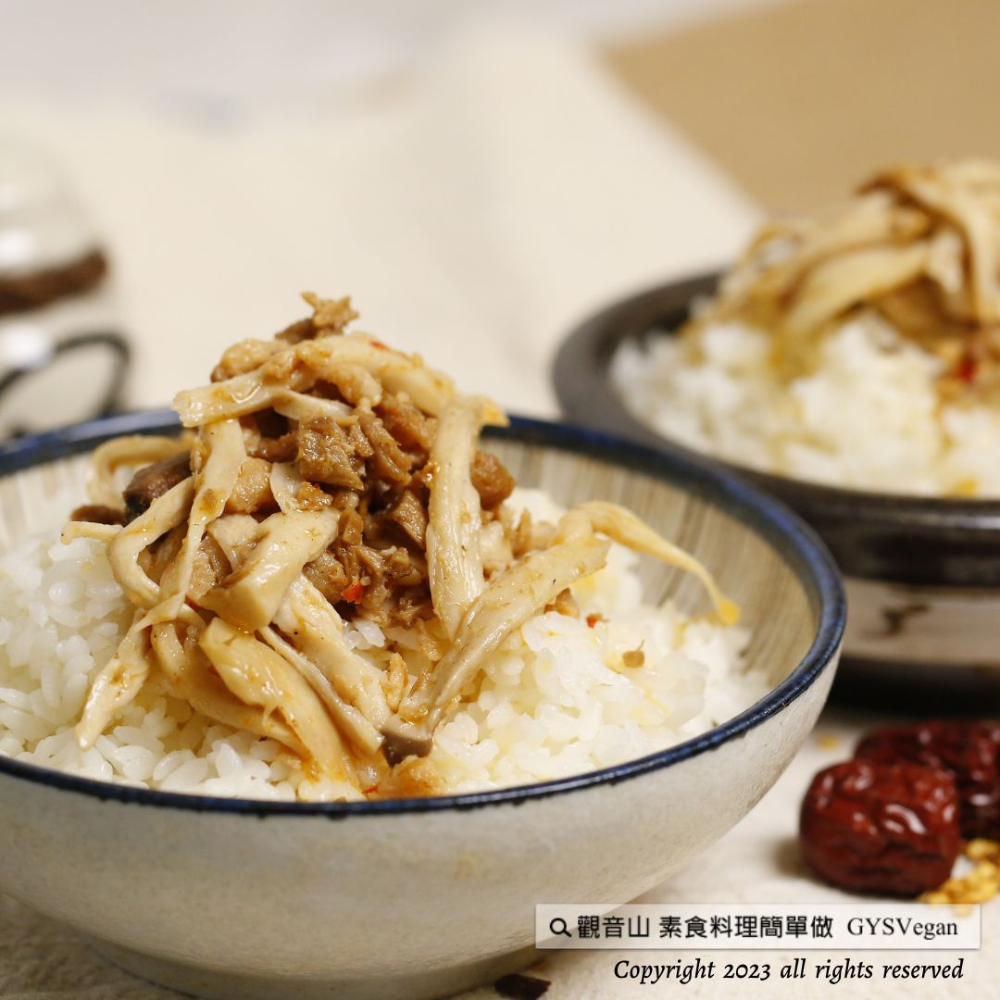

# XO醬G絲飯

## 📋 基本資訊 / Recipe Overview
- **料理名稱**：XO醬G絲飯
- **原始標題**：地方特色美食｜XO醬G絲飯｜全素
- **素食流派 / Diet**：全素 Vegan
- **來源平台 / Source**：[觀音山 · 素食料理簡單做](https://vegan.gys.org.tw/g-silk-rice20230414/)

## 📖 食譜圖文詳情 (中英雙語對照)

地方特色美食 ✨XO醬G絲飯✨全素
古早味小吃-XO醬G絲飯，蒸出手撕杏鮑菇的Q彈口感，搭配主廚特製醬料，健康、簡單又下飯的料理，想要學習蔬食版XO醬的調製嗎？快跟著觀音山主廚，一起素食料理簡單做吧
​
◎食材及佐料〔Ingredients〕：(5人份)
▪️杏鮑菇 ​ 300克
▪️金針菇 ​ 200克
▪️素火腿 ​ 50克 ​ ​ ​
▪️乾香菇 ​ 5朵
▪️薑末 ​ 30克
▪️沙拉油、素沙茶醬、鹽、糖、胡椒粉、素蠔油 ​ 適量
​ ​
​
◎烹飪步驟：
【刀工/前處理】
1.杏鮑菇洗淨，剝成粗絲，加入少許鹽、胡椒粉、素蠔油，用電鍋蒸熟備用。
2.金針菇洗淨去蒂頭，切1公分段備用。
3.素火腿切丁備用。
4.乾香菇泡水軟化，瀝乾水份後切絲備用。
​
【調理作法】
1.素XO醬簡易作法:炒鍋放入油加熱，放入乾香菇、素火腿、薑末炒香，加入調味料:素沙茶、素蠔油、糖、鹽、胡椒粉略炒。加入蒸好的杏鮑菇水，小火略煮5分鐘即可。
2.蒸好的杏鮑菇絲，加入XO醬拌勻。
3.盛裝一碗飯，擺上作法2，即可享用!
​
本食譜提供：台中觀音山蔬食館
​
​ ​
▌慈悲的龍德上師 成立「觀音山蔬食館」提倡健康素食、慈悲護生，以”觀音山素食料理簡單做”的理念，提供多款素食食譜，讓您一學就會！
​
觀音山相關連結
➠
https://www.fazang.org/link/
​ ​
▌觀音山近期活動
5月27日 釋迦牟尼佛‧如珍寶加持總集薈供法會
✦登記「除障祿位 / 超薦蓮位」
https://bit.ly/3HXmCO7
✦護持「薈供供品」供養三寶
https://bit.ly/3bHzJ8H
​ ​
​ ​
—
♛歡迎轉載，請註明出處： 觀音山素食料理簡單做 GYSVegan 素食環保愛地球，健康營養無負擔，慈悲護生一起來~

---
*食譜歸檔時間：2026-08-20 · 來源：觀音山素食料理簡單做 (vegan.gys.org.tw)*