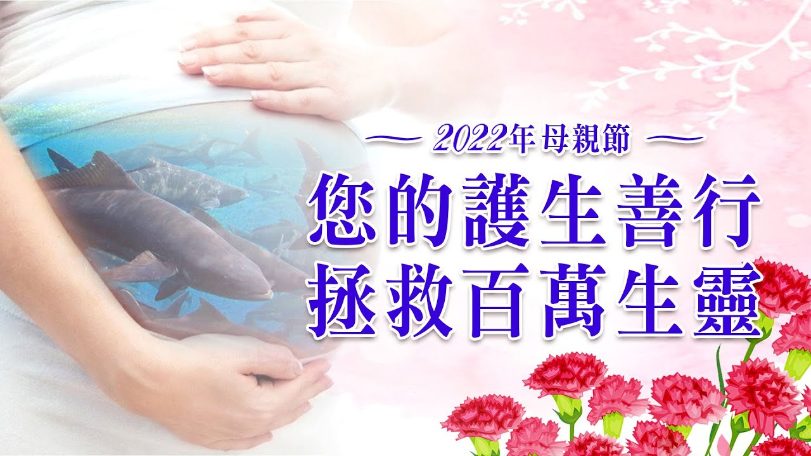

# _溫馨母親節 2022母親節 搶救懷孕的海鱺媽媽 系列活動

## 📋 基本資訊 / Recipe Overview
- **料理名稱**：_溫馨母親節 2022母親節 搶救懷孕的海鱺媽媽 系列活動
- **原始標題**：【?溫馨母親節】2022母親節 搶救懷孕的海鱺媽媽 系列活動
- **素食流派 / Diet**：全素 Vegan
- **來源平台 / Source**：[觀音山 · 素食料理簡單做](https://vegan.gys.org.tw/mothers-day20220329/)

## 📖 食譜圖文詳情 (中英雙語對照)

【?溫馨母親節】2022母親節 搶救懷孕的海鱺媽媽 系列活動​
▸
https://www.fazang.org/liferelease/​
搶救一隻懷孕的海鱺媽媽，約百萬隻小海鱺因您而得救！​
​
​
慈悲 龍德上師開示：「搶救海鱺媽媽的保育放流活動，就是要表達對大自然，絕對的友善絕對的敬畏，發揮我們佛教徒平等大愛的精神，希望能夠孕育海洋生生不息。」每年四、五月為海鱺的繁殖季節，每隻成年的海鱺約有300萬顆的魚卵，可孕育相當多的新生命，但不幸的是海鱺為饕客的最愛，過度捕撈及海洋生態遭到破壞。​
​
​
母親節將至，邀請大家一起來搶救海鱺媽媽腹裡的生命，長養慈悲心，令社會暴戾消弭、祥和增長、疫情退散。​
​
​
無論您是…​
1. 2022母親節最佳獻禮～給予媽媽最貼心的祝福​
2. 想要懷孕的媽媽​
3. 曾經流產的媽媽​
4. 迴向一切如母有情​
5. 懺悔累劫殺業​
6. 久病未癒、重病之人​
7. 尊重生命、愛護動物​
8. 祈福迴向疫情消弭​
9. 想要招感長壽健康​
​
您的護生善行，拯救萬千生靈，功德無量！​
​
​
?溫馨五月─愛護海洋‧保育放流活動​
加入「搶救懷孕的海鱺媽媽」▸
https://bit.ly/3ucvUMa​
​
今年施放的種類包含海鱺、魚苗…等急需救助的生靈，將舉辦5場放流活動：​
① 4月中旬 │澎湖海域​
② 4月下旬 │澎湖海域​
③ 5月上旬 │澎湖海域​
④ 5月中旬 │澎湖海域​
⑤ 5月下旬 │澎湖海域​
​
歡迎十方大眾共同護持海洋生態復育，若響應踴躍，本會將視情況增加放流場次。​
​
​
?為摯愛的母親祈福─度母四壇供祛病祈福法會​
▌法會日期：5月4日 (三)​
▌法會時間：晚上7:30 (GMT+8)​
◕恭立「祛病增福祿位」▸
https://bit.ly/39EGzHM​
​
藏傳佛教四大教派都奉度母為主要的本尊，觀音山特別在母親節前夕舉辦「度母四壇供」法會，祝福天下母親、如母有情眾生都能獲得健康長壽、福慧增長、諸事吉祥。​
​
✨慈悲的龍德上師 成立「觀音山蔬食館」提倡健康素食、慈悲護生，以”觀音山素食料理簡單做”的理念，提供多款素食食譜，讓您一學就會！?​
​
? 母親節！一起搶救懷孕的海鱺媽媽​
https://www.fazang.org/liferelease/​
⭐ 觀音山保育放流​
https://liferelease.gys.org.tw/​
​
⭐「觀音山 社群樹」​
一鍵快速前往觀音山 各官方社群網站​
https://fazang.taplink.ws/​
​
​​
? 觀音山 素食料理簡單做 ?
◎Facebook ｜好文按讚​
https://www.facebook.com/GYSVegan​
​
◎Instagram ｜料理追蹤​
https://www.instagram.com/gysvegan/​
​
◎Youtube ​ ​ ​ ｜加入訂閱​
https://reurl.cc/q8VEqy​
​
◎官方Blog ​ ​ ｜網站推薦​
https://vegan.gys.org.tw/​
​
—​
?歡迎轉載，請註明出處： 觀音山 素食料理簡單做 GYSVegan 素食環保愛地球，健康營養無負擔，慈悲護生一起來~?

---
*食譜歸檔時間：2026-08-20 · 來源：觀音山素食料理簡單做 (vegan.gys.org.tw)*