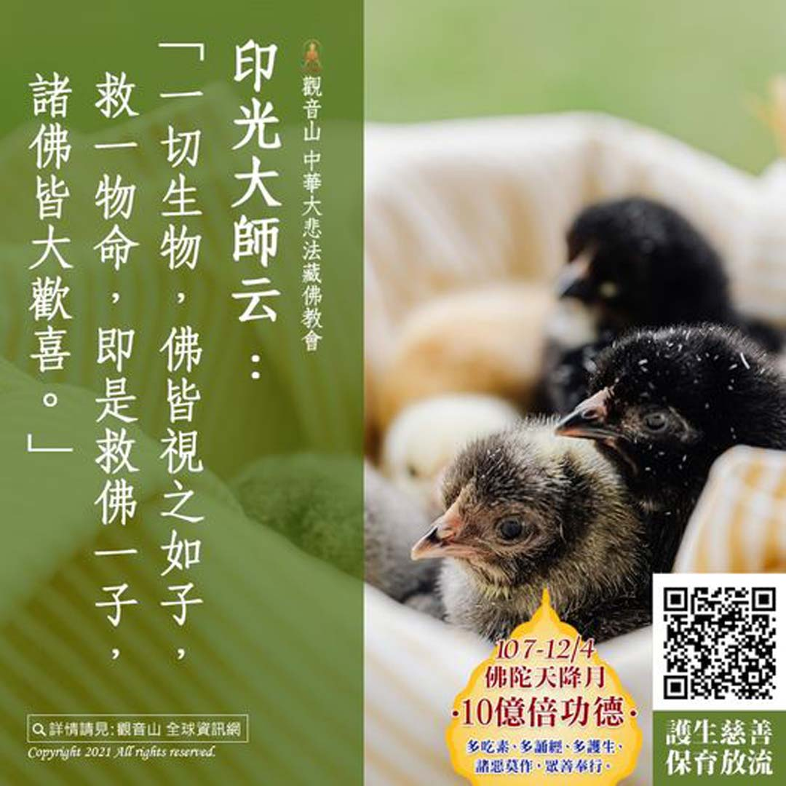

# 「救一物命即救佛一子」──觀音山 護生慈善保育放流

## 📋 基本資訊 / Recipe Overview
- **料理名稱**：「救一物命即救佛一子」──觀音山 護生慈善保育放流
- **原始標題**：「救一物命即救佛一子」──觀音山 護生慈善保育放流
- **素食流派 / Diet**：全素 Vegan
- **來源平台 / Source**：[觀音山 · 素食料理簡單做](https://vegan.gys.org.tw/gys-conservation-and-release20211024/)

## 📖 食譜圖文詳情 (中英雙語對照)

「救一物命即救佛一子」──觀音山 護生慈善保育放流​
​
➤
https://bit.ly/3oWCjfl​
​
印光大師云：「一切生物，佛皆視之如子，救一物命，即是救佛一子，諸佛皆大歡喜。」​
​
「放生，就是在成就每一個未來佛！」世間的天地萬物都是平等的，眾生都有感受，也本具佛性，慈悲看待每一條生命並且尊重珍惜。​
​
我們要知道佛的心就是慈悲心，如何與佛相應，成就佛道 當然就是要與佛心相應。而放生可以長養我們的慈悲心，心與佛合，諸佛歡喜，自然容易與佛感應道交，學佛道業自然容易成就。​
​
觀音山海內外各地道場長期推動戒殺、素食、合法地區保育放流，歡迎有相同理念者一同推廣，共同拯救更多刀口下的生靈，功德無量。​
​
​
✨慈悲 龍德上師──全球護生‧保育放流 消災延壽法會​
​
▌法會日期：10月24日(日)​
▌法會時間：下午2:00(GMT+8)​
▌現場法會Live直播​
◾觀音山法藏YouTube​
https://youtu.be/505yQe3KI8E​
◾觀音山 法藏吉祥洲-好文分享Facebook​
https://bit.ly/2AutG4B​
​
​
更多最新消息，請見「觀音山 全球資訊網」​
​
►
https://www.fazang.org/info/events.php​
​
▍觀音山中華大悲法藏佛教會​
​
►全球資訊網：
http://fazang.org/​
​
►吉祥洲LINE@：
https://line.me/ti/p/%40loc6698t​
​
​
? 觀音山 素食料理簡單做 ?​
◎Facebook ｜好文按讚​
http://www.facebook.com/GYSVegan​
​
◎lnstagram ｜料理追蹤​
http://www.instagram.com/gysvegan/​
​
◎Youtube ｜加入訂閱​
https://reurl.cc/q8VEqy​
​
◎Telegram ｜頻道推薦​
https://t.me/GYSVegan​
​
​
—​
?歡迎轉載，請註明出處： 觀音山 素食料理簡單做 GYSVegan 素食環保愛地球，健康營養無負擔，慈悲護生一起來~?

---
*食譜歸檔時間：2026-08-20 · 來源：觀音山素食料理簡單做 (vegan.gys.org.tw)*