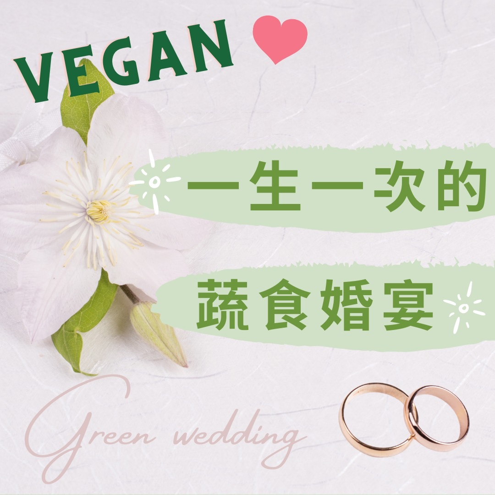

# 一場溫柔的綠色革命「一生一次的蔬食婚宴」

## 📋 基本資訊 / Recipe Overview
- **料理名稱**：一場溫柔的綠色革命「一生一次的蔬食婚宴」
- **原始標題**：一場溫柔的綠色革命「一生一次的蔬食婚宴」
- **素食流派 / Diet**：全素 Vegan
- **來源平台 / Source**：[觀音山 · 素食料理簡單做](https://vegan.gys.org.tw/green-revolution20211115/)

## 📖 食譜圖文詳情 (中英雙語對照)

婚宴是結婚的新人們十分看重的大事✨，也都希望能有一個完美的婚禮，但「葷宴」卻讓成千上萬的生命，在一場希望圓滿的宴客中被烹煮、宰殺，實在令人感到悲傷。
現今蔬食 餐廳已經頗為普遍，無論是西式、中式都色香味俱全，讓味蕾、視覺、美感兼具，給予賓客對蔬食全新的感受，「原來吃素」也可以如此養生美味，讓更多的宴客可以選擇蔬食，體會到蔬食的美好。
​
蓮池大師說：「婚禮不宜殺生?······，夫婚者生人之始也；生之始而行殺，理既逆矣。又婚禮，吉禮也；吉日而用凶事，不亦慘乎？此舉世習行而不覺其非，可為痛哭流涕長太息者四也。」就是說結婚是生孩子的開始，殺生與生人理相違背。又吉禮而用殺生這般兇事，難道這不是很悲慘的嗎？​
​
「婚宴」這個充滿喜樂、幸福的時刻，以尊重生命、健康的方式選擇「素食婚宴」，給予新人終身的祝福，這才是真正吉祥的婚禮。​
​
✨慈悲的 龍德上師成立「觀音山蔬食館」提倡健康素食、慈悲護生，以”觀音山素食料理簡單做”的理念，提供多款素食食譜，讓您一學就會！?​
​
★10月7日~12月4日 ​ 佛陀天降月：善惡業增長10億倍​
​
✨殊勝功德增長日✨​
觀音山邀請您於10月7日~12月4日，響應素食、廣修供養、戒殺護生、誦經修法、行持諸種善行，獲福無量。​
​
​
?  觀音山 素食料理簡單做 ?​
◎Facebook ｜好文按讚​
http://www.facebook.com/GYSVegan
​
​
◎lnstagram ｜料理追蹤​
http://www.instagram.com/gysvegan/​
​
◎Youtube ｜加入訂閱​
https://reurl.cc/q8VEqy​
​
◎Telegram ｜頻道推薦​
https://t.me/GYSVegan​
​
​
—​
?歡迎轉載，請註明出處： 觀音山 素食料理簡單做 GYSVegan 素食環保愛地球，健康營養無負擔，慈悲護生一起來~?

---
*食譜歸檔時間：2026-08-20 · 來源：觀音山素食料理簡單做 (vegan.gys.org.tw)*