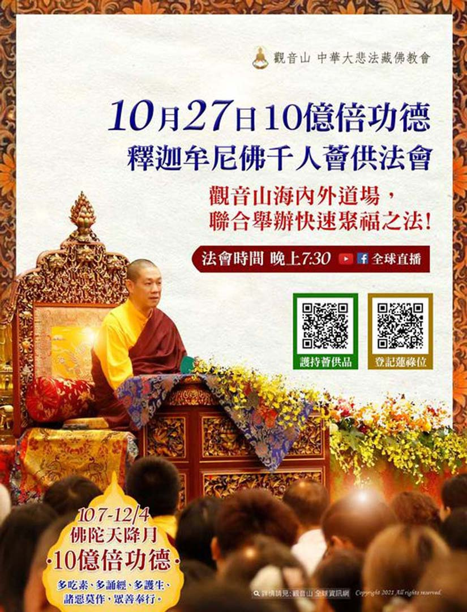

# 一年僅辦一次的佛陀天降日 10億倍功德 釋迦牟尼佛薈供法會

## 📋 基本資訊 / Recipe Overview
- **料理名稱**：一年僅辦一次的佛陀天降日 10億倍功德 釋迦牟尼佛薈供法會
- **原始標題**：一年僅辦一次的佛陀天降日 10億倍功德 釋迦牟尼佛薈供法會
- **素食流派 / Diet**：全素 Vegan
- **來源平台 / Source**：[觀音山 · 素食料理簡單做](https://vegan.gys.org.tw/confession20211016/)

## 📖 食譜圖文詳情 (中英雙語對照)

10/27(三)為佛陀天降日，數千年前的此日為佛陀從天界重返人間，啟以眾生光明、希望的吉祥日。​
​
觀音山將於此日將於海內外所有道場聯合舉辦殊勝釋迦牟尼佛薈供法會，以廣大的供養和至誠心廣大供養慈悲 佛陀，回報佛陀利眾的浩瀚深恩。​
​
薈供數千年來就是四大教派公認最具力、速效累積福報的方法，慈悲 龍德嚴淨仁波切開示：「在殊勝的薈供日，就是我們最好懺悔復戒的時候。」薈供不僅僅能累積福德資糧，也能懺悔罪業，是密乘行者懺悔的一種殊勝方便，藉此重獲清淨。也是與冤親債主解冤釋結最好的機會。​
​
如果是今生因為缺少福德而生活不平順者，如：家人重病、工作不順、感情不美…等，更應該參加薈供。有福報參與者於此殊勝日者，功德福報增長十億倍，請勿錯過最佳修福的時間。​
​
▌怎麼參加觀音山舉辦的薈供累積功德呢？​
​
方法一： 於薈供日，在家中於法會前準備素食供品，水果、飲料、餅乾、熟食…等皆可。家中無佛堂者，可先備辦好供品，同時，將照片傳回觀音山，跟著直播法會一起修法，將會恭請慈悲 龍德上師加持所有設薈供供養處，佛力加持必能呈祥，諸事順遂。​
​
方法二： 同步參加全球直播的薈供法會，慈悲 龍德上師主法，全程線上提供字幕共同修法，再也不用擔心看不懂，不會修。學習密法真的不難！​
​
方法三： 可於線上登記參加薈供法會，為自己、親朋好友祈福除障，尤其是最近令你煩惱的事；有所求的願望，可以更明確說明，尤為效驗！​
✨慈悲的龍德上師 成立「觀音山蔬食館」提倡健康素食、慈悲護生，以”觀音山素食料理簡單做”的理念，提供多款素食食譜，讓您一學就會！?​
​
​
⭐️慶讚佛陀天降日‧十億倍功德增長日⭐️​
▌釋迦牟尼佛‧如珍寶加持總集薈供法會​
▌法會時間：10月27日 晚上7:30 (GMT+8)​
▌法會直播：
https://bit.ly/2BB175Z​
①登記「除障祿位」、「超薦蓮位」積聚廣大福慧資糧​
https://bit.ly/3kHkHkL​
②護持「薈供供品」響應素食推廣計劃 廣結善緣​
https://bit.ly/39HhETC​
(開放登記至10/27晚上7:00截止)​
​
​
更多請見「觀音山 全球資訊網」​
https://www.fazang.org/info/events.php
? 觀音山 素食料理簡單做 ?​
Facebook ｜好文按讚
http://www.facebook.com/GYSVegan​
Instagram ｜料理追蹤
http://www.instagram.com/gysvegan/​
Youtube ｜加入訂閱
https://reurl.cc/q8VEqy​
Telegram ｜頻道推薦
https://t.me/GYSVegan​
​
​
—​
? 歡迎轉載，請註明出處： 觀音山 素食料理簡單做 GYSVegan 素食環保愛地球，健康營養無負擔，慈悲護生一起來~?

---
*食譜歸檔時間：2026-08-20 · 來源：觀音山素食料理簡單做 (vegan.gys.org.tw)*