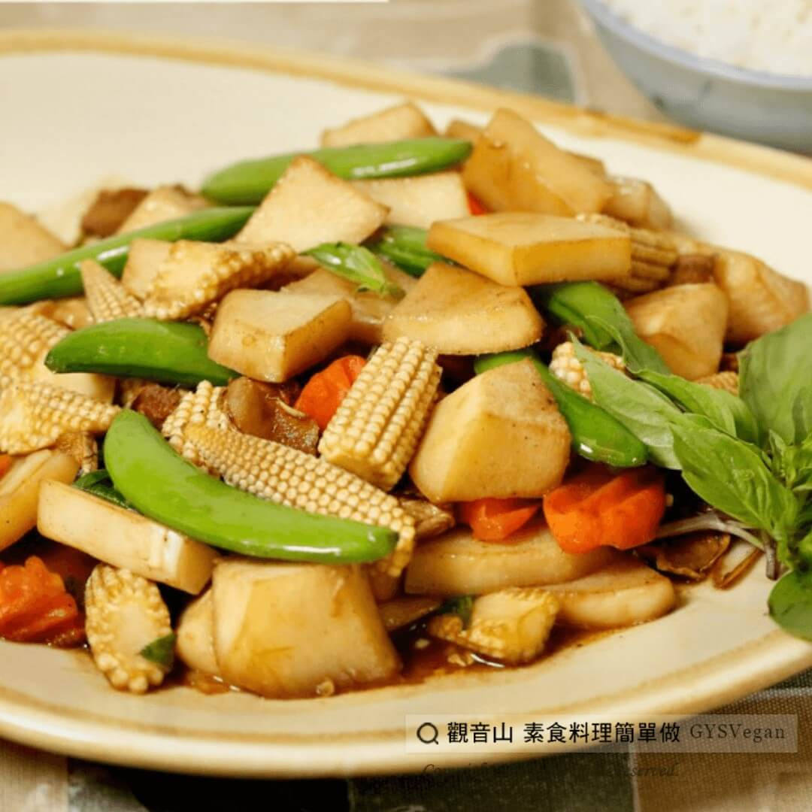

# 三杯綠竹筍

## 📋 基本資訊 / Recipe Overview
- **料理名稱**：三杯綠竹筍
- **原始標題**：三杯綠竹筍｜全素
- **素食流派 / Diet**：全素 Vegan
- **料理分類 / Category**：中式料理
- **來源平台 / Source**：[觀音山 · 素食料理簡單做](https://vegan.gys.org.tw/%e4%b8%89%e6%9d%af%e7%b6%a0%e7%ab%b9%e7%ad%8d%ef%bd%9c%e5%85%a8%e7%b4%a0/)

## 📖 食譜圖文詳情 (中英雙語對照)

清脆的綠竹筍搭配鹹甜的三杯醬汁， 加入清爽的甜豆莢、玉米筍一起拌炒，香氣撲鼻營養又下飯，自己料理美味又健康，快跟著觀音山主廚，一起素食料理簡單做吧！​
​
?食材及佐料〔Ingredients〕：(5人份)​
▪綠竹筍 3支​
▪玉米筍 30克/盒​
▪甜豆莢 30克​
▪紅辣椒 1條​
▪九層塔 1把​
▪紅蘿蔔 10片​
▪薑 10片​
▪素蠔油 3大匙​
▪素沙茶 1大匙​
▪糖 適量​
▪麻油 適量​
▪水 適量​
​
?烹飪步驟：​
1.將綠竹筍川燙後去殼，滾刀切塊備用。​
2.將薑切片，紅辣椒、玉米筍切斜片，甜豆莢切斜，紅蘿蔔切波浪片。​
3.麻油熱鍋後，放入薑片爆香。​
4.將紅蘿蔔放入微炒後，再放入切好筍子翻炒。​
5.將素蠔油及素沙茶倒入鍋內，加入適量的水和糖，翻炒後用小火悶燒煮滾，使竹筍入味。​
6.放入玉米筍及甜豆莢翻炒後，最後放入九層塔翻炒即可起鍋。​
​
??本食譜提供：台中 #觀音山蔬食館 主廚 樂敏​
​
✨慈悲的 龍德上師成立「觀音山蔬食館」提倡健康素食、慈悲護生，以”觀音山素食料理簡單做”的理念，提供多款素食食譜，讓您一學就會！?​
​
​
?觀音山 素食料理簡單做 ​ Follow us?​
Facebook ｜好文按讚
http://www.facebook.com/GYSVegan​
Instagram ｜料理追蹤
http://www.instagram.com/gysvegan/​
Youtube ​ ​ ​ ｜加入訂閱
https://reurl.cc/q8VEqy​
Telegram ​ ｜頻道推薦
https://t.me/GYSVegan​
​
​
? 歡迎轉載，請註明出處： ​ ​ 觀音山 素食料理簡單做GYSVegan按讚、留言設定搶先看! 素食環保愛地球，健康營養無負擔，慈悲護生一起來~?

---
*食譜歸檔時間：2026-08-20 · 來源：觀音山素食料理簡單做 (vegan.gys.org.tw)*