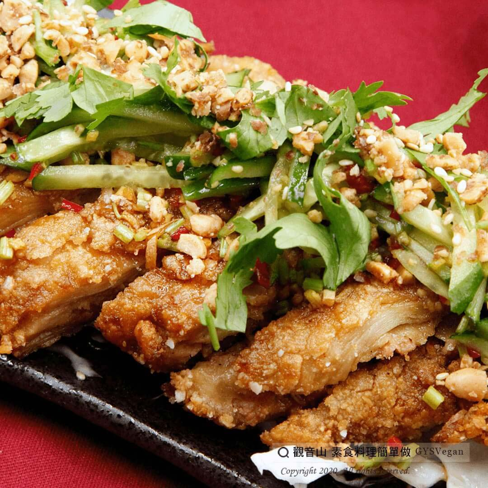

# 不一樣泰式椒麻G

## 📋 基本資訊 / Recipe Overview
- **料理名稱**：不一樣泰式椒麻G
- **原始標題**：不一樣泰式椒麻G｜蛋奶素
- **素食流派 / Diet**：奶素 Lacto-Vegetarian
- **料理分類 / Category**：家常料理
- **來源平台 / Source**：[觀音山 · 素食料理簡單做](https://vegan.gys.org.tw/thai-style20210213/)

## 📖 食譜圖文詳情 (中英雙語對照)

今天是農曆大年初一，新的一年好的緣起，就用蔬食迎接新的一年吧！
觀音山主廚準備了不一樣泰式椒麻G，讓大家吉祥迎新年，好運犇騰、順順利利一整年！
快跟著觀音山主廚，一起素食料理簡單做吧！
?食材及佐料〔Ingredients〕：(5人份)
▪麵腸 6條
▪冷凍猴頭菇 100克
▪素肉漿 150克
▪薑末 90克
▪高麗菜 100克
▪地瓜粉 200克
▪大辣椒 1條
▪香菜 40克
▪鹹花生米 30克
▪小黃瓜 1條
▪醬油 2匙
▪香油 1匙
▪檸檬汁 90cc
▪糖 4匙
▪烏醋 1匙
▪白胡椒粉、白芝麻 少許
▪水、鹽 、油 適量
?烹飪步驟：
1.麵腸剖開，呈平整的片狀。
2.猴頭菇切片。
3.高麗菜切絲泡冰水。
4.大辣椒切末。
5.香菜梗切末，香菜葉略切。
6.花生米去皮壓碎。
7.小黃瓜切絲。
8.麵腸醃漬薑末、糖、鹽、醬油，靜置10分鐘。
醃漬後，麵腸攤開抹上素肉漿，擺入猴頭菇，上方再用麵腸覆蓋。沾地瓜粉備用。
9.麵腸用180度油鍋，炸至酥脆呈金黃色。
10.醬料:醬油、香油、檸檬汁、糖、烏醋、白胡椒粉、水、香菜梗末、薑末20克，攪拌均勻。
11.小黃瓜絲，放入醬料中吸附醬汁約3分鐘。
12.擺盤:底部鋪高麗菜絲，麵腸切成長條狀擺上，放上小黃瓜絲，其他醬汁平均淋在麵腸上，撒上香菜葉、碎花生、白芝麻，完成！
【特別說明】
1.全素者:猴頭菇、素肉漿可以買無奶蛋成分。
?本?食譜提供：台中  觀音山蔬食館​ 主廚 淨雅
⭐️慈悲的 龍德上師成立「觀音山蔬食館」提倡健康素食、慈悲護生，以”觀音山素食料理簡單做”的理念，提供多款素食食譜，讓您一學就會！?
【recipe】
?  Today is the first day of the Lunar New Year. Let’s welcome the new year with vegetarian food! The chef of Guanyinshan prepared a different Thai-style recipe for everyone to welcome the New Year with a hot and sweet taste. Quickly follow the chef of Guanyinshan. Let’s cook simple vegetarian dishes together!
?Ingredients : (For 5 people)
▪Six sticks of mian chang
▪Frozen hericium 100g
▪Vegetarian meat pulp 150g
▪Minced ginger 90g
▪Cabbage 100g
▪Potato flour 200g
▪A Chili
▪Parsley 40g
▪Peanuts 30g
▪A Cucumber
▪Two TBSP of Soy sauce
▪One TBSP of Sesame oil
▪Lemon juice 90cc
▪Four TBSP of Sugar
▪One TBSP of Black vinegar
▪White pepper、Sesame , a little
▪Water、Salt 、Oil , adequate amount
?Cooking steps:
1. Cut miàncháng (Mian chang, rolled flour gluten) lengthwise.
2. Slice the Hericium erinaceus.
3. Shred cabbage and soak in ice water.
4. Mince chilies.
5. Mince the coriander stalks and roughly cut the coriander leaves.
6. Peel the peanuts and crush them.
7. Shred the cucumber.
8. Pour the marinade (ginger, sugar, salt, and soy sauce) over miàncháng and leave it for 10 minutes.
After marinate, spread out miàncháng; smear the vegetarian meat slurry on both sides and then place the hericium in between. Dust with sweet potato powder and set aside.
9. Fry miàncháng in 180 degree oil until crispy and golden brown.
10. Sauce: soy sauce, sesame oil, lemon juice, sugar, black vinegar, white pepper, water, coriander stalk, and ginger 20 grams, stir well.
11. Shred ucumbers, marinade them in the sauce (10) to absorb for about 3 minutes.
12. Food presentation: Spread cabbage shreds at the bottom, cut the miàncháng into long strips and place some shredded cucumbers on the top. Pour sauce evenly over the miàncháng, and then sprinkle some coriander leaves, chopped peanuts, and white sesame seeds for the final touch.
【Special Notes】
1. For vegan: Dairy-free & egg-free Hericium erinaceus and vegetarian meat slurry are available.
??This recipe is provided by: Chef Jing Ya, Taichung, Guanyinshan Green Restaurant.
?觀音山 素食料理簡單做?
Facebook ｜好文按讚
http://www.facebook.com/GYSVegan​​
​
Instagram ｜料理追蹤
http://www.instagram.com/gysvegan/​​
​
Youtube ｜加入訂閱
https://reurl.cc/q8VEqy​​
​
Telegram ｜頻道推薦
https://t.me/GYSVegan​​
—
? 歡迎轉載，請註明出處： 觀音山 素食料理簡單做 GYSVegan 素食環保愛地球，健康營養無負擔，慈悲護生一起來~?

---
*食譜歸檔時間：2026-08-20 · 來源：觀音山素食料理簡單做 (vegan.gys.org.tw)*