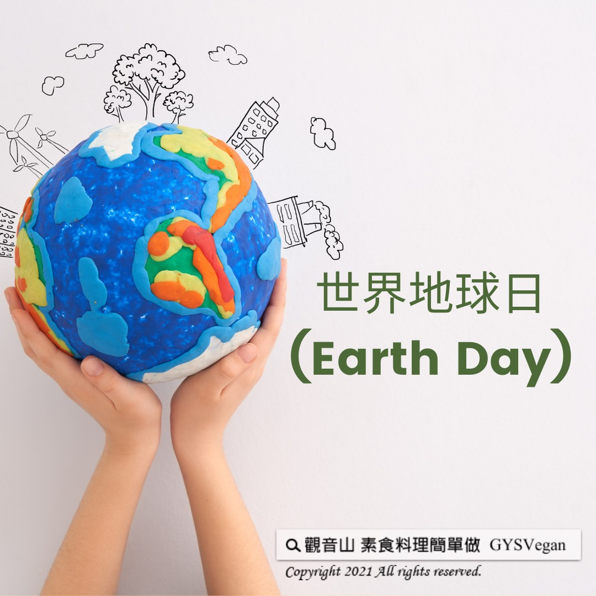

# 世界地球日(Earth Day)

## 📋 基本資訊 / Recipe Overview
- **料理名稱**：世界地球日(Earth Day)
- **原始標題**：世界地球日(Earth Day)
- **素食流派 / Diet**：全素 Vegan
- **來源平台 / Source**：[觀音山 · 素食料理簡單做](https://vegan.gys.org.tw/earth-day20210419/)

## 📖 食譜圖文詳情 (中英雙語對照)

還地球乾淨的空氣與水?
​
地球日（Earth Day），發起於1970年，定於每年的4月22日，這是一項世界性的環境保護活動，以「乾淨的空氣與水」為訴求，繼而喚起全世界對環保議題的重視。​
​
人類要拋開彼此間的爭議和不同，和諧共存，至今2021年，世界地球日邁向第51個年頭，這場全球公民運動仍然持續進行著，需要你我的參與才能更進一步改變世界。​
​
｜恢復我們的地球 ♻​
今年世界地球日的主題是【恢復我們的地球】，不僅從國際教育開始，討論教育工作者在應對氣候變化方面所發揮的關鍵作用；採用新興的綠色技術和創新思維?，來恢復世界各地的生態系統，並推動綠色消費者運動，讓世界各地的公民與團體一起參與。​
​
｜你的生活小事，地球的環保大事​
慈悲 龍德上師：「『環保』最要緊是吃素，減緩暖化，達到環保的實質效益；第二、飲食習慣的簡約，無毒沒有公害的生活方式，不要造成生活環境的污染；第三、臺灣是海島可以淨灘，我們應該去發起，去推動！」。​
​
因此，觀音山近期也在全台各地推出【搶救海鱺媽媽】系列活動，推出海洋生態保衛戰-淨灘活動、愛護海洋保育放流活動，邀請您一同加入生態保衛戰?，共同護持海洋生態復育，恢復我們的地球！​
​
⭐️慈悲的 龍德上師成立「觀音山蔬食館」提倡健康素食、慈悲護生，以”觀音山素食料理簡單做”的理念，提供多款素食食譜，讓您一學就會！?
​
?觀音山 素食料理簡單做 ?
◎Facebook ｜好文按讚
https://www.facebook.com/GYSVegan​
◎Instagram ｜料理追蹤
https://www.instagram.com/gysvegan/​
◎Youtube ​ ​ ​ ｜加入訂閱
https://reurl.cc/q8VEqy​
◎Telegram ​ ｜頻道推薦​
https://t.me/GYSVegan​​
​
—​
? 歡迎轉載，請註明出處：  觀音山素食料理簡單做GYSVegan 素食環保愛地球，健康營養無負擔，慈悲護生一起來~?​

---
*食譜歸檔時間：2026-08-20 · 來源：觀音山素食料理簡單做 (vegan.gys.org.tw)*