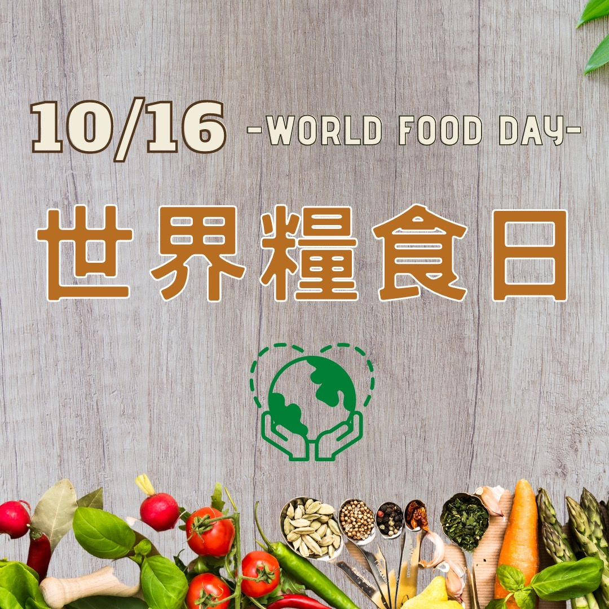

# 世界糧食日

## 📋 基本資訊 / Recipe Overview
- **料理名稱**：世界糧食日
- **原始標題**：世界糧食日
- **素食流派 / Diet**：全素 Vegan
- **來源平台 / Source**：[觀音山 · 素食料理簡單做](https://vegan.gys.org.tw/world-food-day20211011/)

## 📖 食譜圖文詳情 (中英雙語對照)

一天有三次機會改變世界❗️響應世界糧食日​
​
疫情爆發以來，全球焦點都在新冠病毒，殊不知飢餓問題正悄悄襲擊全球各地，2021年7月份聯合國報告指出，全球面臨飢餓的人口增加約18%，且因為衝突、氣候變異與極端等狀況，造成糧食危機加劇，而世界展望會也指出每年有將近240萬名兒童因為營養不良或飢餓而死亡，這是多麼令人悲痛的數據。​
​
全球畜牧業的工業化，釋放大量溫室氣體、汙染水源、破壞自然生態，是影響氣候變遷的頭號殺手，選擇「蔬食」，就是阻止氣候變遷的重要一步！一位肉食者耗費的資源可以養活20~50位蔬食者，蔬食是抑制全球暖化，最有效的行動力❗️​
​
你在「餐桌上的選擇」就能改變世界，10月16日世界糧食日，呼籲全球人民蔬食生活❗️​
​
​
✨慈悲的龍德上師 成立「觀音山蔬食館」提倡健康素食、慈悲護生，以”觀音山素食料理簡單做”的理念，提供多款素食食譜，讓您一學就會！?​
​
★10月7日~12月4日 ​ 佛陀天降月：善惡業增長10億倍​
​
✨殊勝功德增長日✨​
觀音山邀請您於10月7日~12月4日，響應素食、廣修供養、戒殺護生、誦經修法、行持諸種善行，獲福無量。​
​​
? 觀音山 素食料理簡單做 ?
Facebook ｜好文按讚
http://www.facebook.com/GYSVegan​
Instagram ｜料理追蹤
http://www.instagram.com/gysvegan/​
Youtube ｜加入訂閱
https://reurl.cc/q8VEqy​
Telegram ｜頻道推薦
https://t.me/GYSVegan​
​
​
—​
?歡迎轉載，請註明出處： 觀音山 素食料理簡單做 GYSVegan 素食環保愛地球，健康營養無負擔，慈悲護生一起來~?​
​

---
*食譜歸檔時間：2026-08-20 · 來源：觀音山素食料理簡單做 (vegan.gys.org.tw)*