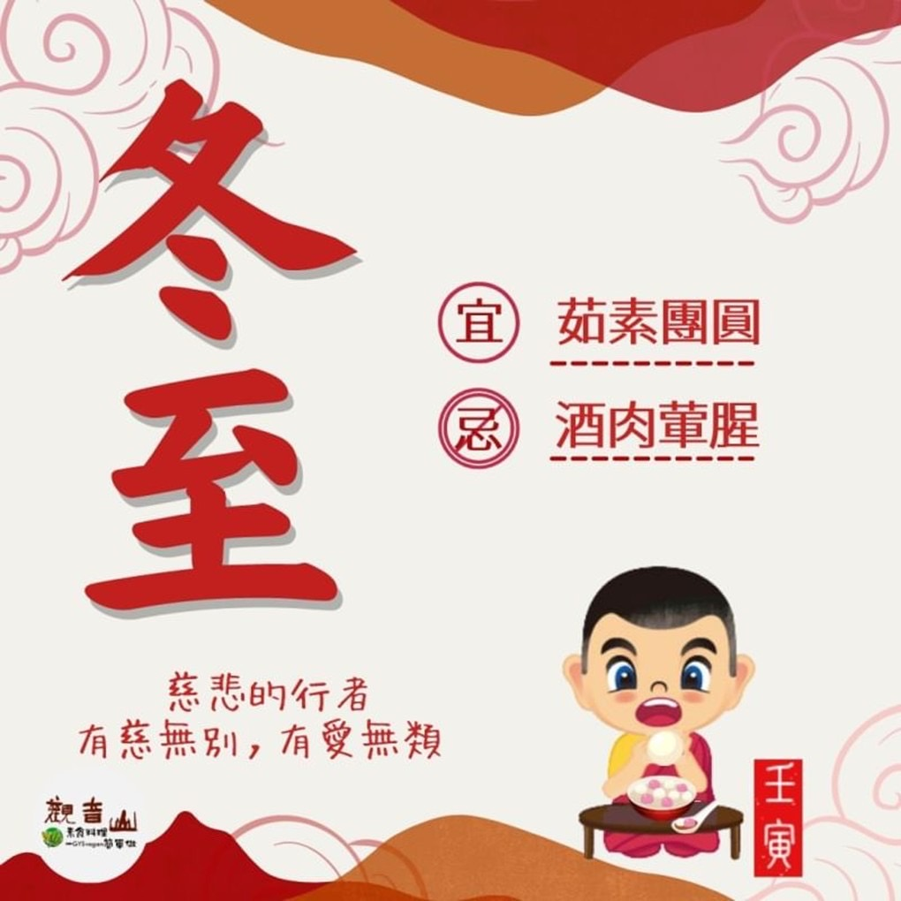

# 二十四節氣— 冬至

## 📋 基本資訊 / Recipe Overview
- **料理名稱**：二十四節氣— 冬至
- **原始標題**：二十四節氣—【冬至】
- **素食流派 / Diet**：全素 Vegan
- **來源平台 / Source**：[觀音山 · 素食料理簡單做](https://vegan.gys.org.tw/winter-solstice20221219/)

## 📖 食譜圖文詳情 (中英雙語對照)

二十四節氣—【冬至】
​
▏冬至大如年，人間共團圓
古人云：陰極之至，陽氣始生，日南至，日短之至，日影之長至，故曰「冬至」。冬至，臺灣古稱「冬節」，此時會感受到濃厚的過節氣氛，供佛、敬神、祭祀祖先、吃湯圓等習俗，象徵能得到圓滿的好預兆✼。
​
▏跟著節氣養生
冬至養生著重在「斂陰護陽、養腎禦寒」，此時正是養生進補的好時機，在溫養體內陽氣方面可多補充核桃、糯米、栗子、芝麻與桂圓；冬季養腎則以黑米、山藥、黑豆、蘿蔔、黑木耳等食材為首選，油炸、辛辣刺激等食物，則不宜多吃；在嚴寒的冷空氣養影響下，特別須注意保暖，避免血管收縮造成身體不適。
​
▏跟著節氣戒殺護生
冬至吃湯圓的習俗，象徵著圓滿與團圓，這樣的節氣與至親至愛的親友團聚特別顯得珍貴，然而動物也有牠的天倫之愛，人類將短暫口腹快樂建築在牠們的痛苦之上，輕易剝奪生靈平安團聚的緣分，就代表牠們永遠無法與家人團聚，這令人憐憫之事，就時常發生在我們的餐桌上。
​
大智度論云：「諸餘罪中，殺業最重；諸功德中，放生第一。」不吃眾生肉就不會讓其家破人亡，還可以解除眾生被擒被抓、死前掙扎的痛苦與恐懼，護生善行是最吉祥的力量，亦是最佳的養生之道。
​
​
​
❄觀音山 2022冬季保育放流
➠
https://bit.ly/3AcPMVC
​
跟著節氣養生──相關食譜推薦
➠
https://bit.ly/3WEHY7p
​
觀音山相關連結
➠
https://www.fazang.org/link/
​
​
—
♛歡迎轉載，請註明出處： ​ 觀音山素食料理簡單做 GYSVegan按讚、留言設定搶先看! 素食環保愛地球，健康營養無負擔，慈悲護生一起來~

---
*食譜歸檔時間：2026-08-20 · 來源：觀音山素食料理簡單做 (vegan.gys.org.tw)*