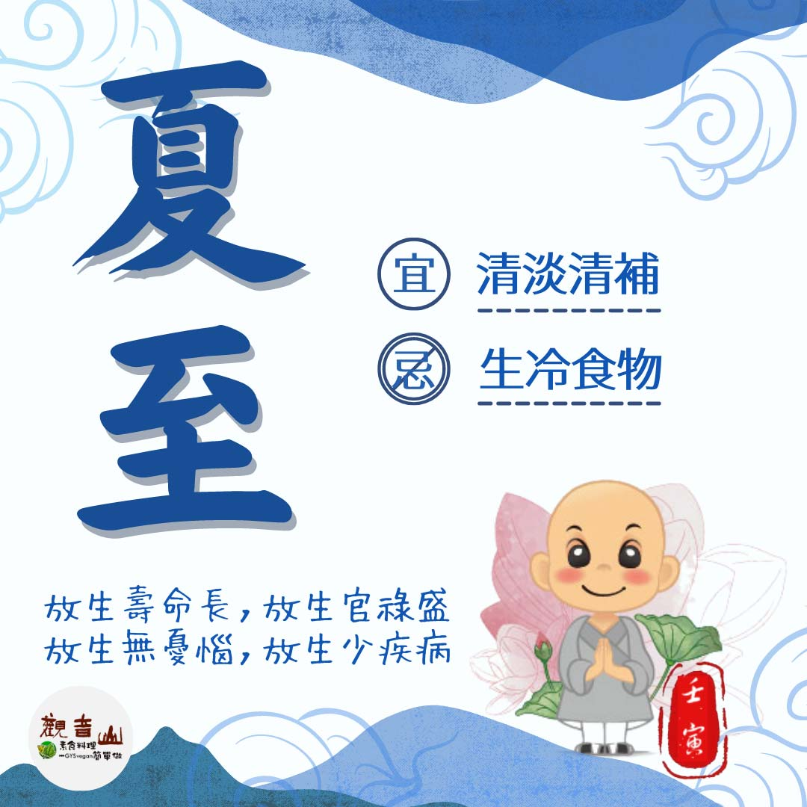

# 二十四節氣— 夏至 ​

## 📋 基本資訊 / Recipe Overview
- **料理名稱**：二十四節氣— 夏至 ​
- **原始標題**：二十四節氣—【夏至】​
- **素食流派 / Diet**：全素 Vegan
- **來源平台 / Source**：[觀音山 · 素食料理簡單做](https://vegan.gys.org.tw/summer-solstice20220620/)

## 📖 食譜圖文詳情 (中英雙語對照)

二十四節氣—【夏至】​
​
▏夏至到，蟬始鳴​
夏至是一年之中白晝最長、黑夜最短的一天，此時正值作物茂盛生長，萬物欣欣向榮，蟬鳴聲說著夏天的到來；夏至過後，氣候由梅雨季轉變為颱風的旺季，應做好防颱工作，減少颱風來襲時的損失，此時天氣逐漸炎熱☀️，須注意飲食衛生，小心預防腸道傳染病。​
​
▏跟著節氣養生​
夏至是陽氣最旺盛的時節，許多人喜歡吃冰消暑，卻忽略了「暑濕」而引發腸胃問題，可多食山藥、薏仁、蓮子等排濕食材；此段期間飲食宜清淡、清補，多食五穀雜糧以寒其體，少吃生冷食物，可選擇的瓜果蔬菜有空心菜、白菜、苦瓜、竹筍、絲瓜、黃瓜、荔枝、鳳梨、西瓜🍉等，都是當季相當好的食材，其中瓜果雖可生津消暑，但也要適量。​
​
▏跟著節氣戒殺護生​
2022年的夏至，正巧欣逢大日如來節日，又是薩嘎達瓦億倍功德的殊勝吉祥月，應當藉此廣修功德福報，其中觀音山夏季保育放流，正展開了一場佛法的生命教育，以圓燕魚🐟、條石雕、水晶鳳凰螺為主要的放流物種，透過專家們的指導，以正確的方式進行保育放流，維繫海洋生態系的完整，還給動物生存的權利，是最圓滿的護生。​
​
觀音山保育放流每一次，皆為生靈修法加持，為其祝禱，願其有一個美好的今生與充滿希望的來世，這是佛法獨有的加持力。共同響應夏季保育放流，學習愛護海洋，尊重萬物，貢獻自己的一份心力幫助生命回歸大海。​
★6月21日薩嘎達瓦月． 大日如來節日，善惡功德1億x1000億倍增長
✨殊勝功德增長日✨​
觀音山邀請您於6月21日響應素食、廣修供養、戒殺護生、誦經修法、行持諸種善行，獲福無量。​
​
​
◎ 觀音山 2022夏季保育放流​
➠
https://reurl.cc/mozvy7​
​
【跟著節氣養生──相關食譜推薦】​
➠
https://vegan.gys.org.tw/veganblog/solar-terms/​
​
◎觀音山相關連結​
➠
https://www.fazang.org/link/​
🌱 觀音山 素食料理簡單做🌱
◎Facebook ｜好文按讚​
https://www.facebook.com/GYSVegan​
​
◎Instagram ｜料理追蹤​
https://www.instagram.com/gysvegan/​
​
◎Youtube ​ ​ ​ ｜加入訂閱​
https://reurl.cc/q8VEqy​
​
◎官方Blog ​ ​ ｜網站推薦​
https://vegan.gys.org.tw/​
​
​
—​
👑歡迎轉載，請註明出處： 觀音山 素食料理簡單做 GYSVegan 素食環保愛地球，健康營養無負擔，慈悲護生一起來~😊

---
*食譜歸檔時間：2026-08-20 · 來源：觀音山素食料理簡單做 (vegan.gys.org.tw)*