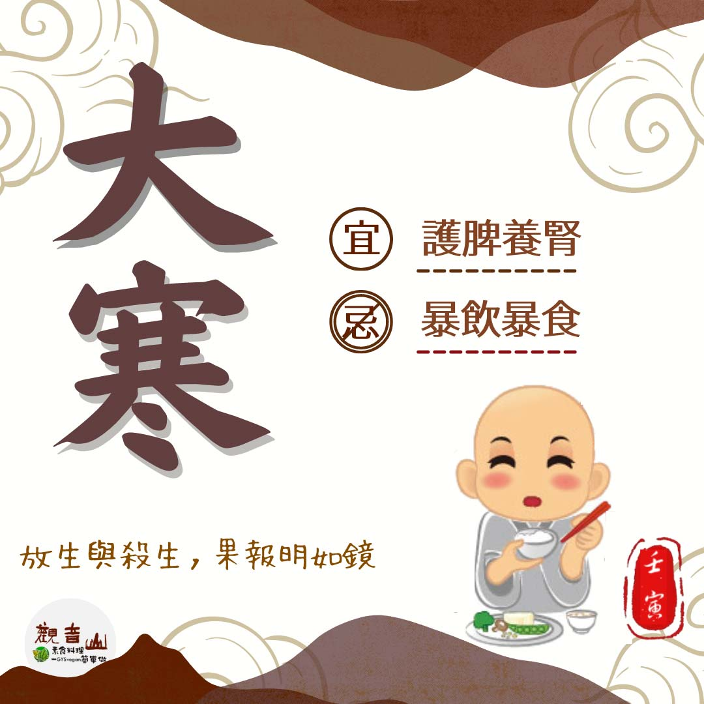

# 二十四節氣— 大寒

## 📋 基本資訊 / Recipe Overview
- **料理名稱**：二十四節氣— 大寒
- **原始標題**：二十四節氣—【大寒】
- **素食流派 / Diet**：全素 Vegan
- **來源平台 / Source**：[觀音山 · 素食料理簡單做](https://vegan.gys.org.tw/great-cold20230120/)

## 📖 食譜圖文詳情 (中英雙語對照)

二十四節氣—【大寒】
​
▏天已大寒，靜待春來
「大寒」一年中最後一個節氣，代表冬季即將結束，農曆春節緊接而來，許多人忙著除舊佈新、備辦年貨，濃厚的過年氛圍充滿大街小巷，在外出時確實做好保暖防護，好好調養身體、養精蓄銳，以最佳的狀態迎接新的一年。
​
▏跟著節氣養生
大寒時期養生應以「護脾養腎」為要點，順應季節變化，須以溫補的方式，逐漸朝清淡轉變，適時選擇甘味的食物來補養氣血、調和脾胃，★推薦的食材有山藥、四季豆、南瓜、馬鈴薯、桂圓、紅棗、紅豆、黑木耳、白蘿蔔等，飲食忌生冷及暴飲暴食；在睡前用熱水泡腳，不僅可以祛寒、消除疲勞，還可以幫助睡眠。
​
▏跟著節氣戒殺護生
大寒節氣的到來，代表著新的一年不遠了，回首過去一年中受到疫情、戰爭等影響，人們的心惶惶不安，祈望上天給予祝福，所有有生命的眾生皆是如此，那些被捕、等待宰殺的生靈更是渴望奇蹟的降臨。
​
觀音山保育放流邀約您，一同給予生靈活命的機會，《普賢行願品》云：「眾生至愛者身命，諸佛至愛者眾生，能救眾生身命，則能成就諸佛心願。」響應蔬食、戒殺護生，就是最佳的祝福、最棒的新春賀禮。
​
​
❄觀音山 冬季保育放流
➠https://bit.ly/3AcPMVC
​
跟著節氣養生──相關食譜推薦
➠http://bit.ly/3ZYRYuH
​
觀音山相關連結
➠https://www.fazang.org/link/
​
​
—
♛歡迎轉載，請註明出處： ​ #觀音山素食料理簡單做 GYSVegan按讚、留言設定搶先看! 素食環保愛地球，健康營養無負擔，慈悲護生一起來~

---
*食譜歸檔時間：2026-08-20 · 來源：觀音山素食料理簡單做 (vegan.gys.org.tw)*