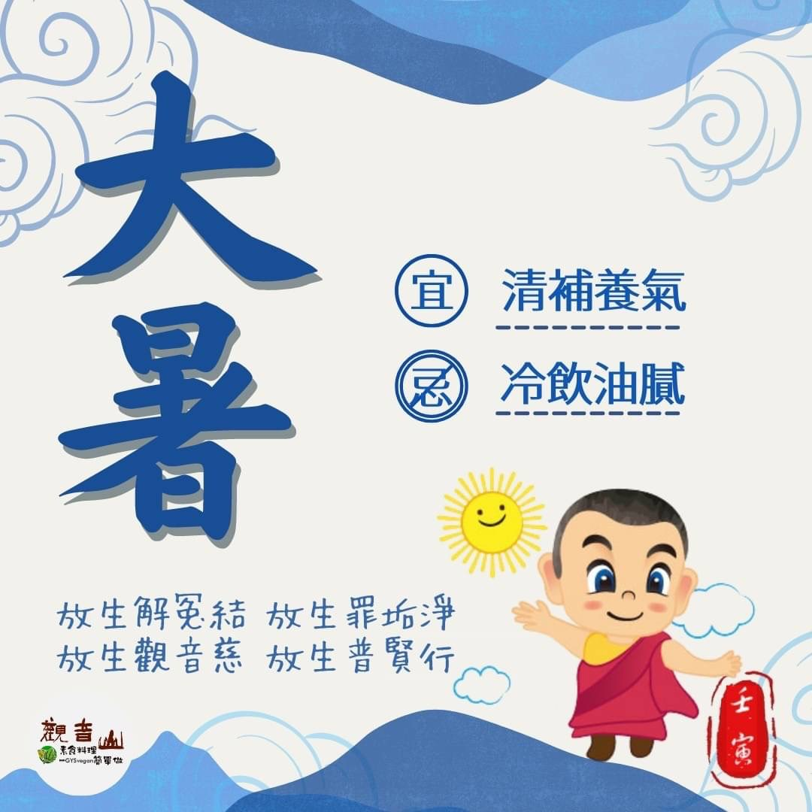

# 二十四節氣— 大暑 ​

## 📋 基本資訊 / Recipe Overview
- **料理名稱**：二十四節氣— 大暑 ​
- **原始標題**：二十四節氣—【大暑】​
- **素食流派 / Diet**：全素 Vegan
- **來源平台 / Source**：[觀音山 · 素食料理簡單做](https://vegan.gys.org.tw/great-heat20220722/)

## 📖 食譜圖文詳情 (中英雙語對照)

二十四節氣—【大暑】​
​
▏大暑要熱透，才有好年冬​
大暑節氣是一年之中最熱的時刻，也是喜熱作物生長速度最快的時期，順應節氣，四季運轉應有其分，萬物生長也才有相對應的時程，此時晝長夜短，高溫悶熱，排汗多、消耗大，可以適時從果瓜補充水分，避免造成中暑的現象。​
​
▏跟著節氣養生​
因為天氣炎熱，飲食準則以「清補養氣」為主，相關的食材有黃瓜、豆芽、苦瓜、紫菜、綠豆、番茄、西瓜等，忌喝冷飲以及油膩食物，避免造成身體的過度負擔；中醫常說「寒病夏治」，一些在冬季容易發作的病症，也可在此時作調理，預防再次復發。​
​
▏跟著節氣戒殺護生​
大暑節氣臨近農曆七月，農曆七月十五日又稱為「自咨日」，因為印度農曆四月十六日後，天氣逐漸炎熱☀️，蛇蟲鼠蟻很多，慈悲 佛陀不希望僧眾因為天氣燥熱，血氣方剛、心浮氣躁與人衝突，出外化緣托缽易誤傷踩踏生靈，因此要大家在這三個月好好的精進用功，結夏安居，直到七月十五日三個月圓滿結束，在這天供佛齋僧，得到祝願的功德不可思議！目犍連尊者亦藉由供佛齋僧之威德力，須臾間超薦墮落在鬼道的母親得生善趣。​
​
時值夏季，透過專業機構建議、指導，觀音山 邀請您一起救護、復育更多的生命，活化海洋生態，也能懺悔殺業、累積無量功德。​
​
​
✨慈悲的龍德上師 成立「觀音山蔬食館」提倡健康素食、慈悲護生，以”觀音山素食料理簡單做”的理念，提供多款素食食譜，讓您一學就會！🥰
​
​
◎觀音山 2022夏季保育放流​
➠
https://bit.ly/3AcPMVC​
​
◎跟著節氣養生──相關食譜推薦​
➠
https://vegan.gys.org.tw/great-heat20210719/​
​
••• 觀音山 2022年中元普度盂蘭盆法會 •••​
➠
https://www.fazang.org/UllambanaFestival​
​
​
🌱觀音山 素食料理簡單做 🌱​
◎Facebook ｜好文按讚​
https://www.facebook.com/GYSVegan​
​
◎Instagram ｜料理追蹤​
https://www.instagram.com/gysvegan/​
​
◎Youtube ​ ​ ​ ｜加入訂閱​
https://reurl.cc/q8VEqy​
​
◎官方Blog ​ ​ ｜網站推薦​
https://vegan.gys.org.tw/​
​
​
—​
👑歡迎轉載，請註明出處： 觀音山 素食料理簡單做 GYSVegan 素食環保愛地球，健康營養無負擔，慈悲護生一起來~😊

---
*食譜歸檔時間：2026-08-20 · 來源：觀音山素食料理簡單做 (vegan.gys.org.tw)*