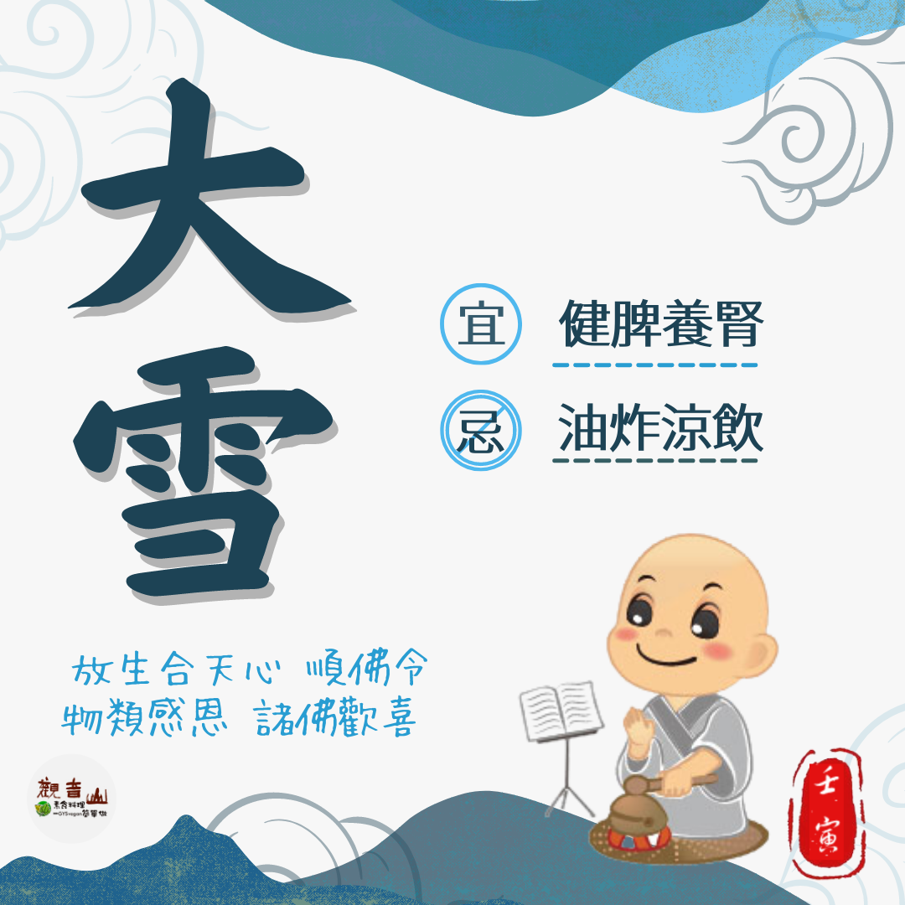

# 二十四節氣— 大雪

## 📋 基本資訊 / Recipe Overview
- **料理名稱**：二十四節氣— 大雪
- **原始標題**：二十四節氣—【大雪】
- **素食流派 / Diet**：全素 Vegan
- **來源平台 / Source**：[觀音山 · 素食料理簡單做](https://vegan.gys.org.tw/heavy-snow20221205/)

## 📖 食譜圖文詳情 (中英雙語對照)

二十四節氣—【大雪】
​
▏大雪至，寒冬始
大雪是冬季的第三個節氣，大者盛也，至此而雪盛也☃，此時可以感覺到氣溫明顯的下降，加上空氣較為乾燥，容易誘發呼吸道方面的疾病，抵抗力較弱的小朋友和老年人需格外注意保暖。
​
▏跟著節氣養生
冬季養生首重補腎，大雪節氣也不例外，黑色食物是養腎的最佳選擇，如黑豆、黑芝麻、黑棗、黑木耳、何首烏，推薦搭配的食材有，白蘿蔔、苦瓜、山藥、冬瓜、核桃、栗子、芹菜、海帶等，適當的進補可以促進新陳代謝，補湯中可多搭配當季蔬菜，更能保持體內的水分；油炸食物及涼飲，在乾燥的冬季易造成體內上火，應盡量避免。
​
▏跟著節氣戒殺護生
春生夏長，秋收冬藏，農事依此而作，而動物們又何嘗不是呢？在寒冷的冬季中，萬物得以養息的時刻，此時如四絲馬鮁(俗稱午仔魚)等卻是被大肆捕捉，海洋裡的魚類資源因為過度捕撈，不但使得數量衰減，魚體小型化日益明顯，因為魚類還來不及長大，便會被捕殺。
​
觀音山 保育放流依不同魚類的生長環境與條件，進行魚苗的放流，活化海洋生態，讓生命回歸大海𓆟 ，敬邀十方大眾一起來響應！
​
​
𓆟 觀音山 2022秋季保育放流
➠https://bit.ly/3AcPMVC
​
跟著節氣養生──相關食譜推薦
➠https://bit.ly/3UoQsO9
​
觀音山相關連結
➠https://www.fazang.org/link/
​
​
—
♛歡迎轉載，請註明出處： ​ 觀音山素食料理簡單做 GYSVegan按讚、留言設定搶先看! 素食環保愛地球，健康營養無負擔，慈悲護生一起來~

---
*食譜歸檔時間：2026-08-20 · 來源：觀音山素食料理簡單做 (vegan.gys.org.tw)*