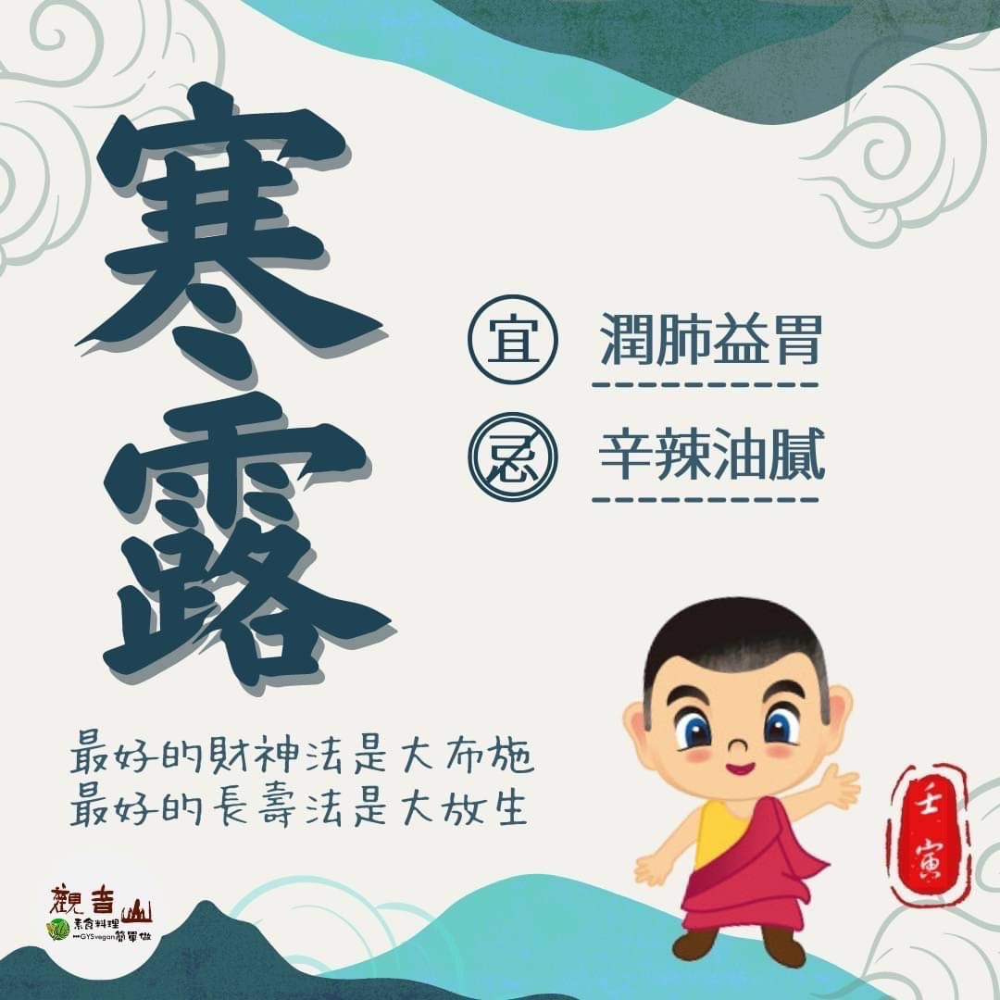

# 二十四節氣— 寒露

## 📋 基本資訊 / Recipe Overview
- **料理名稱**：二十四節氣— 寒露
- **原始標題**：二十四節氣—【寒露】
- **素食流派 / Diet**：全素 Vegan
- **來源平台 / Source**：[觀音山 · 素食料理簡單做](https://vegan.gys.org.tw/cold-dew20221007/)

## 📖 食譜圖文詳情 (中英雙語對照)

二十四節氣—【寒露】
​
▏梧桐一葉而天下知秋
時露寒冷，而將欲凝結，故名寒露，屬於深秋的季節，一波波的東北季風，早晚漸漸感覺到涼意，泛黃的梧桐樹葉也說明了深秋的到來🍂。寒露前後天氣變化較大，應隨身攜帶保暖衣物，避免感冒引起呼吸道方面的疾病。
​
▏跟著節氣養生
春生、夏長、秋收、冬藏，中醫養生與四季運行緊密相繫，此時應當讓情緒保持平緩、身心平衡的狀態，適當的運動保暖更能幫助氣血運行；在吃的方面，多食用甘、淡滋潤的食品，來潤肺益胃、養陰防燥，如芝麻、銀耳、蓮藕、胡蘿蔔、冬瓜、海帶、紫菜、梨、柚子、柑橘🍊等，且應避免辛辣、油膩的食物；若能熬煮粥品食用，更能達到養生之效。
​
▏跟著節氣戒殺護生
秋天天氣涼爽，正是五彩繽紛的賞花季節💐，讓人感受到大自然的美，但這樣的美景已經不是常態了，因為人類過度的欲求，讓地球失去平衡，海洋汙染、極端氣候等，無不是在提醒我們應該尊重萬物、愛護地球。
​
有鑑於此，『觀音山保育放流』傳達一種「身體」與「心靈」平衡和諧的生活態度，世間的天地萬物皆平等，眾生與人類一樣有著情感、有家庭，亦本具佛性，我們應該學習平等與慈悲地看待每一條生命，🤲邀請您共同為護生而努力。
​
​
🐠 觀音山 2022秋季保育放流
➠
https://bit.ly/3AcPMVC
​
🥗跟著節氣養生──相關食譜推薦
➠
https://bit.ly/3SJlzn6
​
📣觀音山相關連結
➠
https://www.fazang.org/link/
​
—
👑歡迎轉載，請註明出處： ​ #觀音山素食料理簡單做 GYSVegan按讚、留言設定搶先看! 素食環保愛地球，健康營養無負擔，慈悲護生一起來~🥰

---
*食譜歸檔時間：2026-08-20 · 來源：觀音山素食料理簡單做 (vegan.gys.org.tw)*