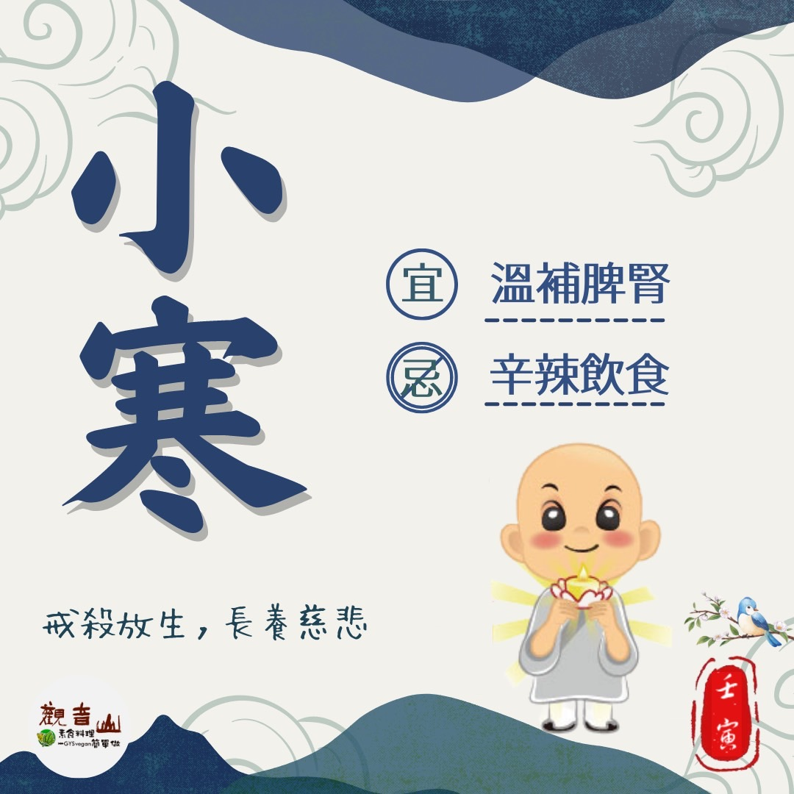

# 二十四節氣— 小寒

## 📋 基本資訊 / Recipe Overview
- **料理名稱**：二十四節氣— 小寒
- **原始標題**：二十四節氣—【小寒】
- **素食流派 / Diet**：全素 Vegan
- **來源平台 / Source**：[觀音山 · 素食料理簡單做](https://vegan.gys.org.tw/osamu20230102/)

## 📖 食譜圖文詳情 (中英雙語對照)

二十四節氣—【小寒】
​
▏小寒冷風襲來，首重防寒保暖
「小寒」，冷氣積久而為寒，小者未至於極也。即天氣寒冷但還沒有到極點的意思，是表示氣温冷暖變化的節氣❄，冬至之後，冷空氣頻繁南下，氣温持續降低，温度在一年的小寒、大寒之際降到最低。有心腦血管疾病者，出入室內外溫差大，務必做好充分保暖，平安度過一年中最寒冷的時節。
​
▏跟著節氣養生
天氣寒冷時的飲食方針，應以「溫補脾腎」為主，可多吃些溫性或熱性的食物來養脾胃、潤腎氣，有助於提升免疫力。推薦食材有，葵花子、糯米、黑豆、桂圓、紅棗、紅豆等，若將其調理成粥品，則有補氣養血、驅寒強身、生津止渴之效；過於油膩、辛辣的食物容易上火，必須節制；溫和飲品如桂圓紅棗茶、桂花茶等，也能有效的幫助禦寒。
​
▏跟著節氣戒殺護生
寒冷的冬季，人們會進補來保暖養生，盤中的眾生卻因此失去了生命的溫度，若能以天然的食材養生，還能讓眾生性命得以自由存活，觀音山 保育放流特別企劃「冬季 愛護海洋·保育放流活動」，放流的物種以硨磲、海膽、嘉鱲為主，希望藉此喚醒人們本具的慈悲心。
​
現代生活型態失調造成各種文明病，若想要活得長壽健康，以蔬食、忌口、戒殺護生等方式來調整自身的生活型態，才是維護自身健康的保健之道。
​
​
❄觀音山 2022冬季保育放流
➠
https://bit.ly/3AcPMVC
​
跟著節氣養生──相關食譜推薦
➠
https://bit.ly/3ZeVUqK
​
觀音山相關連結
➠
https://www.fazang.org/link/
​
​
—
♛歡迎轉載，請註明出處： ​ #觀音山素食料理簡單做 GYSVegan按讚、留言設定搶先看! 素食環保愛地球，健康營養無負擔，慈悲護生一起來~

---
*食譜歸檔時間：2026-08-20 · 來源：觀音山素食料理簡單做 (vegan.gys.org.tw)*