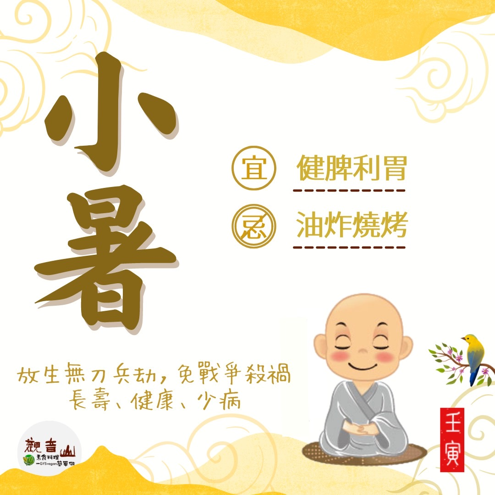

# 二十四節氣— 小暑 ​

## 📋 基本資訊 / Recipe Overview
- **料理名稱**：二十四節氣— 小暑 ​
- **原始標題**：二十四節氣—【小暑】​
- **素食流派 / Diet**：全素 Vegan
- **來源平台 / Source**：[觀音山 · 素食料理簡單做](https://vegan.gys.org.tw/little-summer20220704/)

## 📖 食譜圖文詳情 (中英雙語對照)

二十四節氣—【小暑】​
​
▏小暑過，一日熱三分​
暑即熱也，小暑代表天氣炎熱☀️，但尚未達到最熱的時刻，此時氣溫升高、濕氣重，時常會有午後雷陣雨以及颱風的到來，應注意飲食衛生，避免中暑或引發其他的疾病。​
​
▏跟著節氣養生​
悶熱的天氣容易造成陽氣的損耗，濕氣的代謝困難，影響脾胃功能，此時養生的重點為「健脾利胃」，而良好的飲食習慣是健康的第一步，可食用黃色食物來養脾胃，如黃豆、南瓜、黃椒、木瓜、地瓜?等，也可適量食用清熱解毒的食材，如綠豆、薏仁等，避免吃過甜、油炸燒烤類的食物，另外山藥、蓮子、紅棗亦有益氣補脾胃的效果。​
​
▏跟著節氣戒殺護生​
7/7日小暑節氣開始，此節氣間有一個重要的節日–觀世音菩薩成道紀念日(農曆六月十九日)，觀世音菩薩，楊枝淨水遍灑三千，清涼濁世熱惱；菩薩慈眼視眾生，無間斷地聆聽眾生的祈求和心願。跟著觀音山夏季保育放流，學習菩薩精神善待一切眾生、拔苦予樂，給予無數眾生活命的機會；共同搶救圓燕魚、條石雕、水晶鳳凰螺夏季保育放流物種，一同守護海洋母親。​
​
​
◎觀音山 2022夏季保育放流​
➠
https://bit.ly/3AcPMVC
​
​
【跟著節氣養生──相關食譜推薦】​
➠
https://vegan.gys.org.tw/veganblog/solar-terms/​
​
◎觀音山相關連結​
➠
https://www.fazang.org/link/​
​
​
🌱 觀音山 素食料理簡單做 🌱
◎Facebook ｜好文按讚​
https://www.facebook.com/GYSVegan​
​
◎Instagram ｜料理追蹤​
https://www.instagram.com/gysvegan/​
​
◎Youtube ​ ​ ​ ｜加入訂閱​
https://reurl.cc/q8VEqy​
​
◎官方Blog ​ ​ ｜網站推薦​
https://vegan.gys.org.tw/​
​
​
—​
👑歡迎轉載，請註明出處： 觀音山 素食料理簡單做 GYSVegan 素食環保愛地球，健康營養無負擔，慈悲護生一起來~😊

---
*食譜歸檔時間：2026-08-20 · 來源：觀音山素食料理簡單做 (vegan.gys.org.tw)*