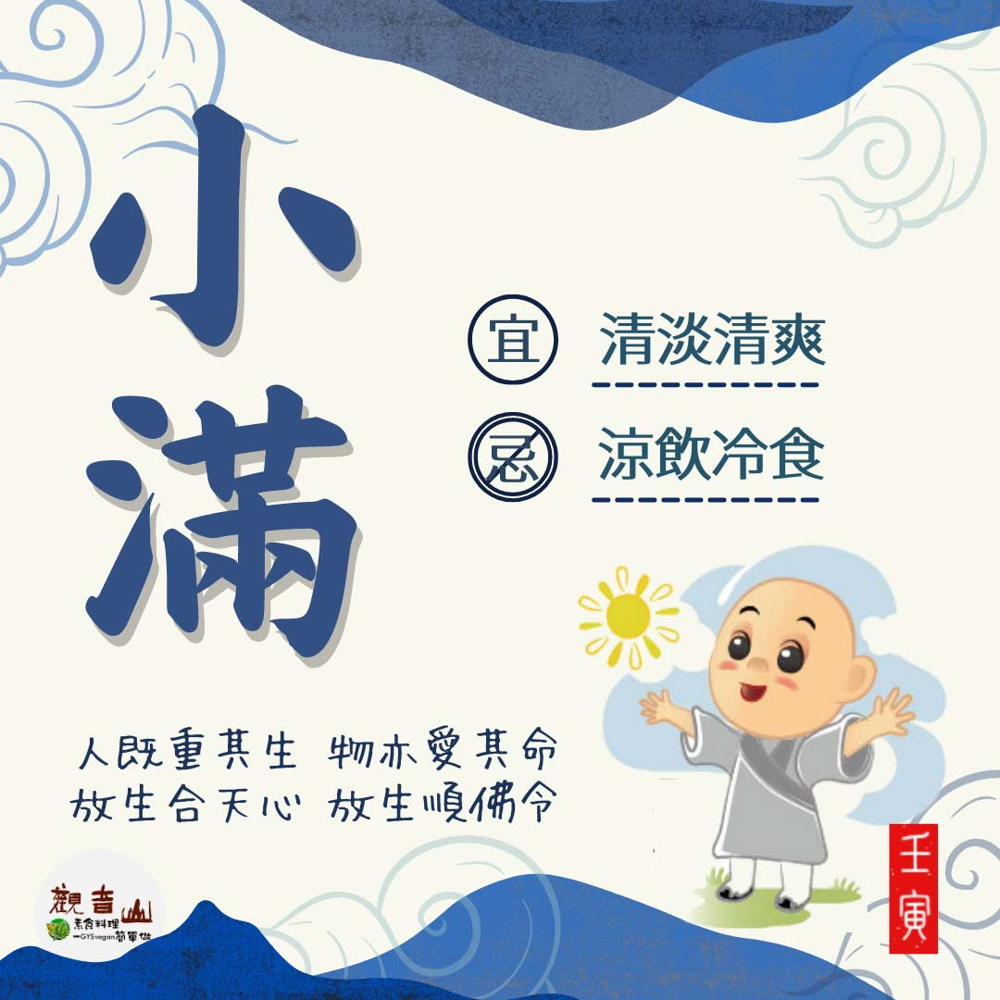

# 二十四節氣— 小滿 ​

## 📋 基本資訊 / Recipe Overview
- **料理名稱**：二十四節氣— 小滿 ​
- **原始標題**：二十四節氣—【小滿】​
- **素食流派 / Diet**：全素 Vegan
- **來源平台 / Source**：[觀音山 · 素食料理簡單做](https://vegan.gys.org.tw/xiaoman20220520/)

## 📖 食譜圖文詳情 (中英雙語對照)

二十四節氣—【小滿】​
​
▏小滿麥漸黃，夏至稻花香​
小滿節氣中，麥苗結穗、麥穗開始飽滿，但是尚未成熟，故稱為「小滿」，此時亦是梅雨季的開始，土地得到雨水的滋潤，花草樹木蓬勃成長，故有「小滿梅雨在本島，種植花木接成寶」之說。​
​
▏跟著節氣養生​
由於天熱水多，表示悶熱、潮濕的夏季即將登場，日常飲食可選擇甘涼、甘寒的食物，如苦瓜、苦菜、筍、綠豆、薏仁等，不僅可以消暑清熱，還可健脾去濕；飲食調養宜以清淡清爽的素食為主，多食用當季盛產的蔬果，忌貪涼飲冷，而損傷脾胃。​
​
▏跟著節氣戒殺護生​
夏天到來，許多遊客會來到海邊的景點遊玩，總想要吃海鮮大快朵頤，連帶海鮮宅配大肆崛起，卻不知海洋生命已大規模的驟減，漁民捕不到魚已是常態，新興的海洋牧場開始流行，一望無際的海洋牧場，無數的生命被眷養在其中，如果這些生命能回歸大海，這份喜悅不僅只有大海知道。​
​
觀音山「搶救懷孕的海鱺媽媽」愛護海洋．保育放流活動推廣至今，已邁入第3年，放流可以拯救性命垂危、朝不保夕的眾多生命，敬邀十方大眾共同響應，恢復海洋多樣性、讓生命友善回歸。​
​
✨慈悲的龍德上師 成立「觀音山蔬食館」提倡健康素食、慈悲護生，以”觀音山素食料理簡單做”的理念，提供多款素食食譜，讓您一學就會！🥰
​
​
★5月21日 地藏王菩薩節日：善惡業增長1億x1萬倍​
​
✨殊勝功德增長日✨​
觀音山邀請您於5月21日響應素食、廣修供養、戒殺護生、誦經修法、行持諸種善行，獲福無量。​
​
​
★溫馨五月─愛護海洋‧保育放流活動 ​
立即「搶救懷孕的海鱺媽媽」​
►
https://bit.ly/3JHM33x​​
​
【跟著節氣養生──相關食譜推薦】​
➠
https://vegan.gys.org.tw/veganblog/so…​
​
「觀音山 社群」一鍵快速前往觀音山 官方相關連結！​
➠
https://www.fazang.org/link/​
​
​
🌱 觀音山 素食料理簡單做🌱
◎Facebook ｜好文按讚​
https://www.facebook.com/GYSVegan​
​
◎Instagram ｜料理追蹤​
https://www.instagram.com/gysvegan/​
​
◎Youtube ​ ​ ​ ｜加入訂閱​
https://reurl.cc/q8VEqy​
​
◎官方Blog ​ ​ ｜網站推薦​
https://vegan.gys.org.tw/​
​
​
—​
👑歡迎轉載，請註明出處： 觀音山 素食料理簡單做 GYSVegan 素食環保愛地球，健康營養無負擔，慈悲護生一起來~😊

---
*食譜歸檔時間：2026-08-20 · 來源：觀音山素食料理簡單做 (vegan.gys.org.tw)*