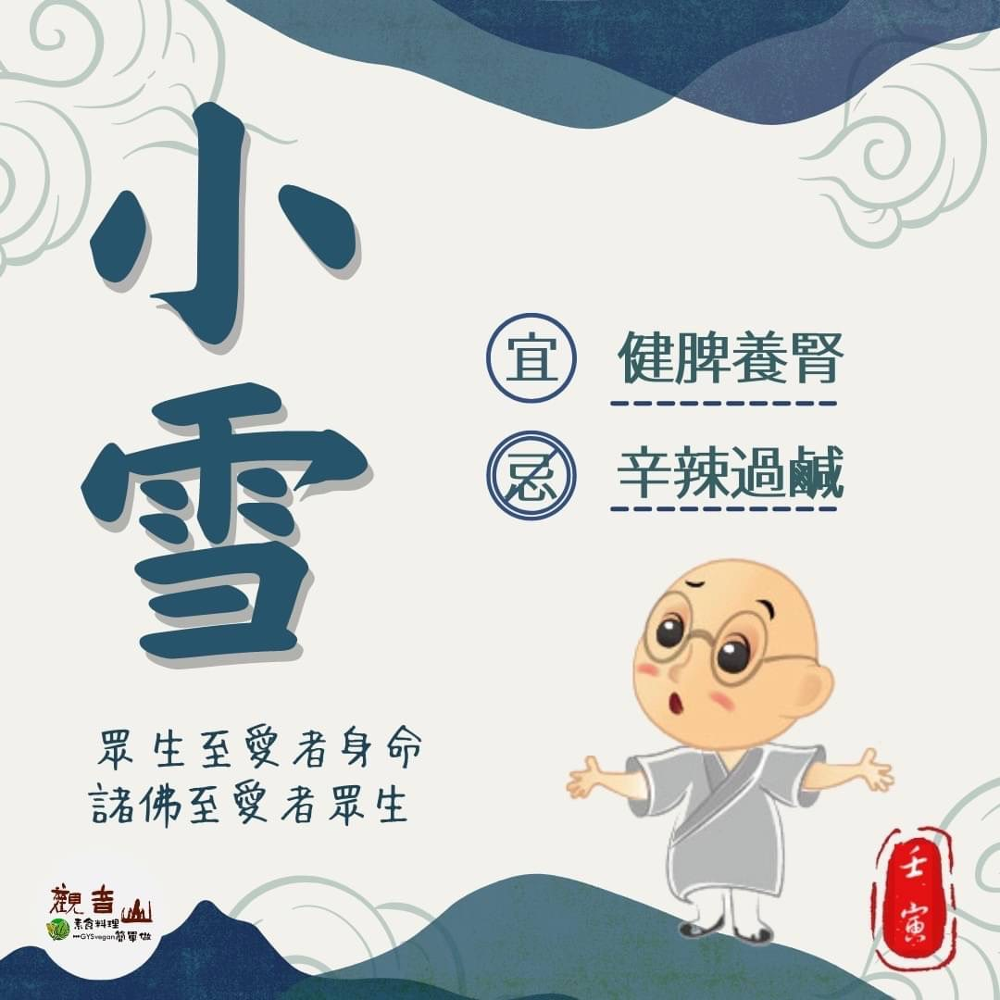

# 二十四節氣— 小雪

## 📋 基本資訊 / Recipe Overview
- **料理名稱**：二十四節氣— 小雪
- **原始標題**：二十四節氣—【小雪】
- **素食流派 / Diet**：全素 Vegan
- **來源平台 / Source**：[觀音山 · 素食料理簡單做](https://vegan.gys.org.tw/light-snow20221121/)

## 📖 食譜圖文詳情 (中英雙語對照)

二十四節氣—【小雪】
​
▏微雪初降，溫暖陪伴
小雪，入冬的第二個節氣，天氣將越來越冷☃，『雨下而為寒氣所薄，故凝而為雪，故名小雪』，體質手腳容易冰冷的人，此時應多注意保暖，珍惜陽光露臉的機會，以補足體內的陽氣。
​
▏跟著節氣養生
小雪時節養生以健脾、養腎為要點，適合用溫補的方式來調整體質，如紅棗、桂圓、枸杞、山藥、黑米都是很好入菜的食材，以下推薦一些適合小雪節氣的食材，如大白菜、芥藍菜、栗子、南瓜、蘿蔔、香蕉、黑豆等；飲食上需注意避免辛辣、過鹹的料理，以減輕身體負擔。
​
▏跟著節氣戒殺護生
「眾生至愛者身命，諸佛至愛者眾生，能救眾生身命，則能成就諸佛心願。」放生、護生是最合天心、佛心的了，能長養我們的慈悲心，境隨心轉，一切所求自然容易滿願！且寒冷的冬天，是最需要溫暖的時刻，此時觀音山保育放流以『護生善行，拯救億萬生靈』的溫暖大愛 ，為世界祥和帶來一股暖流，並與政府機關及專業機構合作，以正確的方式進行保育放流，維繫海洋生態的完整，並還給動物生存的權利，在這嚴寒的冬天，給予眾生們溫暖。
​
​
𓆟 觀音山 2022秋季保育放流
➠
https:/y/3AcPM/bit.lVC
​跟著節氣養生──相關食譜推薦
➠
http://bit.ly/3AsxlMc
​
觀音山相關連結
➠
https://www.fazang.org/link/
​
—
♛歡迎轉載，請註明出處： ​ 觀音山素食料理簡單做 GYSVegan按讚、留言設定搶先看! 素食環保愛地球，健康營養無負擔，慈悲護生一起來~

---
*食譜歸檔時間：2026-08-20 · 來源：觀音山素食料理簡單做 (vegan.gys.org.tw)*