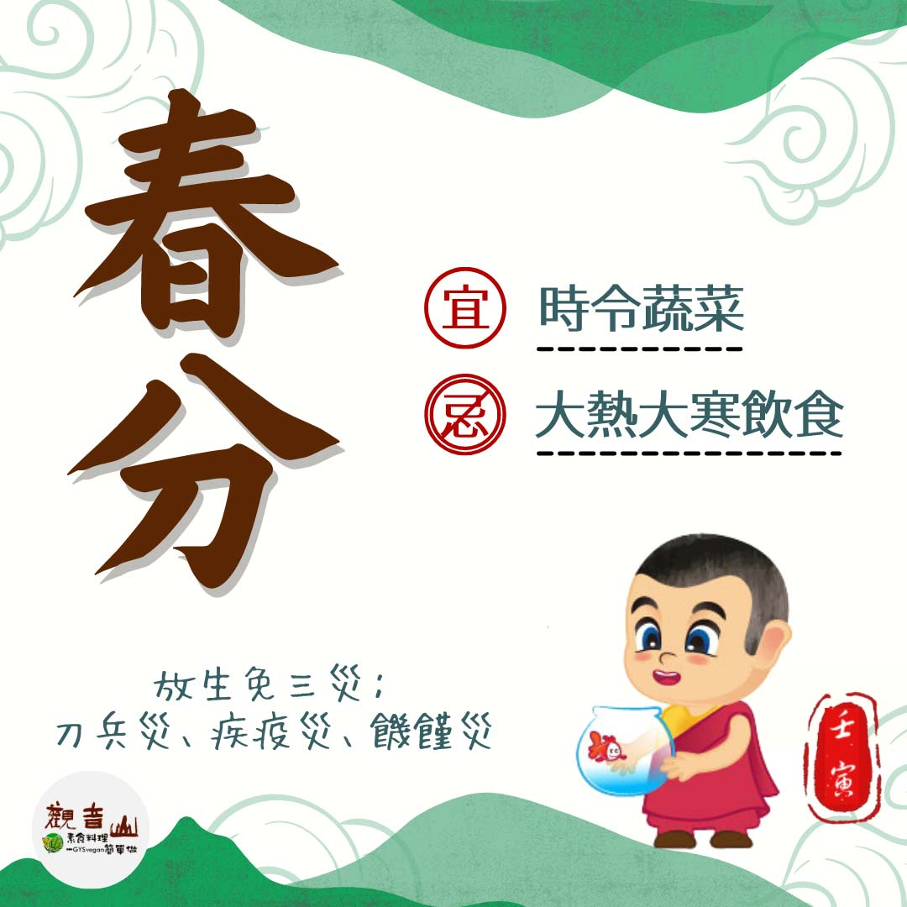

# 二十四節氣— 春分

## 📋 基本資訊 / Recipe Overview
- **料理名稱**：二十四節氣— 春分
- **原始標題**：二十四節氣—【春分】
- **素食流派 / Diet**：全素 Vegan
- **來源平台 / Source**：[觀音山 · 素食料理簡單做](https://vegan.gys.org.tw/spring-equinox20220318/)

## 📖 食譜圖文詳情 (中英雙語對照)

二十四節氣—【春分】​
​
▏春分，日暝對分 ​ ​
「春分」是一年當中晝夜等長的日子，此時氣溫逐漸回暖，百花盛開，農民忙著耕種、果農培育果樹、茶農們忙著採收春茶，萬物生機蓬勃。​
​
▏跟著節氣養生​
春分是調整人體陰陽平衡的重要節氣，此時的天氣變化大，傳染病好發，應多注意保暖，多吃當令新鮮蔬菜、水果，如菠菜、香椿、碗豆、桑葚、草莓，還有多喝綠茶、紅茶、烏龍茶，除了可以養肝、助長陽氣還可提高身體的免疫力。​
​
▏跟著節氣戒殺護生​
春分時節繁花盛開，處處百花齊放，熱鬧非凡的大海也應如此，但隨著人類造成的環境污染以及過度捕撈，連「海中的熱帶雨林」之稱的珊瑚礁生態系也被嚴重破壞，觀音山保育放流，集合眾人的力量，經專業機構輔導，以慈悲的動機，行救海洋生命之實、健全海洋生態體系，讓生命找到出口。​
​
憨山大師云：「放生免三災：刀兵災、疾疫災、饑饉災。」共同響應觀音山保育放流，讓這春分節氣，充滿善的氣息。​
✨慈悲的龍德上師 成立「觀音山蔬食館」提倡健康素食、慈悲護生，以”觀音山素食料理簡單做”的理念，提供多款素食食譜，讓您一學就會！?​
​
​​
觀音山 2022神變月──春季保育放流​
➠
https://bit.ly/33IiD5W​
(線上登記開放至5/30晚上11:59截止)​
​
【跟著節氣養生──相關食譜推薦】​
➠
https://vegan.gys.org.tw/veganblog/solar-terms/​
​
​
▌觀音山近期活動 ▌​
3月3日~4月1日​
▎2022年神變月 祈福專案 ​
►
https://reurl.cc/xO31Me​
​
​
​
? 觀音山 素食料理簡單做 ?​
◎Facebook ｜好文按讚​
https://www.facebook.com/GYSVegan​
​
◎Instagram ｜料理追蹤​
https://www.instagram.com/gysvegan/​
​
◎Youtube ​ ​ ​ ｜加入訂閱​
https://reurl.cc/q8VEqy​
​
◎官方Blog ​ ｜網站推薦​
https://vegan.gys.org.tw/
—​
?歡迎轉載，請註明出處： 觀音山 素食料理簡單做 GYSVegan 素食環保愛地球，健康營養無負擔，慈悲護生一起來~?

---
*食譜歸檔時間：2026-08-20 · 來源：觀音山素食料理簡單做 (vegan.gys.org.tw)*