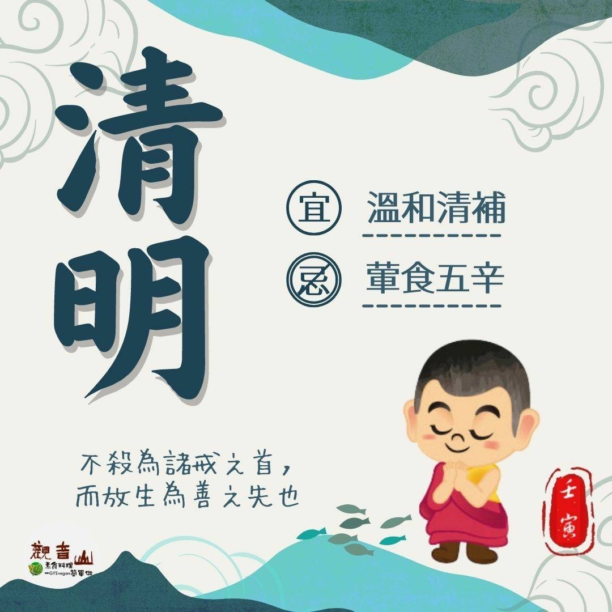

# 二十四節氣— 清明 ​

## 📋 基本資訊 / Recipe Overview
- **料理名稱**：二十四節氣— 清明 ​
- **原始標題**：二十四節氣—【清明】​
- **素食流派 / Diet**：全素 Vegan
- **來源平台 / Source**：[觀音山 · 素食料理簡單做](https://vegan.gys.org.tw/qingming20220404/)

## 📖 食譜圖文詳情 (中英雙語對照)

二十四節氣—【清明】​
​
▏清明時節天轉暖，柳絮紛飛花爭妍 ​ ​
天氣逐漸暖和、花草樹木開始萌芽、大地呈現氣清景明?，故稱之為「清明」，此時亦是重要的民俗節日，「清明時節雨紛紛，路上行人欲斷魂。」時逢清明追思祭祖，應本著「父母生，事之以禮，父母亡，祭之以禮」之精神恪盡孝道，而為人子女應知「孝順」是天經地義的事，懂得孝親報恩才是有福之人。​
​
▏跟著節氣養生​
此時節氣溫多變，易造成心血管疾病以及呼吸道感染，飲食宜溫，以清補為主，適合吃地瓜、白菜、蘿蔔、菠菜、山藥，幫助護肝養胃，多喝牛蒡茶可幫助血糖、血壓的穩定，還有銀耳、薏仁、桑葚、杏仁、黃耆等，都是非常合適的養生食材?。​
​
▏跟著節氣戒殺護生​
天地萬物眾生與我們，在無始以來的輪迴中，皆曾經是我們的父母，今朝放生，等於救自己的親人！末法時期提到放生，周遭就有無數阻撓批評的聲音四起，其實放生只是最單純的一念慈悲心而已，守住「清明」的理智，觀音山保育放流，秉持佛陀的教示，在專業的評估下，以最佳的時間、地點、物種、方法，讓生命回歸大海?。​
​
諦閑大師云：「不殺為諸戒之首，而放生為眾善之先也。」?一同響應觀音山春季保育放流，行聖賢所行，招感加持庇蔭，為己修福消災，積聚廣大功德，為海洋生態復育盡一份心力，促進物種共榮的美好願景。​
​
✨慈悲的龍德上師 成立「觀音山蔬食館」提倡健康素食、慈悲護生，以”觀音山素食料理簡單做”的理念，提供多款素食食譜，讓您一學就會！?​
​
?溫馨五月─愛護海洋‧保育放流活動 ​
立即「搶救懷孕的海鱺媽媽」​
►
https://bit.ly/3ucvUMa
​
​
【跟著節氣養生──相關食譜推薦】​
➠
https://vegan.gys.org.tw/veganblog/solar-terms/​
​
「觀音山 社群樹」一鍵快速前往觀音山 官方相關連結！​
➠
https://fazang.taplink.ws/​
​
​
? 觀音山 素食料理簡單做 ?​ ​
◎Facebook ｜好文按讚​
https://www.facebook.com/GYSVegan
​
​
◎Instagram ｜料理追蹤​
https://www.instagram.com/gysvegan/​
​
◎Youtube ​ ​ ​ ｜加入訂閱​
https://reurl.cc/q8VEqy​
​
◎官方Blog ​ ｜網站推薦​
https://vegan.gys.org.tw/​
—​
?歡迎轉載，請註明出處： 觀音山 素食料理簡單做 GYSVegan 素食環保愛地球，健康營養無負擔，慈悲護生一起來~?

---
*食譜歸檔時間：2026-08-20 · 來源：觀音山素食料理簡單做 (vegan.gys.org.tw)*