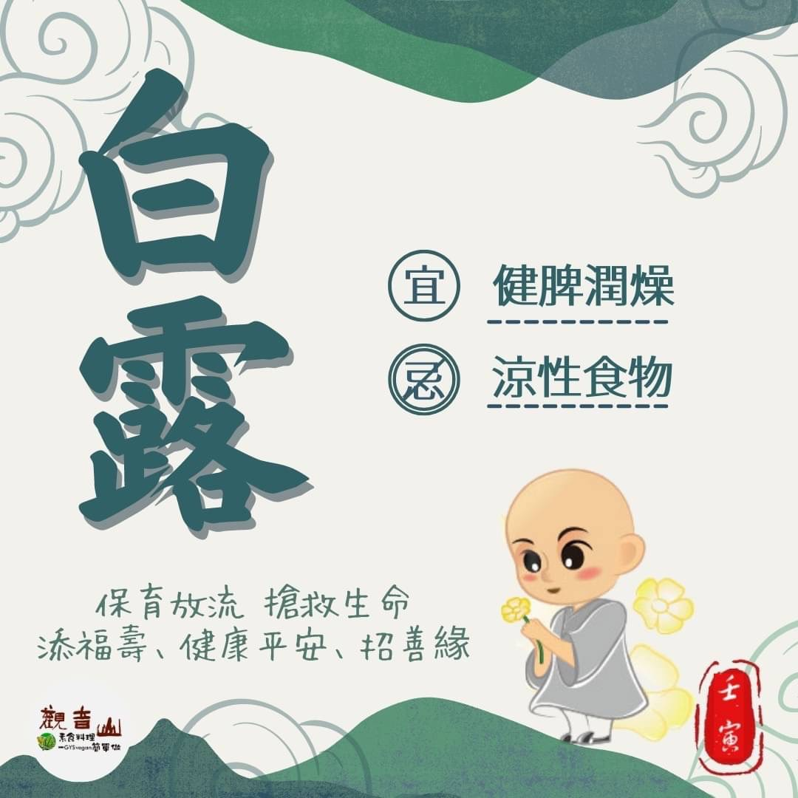

# 二十四節氣— 白露

## 📋 基本資訊 / Recipe Overview
- **料理名稱**：二十四節氣— 白露
- **原始標題**：二十四節氣—【白露】
- **素食流派 / Diet**：全素 Vegan
- **來源平台 / Source**：[觀音山 · 素食料理簡單做](https://vegan.gys.org.tw/bailu20220905/)

## 📖 食譜圖文詳情 (中英雙語對照)

二十四節氣—【白露】​
​
▏涼風至，白露降​
「白露」節氣是秋天最典型的天氣，從這天起夜晚及清晨可見到顆顆清透的露珠附著在植物上?，此時白天氣溫暖和，晚上開始轉涼，日夜溫差漸大，空氣變得乾燥，應多注意呼吸道方面的保養。​
​
▏跟著節氣養生​
中醫養生依循春生、夏長、秋收、冬藏的自然規律，白露時節以健脾潤燥為主，可多攝取銀耳、百合、蓮藕、杏仁、枸杞、山藥、秋葵等；水分多的水果也可以適時補充，如柑橘?、蘋果、梨子、葡萄，而生菜沙拉、瓜果等涼性食物建議少吃，辛辣食物也要避免。​
​
▏跟著節氣戒殺護生​
現代人步調快，生活壓力大，每到節日飲食就無法節制，不僅對身體造成負擔，對資源也是一種浪費；白露節氣之後就是四大傳統節日的「中秋節」，跟親友一起享受溫馨的過節時光，在疫情升溫之下，如何做好防疫、又可以共享佳節呢?​
​
【觀音山 素食料理簡單做】推薦三種中秋佳節必備?素食烤物食譜，既享受動手做佳餚的樂趣又能安心防疫，吃下每口美味素食。​
​
✨慈悲的龍德上師 成立「觀音山蔬食館」提倡健康素食、慈悲護生，以”觀音山素食料理簡單做”的理念，提供多款素食食譜，讓您一學就會！🥰
​
​
⭐️羅勒野菇附迷你烤洋芋｜全素​
https://reurl.cc/QbYdkM​
​
⭐️泡菜烤焗羅｜奶素​
https://reurl.cc/RXY4lx​
​
⭐️烤杏鮑菇佐檸檬奶油醬｜奶素​
https://reurl.cc/kEndYL​
​
​
◎ 觀音山 2022秋季保育放流​
➠
https://bit.ly/3AcPMVC​
​
◎觀音山相關連結​
➠https://www.fazang.org/link/​
​
​
​
🌱 觀音山 素食料理簡單做 🌱​
◎Facebook ｜好文按讚​
https://www.facebook.com/GYSVegan​
​
◎Instagram ｜料理追蹤​https://t.me/GYSVegan
https://www.instagram.com/gysvegan/​
​
◎Youtube ​ ​ ​ ｜加入訂閱​
https://reurl.cc/q8VEqy​
​
◎官方Blog ​ ​ ｜網站推薦​
https://vegan.gys.org.tw/
​
​
​
—​
👑歡迎轉載，請註明出處： 觀音山 素食料理簡單做 GYSVegan 素食環保愛地球，健康營養無負擔，慈悲護生一起來~😊

---
*食譜歸檔時間：2026-08-20 · 來源：觀音山素食料理簡單做 (vegan.gys.org.tw)*