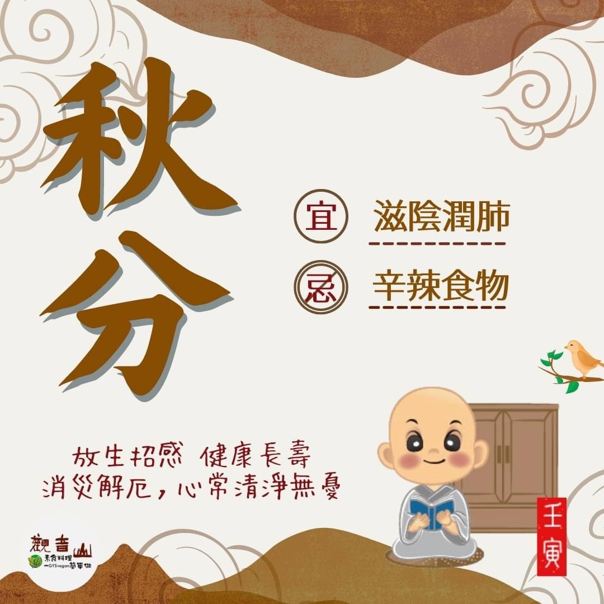

# 二十四節氣— 秋分

## 📋 基本資訊 / Recipe Overview
- **料理名稱**：二十四節氣— 秋分
- **原始標題**：二十四節氣—【秋分】
- **素食流派 / Diet**：全素 Vegan
- **來源平台 / Source**：[觀音山 · 素食料理簡單做](https://vegan.gys.org.tw/autumnal-equinox20220923/)

## 📖 食譜圖文詳情 (中英雙語對照)

二十四節氣—【秋分】
​
▏秋分氣初爽，燈火新照夜
秋分是秋天的第四個節氣，這天陽光直射地球赤道，晝夜相等，是反映季節變化的重要節氣。天氣方面開始轉涼，悶熱潮濕的暑氣漸漸消失，空氣變得乾燥。秋高氣爽正是此時最佳的寫照，紅通通的柿子增添了秋天的色彩，令人心情愉悅。
​
▏跟著節氣養生
秋分養生之道首要注意涼燥現象，因為天氣轉涼，人體新陳代謝趨緩，加上原本就有過敏及呼吸道不適的人，常會出現口乾舌燥、乾咳症狀；飲食上多吃滋陰潤肺的食材，如銀耳、百合、核桃、蓮藕、芝麻、蘋果、葡萄、柑橘🍊、梨子等；辛辣食物易傷肺氣，因此應該少吃。
​
▏跟著節氣戒殺護生
秋天天氣涼爽宜人，是最適合養生的季節，但現代生活型態快速、失調，容易造成各種文明病，透過自身食素、忌口、斷食等方式，當成保健之道，並積極地護生，以慈悲救護所有的動物，才能創造出健康長壽的因緣。
​
觀音山『秋季』保育放流，配合各縣市政府的申請、輔導，以銀塔鐘螺、黃錫鯛、九孔、四絲馬鮁、澎湖海鱺 ​ 等為主要復育的對象。欲得長壽，首重戒殺護生，邀請大眾一起來參與海洋復育。
​
​
◎觀音山 2022秋季保育放流
➠
https://bit.ly/3AcPMVC
​
◎跟著節氣養生──相關食譜推薦
➠
https://bit.ly/3qzPjH5
​
◎觀音山相關連結
➠
https://www.fazang.org/link/
​
​
🌱  觀音山 素食料理簡單做 🌱​
◎Facebook ｜好文按讚​
https://www.facebook.com/GYSVegan​
​
◎Instagram ｜料理追蹤​https://t.me/GYSVegan
https://www.instagram.com/gysvegan/​
​
◎Youtube ​ ​ ​ ｜加入訂閱​
https://reurl.cc/q8VEqy​
​
◎官方Blog ​ ​ ｜網站推薦​
https://vegan.gys.org.tw/​
​
​
—​
👑歡迎轉載，請註明出處： 觀音山 素食料理簡單做 GYSVegan 素食環保愛地球，健康營養無負擔，慈悲護生一起來~🥰

---
*食譜歸檔時間：2026-08-20 · 來源：觀音山素食料理簡單做 (vegan.gys.org.tw)*