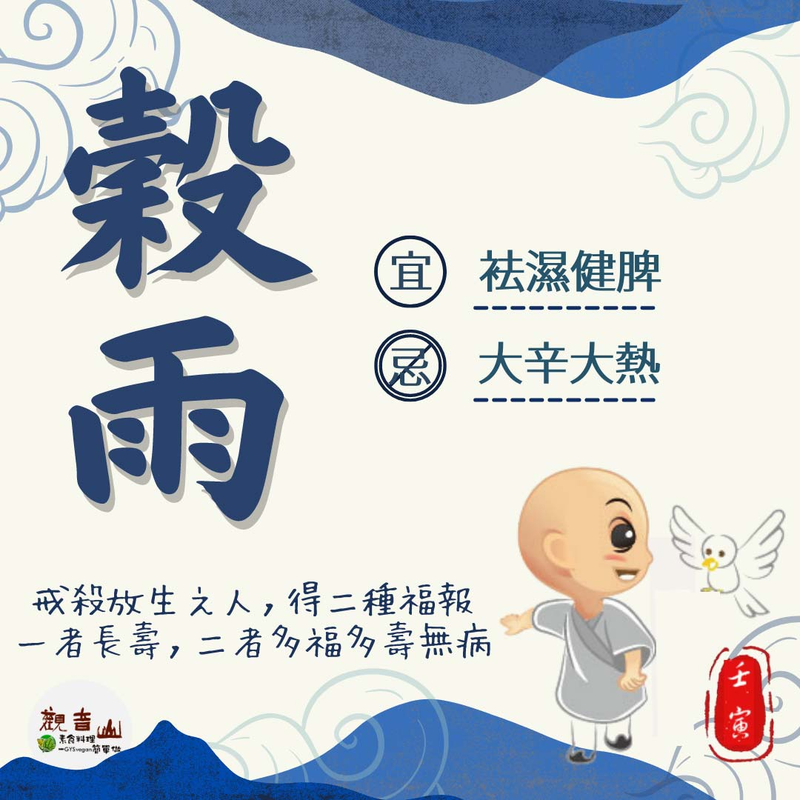

# 二十四節氣— 穀雨

## 📋 基本資訊 / Recipe Overview
- **料理名稱**：二十四節氣— 穀雨
- **原始標題**：二十四節氣—【穀雨】
- **素食流派 / Diet**：全素 Vegan
- **來源平台 / Source**：[觀音山 · 素食料理簡單做](https://vegan.gys.org.tw/guyu20220418/)

## 📖 食譜圖文詳情 (中英雙語對照)

二十四節氣—【穀雨】​
​
▏雨生百穀春已暮，柳絮紛飛夏將至​
穀雨是春季最後一個節氣，農民剛春耕完，秧苗期盼著雨水的潤澤，「穀得雨而生也」，雨水增多，正是莊稼生長的最佳時節。​
​
▏跟著節氣養生​
因為雨水充足、溫差大，氣候潮濕，養生著重在「袪濕健脾」，可適量食用綠豆、山藥、薏仁、小麥、香椿、桑葚、黃豆芽、番茄等，飲食方面應以清淡為主，不宜大辛大熱，適逢季節交替，亦是各種疾病好發的時候，多食用當季蔬果養生，配合適量運動，提升免疫力，才是養生之道。​
​
▏跟著節氣戒殺護生​
「梭子蟹」是人人都讚不絕口的鮮美料理，穀雨前後(約四月中旬)的蟹是最豐滿、蟹黃色艷味香，幾乎沒有吃素的人，無一沒有未吃過蟹之料理。慈悲 龍德上師曾開示水族蝦蟹類的瞋恨心極強，我們一生不知道吃了多少，和牠們結了多少命債。現在跟隨觀音山保育放流的腳步，參與施放成蟹與蟹苗，這是懺罪消業、累積功德大好的機會。​
​
由於過度捕撈，導致海洋自然生長的梭子蟹日益減少，為此政府積極推動復育，此亦為澎湖縣府年度重點工作之一。每隻雌蟹在繁殖季節能產2～3次卵，總數約幾十萬至二百萬粒卵者皆有。觀音山透過與水試所配合，將繁殖成功的梭子蟹苗進行海放，讓牠們重回大海的懷抱，自由徜徉在海洋裡。​
​
​✨慈悲的龍德上師 成立「觀音山蔬食館」提倡健康素食、慈悲護生，以”觀音山素食料理簡單做”的理念，提供多款素食食譜，讓您一學就會！🥰
✨春季保育放流──搶救梭子蟹、鱟、嘉鱲​
前往救護生命➠
https://bit.ly/3rpDrIL​
​
【跟著節氣養生──相關食譜推薦】​
➠
https://vegan.gys.org.tw/veganblog/solar-terms/​
​
「觀音山 社群樹」一鍵快速前往觀音山 官方相關連結！​
➠ ​
https://fazang.taplink.ws/​
​
🌱觀音山 素食料理簡單做 ​🌱
◎Facebook ｜好文按讚​
https://www.facebook.com/GYSVegan​
​
◎Instagram ｜料理追蹤​
https://www.instagram.com/gysvegan/​
​
◎Youtube ​ ​ ​ ｜加入訂閱​
https://reurl.cc/q8VEqy​
​
◎官方Blog ​ ​ ｜網站推薦​
https://vegan.gys.org.tw/​
​
—​
👑歡迎轉載，請註明出處： 觀音山 素食料理簡單做 GYSVegan 素食環保愛地球，健康營養無負擔，慈悲護生一起來~😊

---
*食譜歸檔時間：2026-08-20 · 來源：觀音山素食料理簡單做 (vegan.gys.org.tw)*