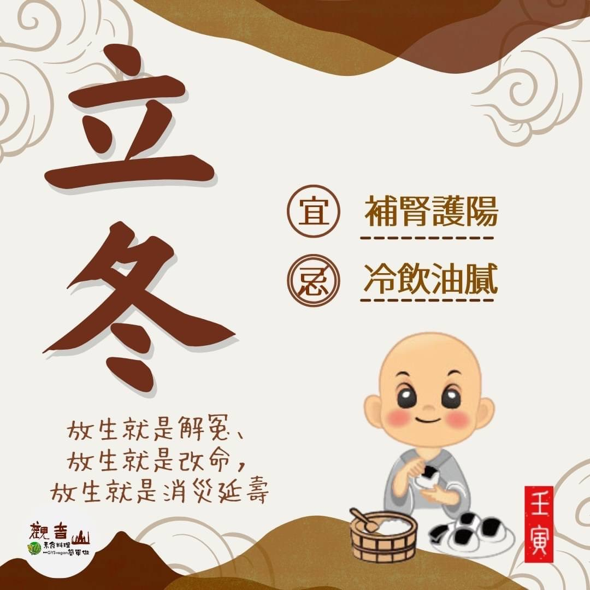

# 二十四節氣— 立冬

## 📋 基本資訊 / Recipe Overview
- **料理名稱**：二十四節氣— 立冬
- **原始標題**：二十四節氣—【立冬】
- **素食流派 / Diet**：全素 Vegan
- **來源平台 / Source**：[觀音山 · 素食料理簡單做](https://vegan.gys.org.tw/beginning-of-winter20221107/)

## 📖 食譜圖文詳情 (中英雙語對照)

二十四節氣—【立冬】
▏立冬進補須節制，蔬食平補最健康
秋去冬來，立冬是冬季的第一個節氣，農夫將作物冬藏，萬物蟄伏以收養，此時有進補的習俗，希望能為寒冬保存體力，而現代人大多營養過剩，最須以蔬食平補方式來調整體質，方是抵禦寒冬的養生良方；冬季新陳代謝慢，老年人較容易有心血管方面的問題，應多關心家中長輩的保暖。
​
▏跟著節氣養生
立冬是補冬的好時機，養生以補腎護陽為主，可多食用黑色食材滋補，如黑米、黑豆、黑木耳、黑芝麻等；此時節✍推薦的養生食材有：山藥、菠菜、大白菜、馬鈴薯、紅棗、桂圓、柿子、梨子、葡萄等，飲食不可貪涼及太過油膩；冬季體內臟腑氣血循環旺盛，食量增大，應注意飲食並適當運動。
​
▏跟著節氣戒殺護生
全球暖化，在台灣最明顯的感受就是，冬天越來越短了，每個人都會因為生活型態而傷害地球，進而剝奪其他生命「活」的權利，日益嚴重的環境問題，總要有人開始改變，如同觀音山 保育放流𓆟，傳達一種平衡和諧的生活態度，學習愛護地球、守護生命，敬邀十方大眾能共同響應，成為改變世界的先驅者。
​
𓆟 觀音山 2022秋季保育放流
➠
https://bit.ly/3AcPMVC
​
​
觀音山素食料理簡單做
推薦當季立冬節氣料理 食譜
​
電鍋料理｜素食補肉骨茶湯｜全素 ​ ​
http://bit.ly/3UscqAl
麻油竹笙猴菇鍋｜全素
http://bit.ly/3FISO6P
​
跟著節氣養生──相關食譜推薦
➠
http://bit.ly/3FKnZ1A
觀音山相關連結
➠
https://www.fazang.org/link/
​
—
♛歡迎轉載，請註明出處： ​ #觀音山素食料理簡單做 GYSVegan按讚、留言設定搶先看! 素食環保愛地球，健康營養無負擔，慈悲護生一起來~

---
*食譜歸檔時間：2026-08-20 · 來源：觀音山素食料理簡單做 (vegan.gys.org.tw)*