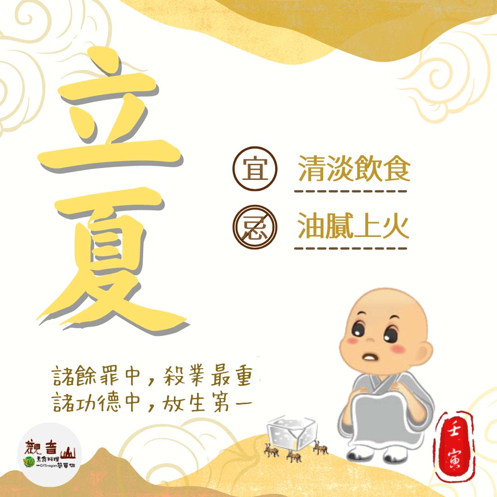

# 二十四節氣— 立夏

## 📋 基本資訊 / Recipe Overview
- **料理名稱**：二十四節氣— 立夏
- **原始標題**：二十四節氣—【立夏】
- **素食流派 / Diet**：全素 Vegan
- **來源平台 / Source**：[觀音山 · 素食料理簡單做](https://vegan.gys.org.tw/beginning-of-summer20220502/)

## 📖 食譜圖文詳情 (中英雙語對照)

二十四節氣—【立夏】​
​
▏四時天氣促相催，一夜薰風帶暑來​
立夏的到來，開啟了夏天的序幕，氣溫漸漸升高，雷雨增多，作物進入成長的旺季。此時是康乃馨盛產的季節，別忘了為母親獻上滿滿的祝福，感謝母親的辛勞。​
​
每年的農曆四月初八，是佛教教主 本師釋迦牟尼佛聖誕，各地寺廟皆會盛大舉辦浴佛活動，「浴佛」的動作看似簡單，卻蘊含深刻的慈悲寓意，以淨水灌沐佛身，洗濯種種塵世的垢染，清淨自身的身語意。​
​
▏跟著節氣養生​
立夏時節，屬於春夏交替，心氣漸強，以增酸減苦、補腎助肝為養生原則，酸味食物有番茄、檸檬、葡萄、木瓜、山楂、草莓等，若要以中藥調理，百合、生地、桂圓、丹參都是很好的選擇；飲食宜清淡， 避免油膩、上火的食物，多食用富含維生素的蔬果。​
​
▏跟著節氣戒殺護生​
立夏剛進入夏季，第一個節日就是母親節，而海洋為地球之母，眾多海洋生物在此刻進入繁殖的季節，其中最需要母親節祝福的就是在「大型箱網」中的海鱺媽媽?，一隻成年的母海鱺腹中的魚卵高達300萬個，讓牠們回歸大海免於被宰殺烹烤，就是最好的禮物。​
​
觀音山發起「搶救懷孕的海鱺媽媽」愛護海洋．保育放流計畫，希望大家共同來搶救海鱺媽媽腹裡的生命，為復育海洋生態盡一份心力。​
​
✨慈悲的龍德上師 成立「觀音山蔬食館」提倡健康素食、慈悲護生，以”觀音山素食料理簡單做”的理念，提供多款素食食譜，讓您一學就會！🥰​
​
✨溫馨五月─愛護海洋‧保育放流活動 ​
立即「搶救懷孕的海鱺媽媽」​
►
https://bit.ly/3JHM33x​
​
【跟著節氣養生──相關食譜推薦】​
➠
https://vegan.gys.org.tw/veganblog/solar-terms/​
​
​
🌱 觀音山 素食料理簡單做🌱
◎Facebook ｜好文按讚​
https://www.facebook.com/GYSVegan​
​
◎Instagram ｜料理追蹤​
https://www.instagram.com/gysvegan/​
​
◎Youtube ​ ​ ​ ｜加入訂閱​
https://reurl.cc/q8VEqy​
​
◎官方Blog ​ ​ ｜網站推薦​
https://vegan.gys.org.tw/​
​
​
—​
👑歡迎轉載，請註明出處： 觀音山 素食料理簡單做 GYSVegan 素食環保愛地球，健康營養無負擔，慈悲護生一起來~😊

---
*食譜歸檔時間：2026-08-20 · 來源：觀音山素食料理簡單做 (vegan.gys.org.tw)*