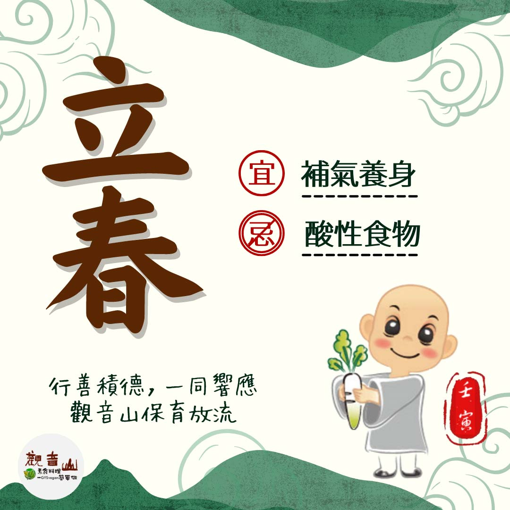

# 二十四節氣— 立春

## 📋 基本資訊 / Recipe Overview
- **料理名稱**：二十四節氣— 立春
- **原始標題**：二十四節氣—【立春】
- **素食流派 / Diet**：全素 Vegan
- **來源平台 / Source**：[觀音山 · 素食料理簡單做](https://vegan.gys.org.tw/beginning-of-spring20220404/)

## 📖 食譜圖文詳情 (中英雙語對照)

二十四節氣—【立春】​
​
▏立春一日，百草回芽​
一年之計在於春，立春是二十四節氣中的第一個節氣，揭開了春天的序幕，萬物復甦，萬物欣欣向榮。​
​
▏跟著節氣養生​
冬天蔬菜種類相對少，經過冬天和農曆過年，許多民眾可能都進補過度而囤積了不少脂肪，維生素攝取顯得不足，所以立春時可以多攝取蔬菜、野菜類。立春飲食可偏重「補氣」食材，如人蔘、黃芪；紅棗、薏米…補氣養血，都是很好的補體內陽氣的食材。​
​
▏跟著節氣戒殺護生​
立春升發體內陽氣，除了積極行善積德，可助升發體內陽氣，一同響應觀音山保育放流，不同放流物種有各自適合放流的季節與棲地，保育放流也要選對時間，讓物命平安回歸大海。​
​
【觀音山 2022神變月──冬季保育放流】 ​
共同拯救更多生靈守護海洋平衡​
➠
https://bit.ly/33IiD5W​
(登記至2/28晚上12點前截止)​
​
【跟著節氣養生──相關食譜推薦】​
➠
https://vegan.gys.org.tw/veganblog/solar-terms/​
​
​
?  觀音山 素食料理簡單做 ?
◎Facebook ｜好文按讚​
http://www.facebook.com/GYSVegan​
​
◎lnstagram ｜料理追蹤​
http://www.instagram.com/gysvegan/​
​
◎Youtube ｜加入訂閱​
https://reurl.cc/q8VEqy​
​
◎Telegram ｜頻道推薦​
https://t.me/GYSVegan​
​
—​
?歡迎轉載，請註明出處： 觀音山 素食料理簡單做 GYSVegan 素食環保愛地球，健康營養無負擔，慈悲護生一起來~?

---
*食譜歸檔時間：2026-08-20 · 來源：觀音山素食料理簡單做 (vegan.gys.org.tw)*