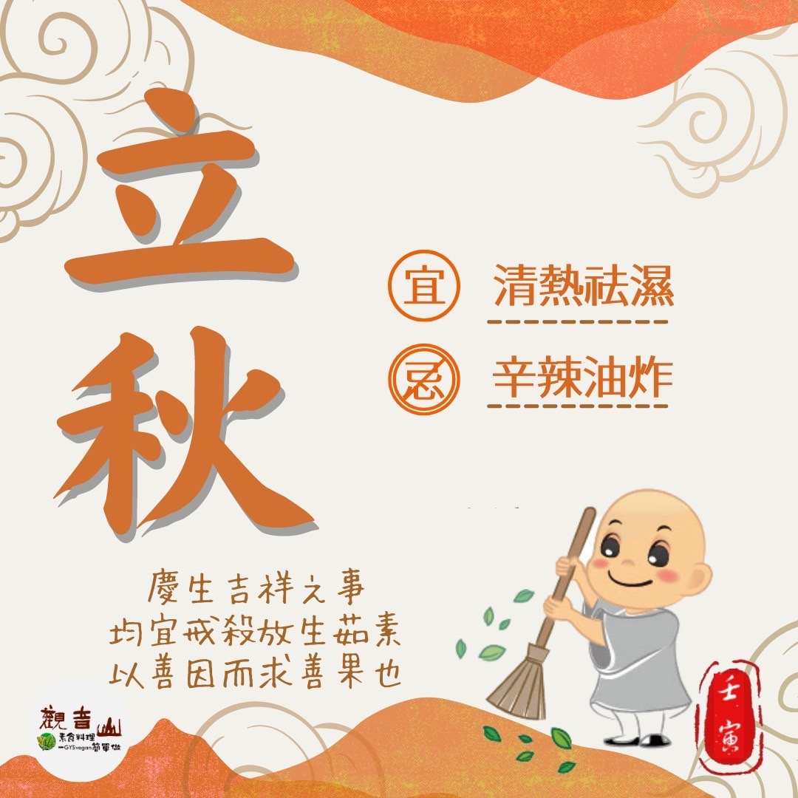

# 二十四節氣— 立秋 ​

## 📋 基本資訊 / Recipe Overview
- **料理名稱**：二十四節氣— 立秋 ​
- **原始標題**：二十四節氣—【立秋】​
- **素食流派 / Diet**：全素 Vegan
- **來源平台 / Source**：[觀音山 · 素食料理簡單做](https://vegan.gys.org.tw/beginning-of-autumn20220805/)

## 📖 食譜圖文詳情 (中英雙語對照)

二十四節氣—【立秋】​
​
▏雲天收夏色，木葉動秋聲​
「立秋」是進入秋季的第一個節氣，對於以農業立國的我們相當重要，依照農民智慧經驗，如果立秋這天下雨，則表示今年秋天雨水充足，是一個豐收的好年；仔細觀察萬物變化，可發現大自然的奧妙，清風吹來、樹木開始落葉，就可以知道涼爽的秋天來臨了。​
​
▏跟著節氣養生​
立秋雖然是秋天的第一個節氣，但天氣依然炎熱，體內容易溼氣、燥熱俱重，故仍以養心健脾、清熱祛濕為主，適合的食材有百合、芥菜、蘿蔔、香蕉、梨、柿子等，且應避免吃辛辣、油炸食品；此時亦是最適宜進補的時節，可多食用各式粥品，特別是豆類，不僅可補充優質蛋白質並有養脾袪濕之效，相關的粥品如紅豆、綠豆、小麥、黑米、蓮子粥等，對身體皆十分有益。​
​
▏跟著節氣戒殺護生​
一般立秋之後，魚群為冬季做準備食慾增加，覓食活動頻繁；許多捕魚業者、釣客也會於節氣後期待漁獲豐收；而近年來，氣候變遷對於海洋漁業造成嚴重衝擊，漁獲捕獲量大幅減少，過度捕撈也讓海裡的小魚，來不及長大就被捕撈殆盡，海洋資源嚴重枯竭，拯救海洋物種的多樣性刻不容緩！立秋不應再是漁獲豐收的節氣，響應觀音山保育放流，一同守護海洋生生不息！​
✨慈悲的龍德上師 成立「觀音山蔬食館」提倡健康素食、慈悲護生，以”觀音山素食料理簡單做”的理念，提供多款素食食譜，讓您一學就會！🥰​
​
​
◎觀音山 2022夏季保育放流​
➠
https://bit.ly/3AcPMVC
◎跟著節氣養生──相關食譜推薦​
➠
https://vegan.gys.org.tw/beginning-of-autumn-20210801/​
​
◎觀音山相關連結​
➠
https://www.fazang.org/link/
​
​
​
🌱觀音山 素食料理簡單做🌱
◎Facebook ｜好文按讚​
https://www.facebook.com/GYSVegan​
​
◎Instagram ｜料理追蹤​
https://www.instagram.com/gysvegan/​
​
◎Youtube ​ ​ ​ ｜加入訂閱​
https://t.me/GYSVegan​
​
◎官方Blog ​ ​ ｜網站推薦​
​
https://t.me/GYSVegan​
​
—​
👑歡迎轉載，請註明出處： 觀音山素食料理簡單做 GYSVegan 素食環保愛地球，健康營養無負擔，慈悲護生一起來~😊

---
*食譜歸檔時間：2026-08-20 · 來源：觀音山素食料理簡單做 (vegan.gys.org.tw)*