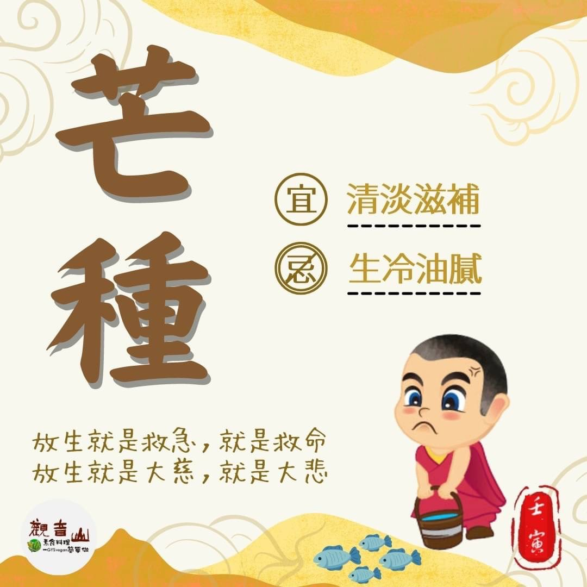

# 二十四節氣— 芒種

## 📋 基本資訊 / Recipe Overview
- **料理名稱**：二十四節氣— 芒種
- **原始標題**：二十四節氣—【芒種】
- **素食流派 / Diet**：全素 Vegan
- **來源平台 / Source**：[觀音山 · 素食料理簡單做](https://vegan.gys.org.tw/awn20220604/)

## 📖 食譜圖文詳情 (中英雙語對照)

二十四節氣—【芒種】​
​
▏芒種逢雷美亦然，端陽有雨是豐年​
稻子吐穗結實，稻穀上長出細芒，故稱為「芒種」；氣溫高、多午後雷陣雨⛈是這個節氣的特點，此時一般的花朵不易生長，唯有池裡的荷花盛開，具有獨特的風貌。​
​
▏跟著節氣養生​
芒種時節，空氣潮濕且天氣悶熱，易使人精神不振、沒有胃口，飲食要以「清淡滋補」為原則，多食用當季的蔬果以促進食欲並補充身體水分，如苦瓜、芥藍、蕎麥、絲瓜、木耳、秋葵、番茄、西瓜、水梨等。​
​
農曆五月乃陰陽相爭死生分判之時，是最為需要多加注意節制身心的月份，農曆五月初五、初六、初七、十五、十六、十七以及二五、二六、二七，這九天稱為「九毒日」，在農曆九毒日倘能色慾撙節，百病可消除!若是能夠全月不行房，對身心有極大好處。​
​
▏跟著節氣戒殺護生​
海洋為我們調節氣候、供應氧氣，地球一半以上的生物都以海洋為家，想像中漫步海灘與魚群嬉戲的場景早已不復存在，6月8日是世界海洋日，身為地球公民的我們責無旁貸，用心去了解這過度捕撈、垃圾汙染、海洋酸化的原因，真心守護這美麗的海洋。​
​
地球上的生命息息相關，牽一髮而動全身，現代自然環境與海洋生態，遭到許多的汙染與破壞，需要地球公民來共同守護。觀音山配合政府政策共同參與保育放流活動，推動救贖物命，饒益有情的慈悲善行，不僅廣結善緣，具無量功德，更具有時代性的意義。​
​
​
◎觀音山 2022夏季保育放流​
➠
https://reurl.cc/mozvy7​
​
【跟著節氣養生──相關食譜推薦】​
➠
https://vegan.gys.org.tw/veganblog/solar-terms/​
​
「觀音山 社群」一鍵快速前往觀音山 官方相關連結！​
➠
https://www.fazang.org/link/​
​
​
🌱 觀音山 素食料理簡單做 🌱​
◎Facebook ｜好文按讚​
https://www.facebook.com/GYSVegan​
​
◎Instagram ｜料理追蹤​
https://www.instagram.com/gysvegan/​
​
◎Youtube ​ ​ ​ ｜加入訂閱​
https://reurl.cc/q8VEqy​
​
◎官方Blog ​ ​ ｜網站推薦​
https://vegan.gys.org.tw/​
​
​
—​
👑歡迎轉載，請註明出處： 觀音山 素食料理簡單做 GYSVegan 素食環保愛地球，健康營養無負擔，慈悲護生一起來~😊

---
*食譜歸檔時間：2026-08-20 · 來源：觀音山素食料理簡單做 (vegan.gys.org.tw)*