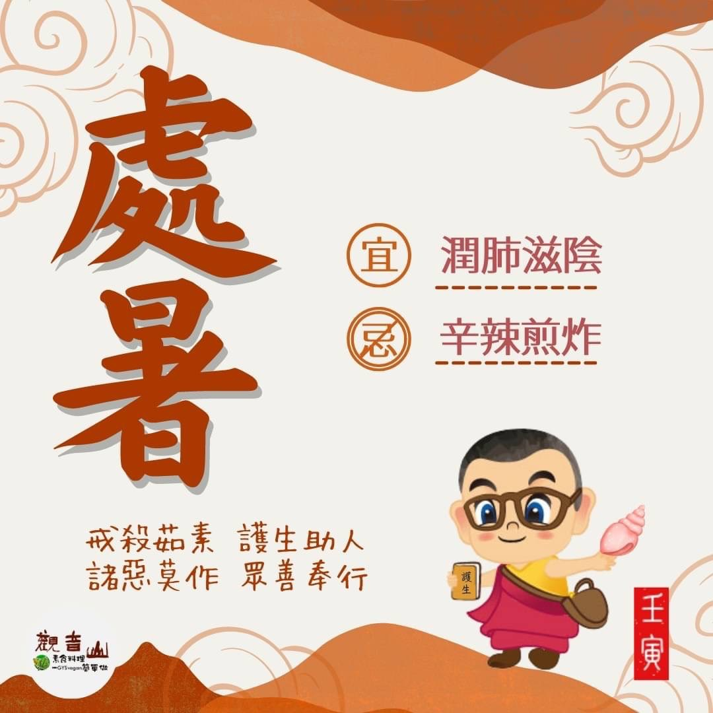

# 二十四節氣— 處暑 ​

## 📋 基本資訊 / Recipe Overview
- **料理名稱**：二十四節氣— 處暑 ​
- **原始標題**：二十四節氣—【處暑】​
- **素食流派 / Diet**：全素 Vegan
- **來源平台 / Source**：[觀音山 · 素食料理簡單做](https://vegan.gys.org.tw/summer-heat20220822/)

## 📖 食譜圖文詳情 (中英雙語對照)

二十四節氣—【處暑】​
​
▏離離暑雲散，裊裊涼風起​
「處暑」是秋天第二個節氣，處有終止的含意，表示揮汗如雨的炎夏將結束，暑氣到此打住、逐漸消除，準備迎來清爽的秋風；處暑正處於由熱轉涼的交替時期，所以身體容易產生疲乏感，俗稱「秋乏」，正常的作息以及適當的運動?‍♂️，可以改善此狀況。​
​
​
▏跟著節氣養生​
涼熱交替的節氣，飲食原則以甘平為主，適合的蔬果有菠菜、豆芽菜、芹菜、胡蘿蔔、茄子?、龍眼、柚子、枇杷等；秋季氣候偏乾燥，肺臟容易受影響，此時可以將中藥材白合、蓮子、銀耳、水梨入菜來調養，以達到「潤肺滋陰」之效，並應避免辛辣、煎炸類食物。​
​
▏跟著節氣戒殺護生​
萬物始於春而成於秋，四季應時循環，生命自有其順應之道，而今年的夏季節氣，世界各地又打破高溫紀錄?，極端高溫造成疾病和死亡的災難，氣候變遷之劇烈已遠超乎我們的想像。​
​
想要健康生活、生態永續，就應該順應天理，積極修復我們的地球?，加強海洋生態保育，維持物種多樣性，觀音山與專業機構合作，透過專家們的指導，以正確的方式進行保育放流，維繫海洋生態系的完整，?邀請您響應「觀音山夏季保育放流」貢獻自己的一份心力幫助地球降溫。​
​
✨慈悲的龍德上師 成立「觀音山蔬食館」提倡健康素食、慈悲護生，以”觀音山素食料理簡單做”的理念，提供多款素食食譜，讓您一學就會！🥰
​
​
◎觀音山 2022夏季保育放流​
➠https://bit.ly/3AcPMVC​
​
◎跟著節氣養生──相關食譜推薦​
➠https://bit.ly/3zEukHj​
​
◎觀音山相關連結​
➠https://www.fazang.org/link/​
​
​
​
🌱觀音山 素食料理簡單做 🌱
◎Facebook ｜好文按讚​
https://www.facebook.com/GYSVegan​
​
◎Instagram ｜料理追蹤​
https://www.instagram.com/gysvegan/
​
​
◎Youtube ​ ​ ​ ｜加入訂閱​
https://t.me/GYSVegan​
​
◎官方Blog ​ ​ ｜網站推薦​
https://t.me/GYSVegan​
​
—​
👑歡迎轉載，請註明出處： 觀音山素食料理簡單做 GYSVegan 素食環保愛地球，健康營養無負擔，慈悲護生一起來~😊

---
*食譜歸檔時間：2026-08-20 · 來源：觀音山素食料理簡單做 (vegan.gys.org.tw)*