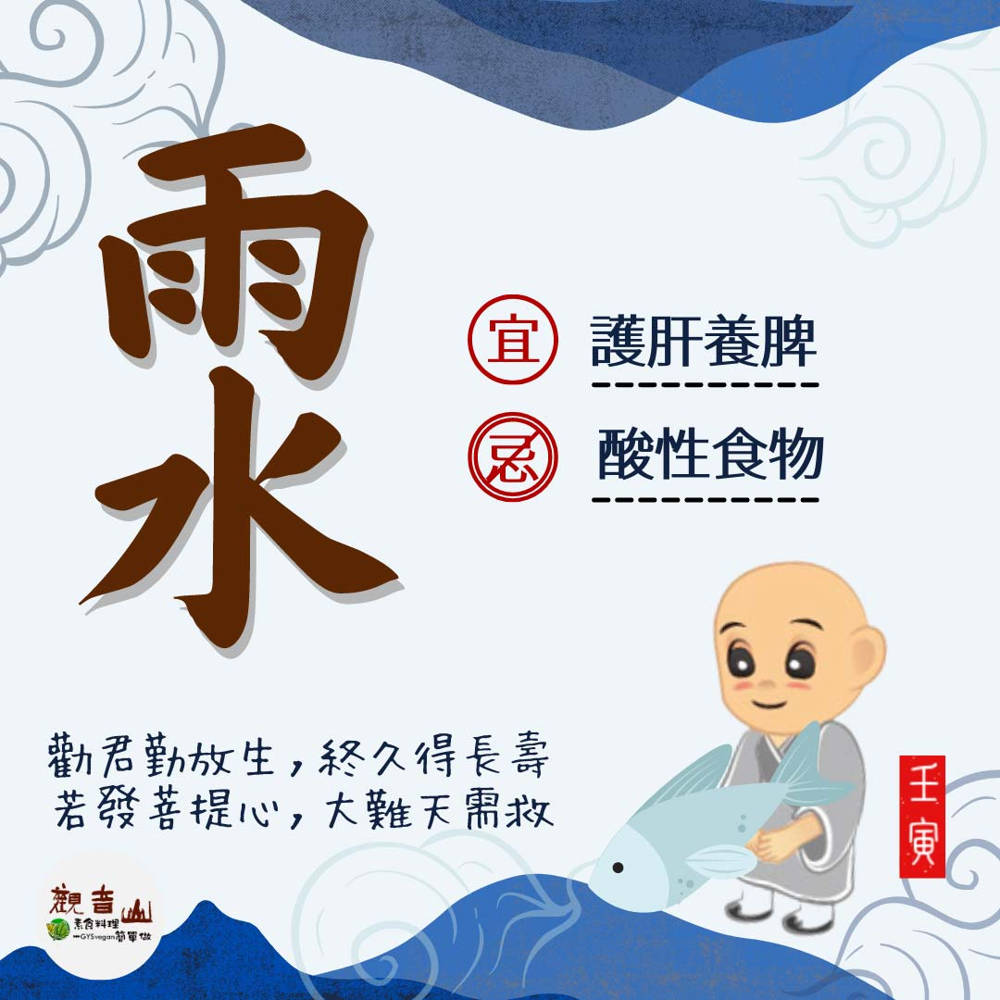

# 二十四節氣— 雨水 ​

## 📋 基本資訊 / Recipe Overview
- **料理名稱**：二十四節氣— 雨水 ​
- **原始標題**：二十四節氣—【雨水】​
- **素食流派 / Diet**：全素 Vegan
- **來源平台 / Source**：[觀音山 · 素食料理簡單做](https://vegan.gys.org.tw/rainwater20220214/)

## 📖 食譜圖文詳情 (中英雙語對照)

▏雨水連綿是豐年​
立春之後，農民開始耕種，此時最期盼有雨水的澆灌，使作物茁壯成長，雨後的春天花開、葉綠，充滿著蓬勃的生機。​
​
▏跟著節氣養生​
雨水時節氣溫依然偏低，應多活絡筋骨，促進身體循環，增長體內陽氣☀；春節養生著重「護肝養脾」，宜少吃酸味，多食用新鮮綠色蔬菜、水果以及熱粥，適合養生的食材有百合、山藥、蘿蔔、芋頭、桂圓、紅棗、銀耳…；保持愉悅、樂觀的心情，也是養肝的重要關鍵。​
​
▏跟著節氣戒殺護生​
雨水時節，帶來降雨讓大地回春，許多魚種也會在這樣水溫適中、食物充沛的時節產卵，繁衍下一代；本次保育放流施放小丑魚、黃錫鯛、海膽，有助於穩定海洋生態物種的多樣性，亦可維持海洋生態的平衡。​
​
一同響應觀音山合法保育放流，遵守國家相關政策，經專業機構輔導，進行合法保育放流，在對的時間施放對的物種，同時確保生靈存活率。​
​
✨慈悲的龍德上師 成立「觀音山蔬食館」提倡健康素食、慈悲護生，以”觀音山素食料理簡單做”的理念，提供多款素食食譜，讓您一學就會！​?
【觀音山 2022神變月──冬季保育放流】 ​
共同拯救更多生靈?守護海洋平衡​
➠
https://bit.ly/33IiD5W​
(登記至2/28晚上12點前截止)​
​
【跟著節氣養生──相關食譜推薦】​
➠
https://vegan.gys.org.tw/veganblog/solar-terms/​
​
​
? 觀音山 素食料理簡單做 ?​
◎Facebook ｜好文按讚​
http://www.facebook.com/GYSVegan​
​
◎lnstagram ｜料理追蹤​
http://www.instagram.com/gysvegan/​
​
◎Youtube ｜加入訂閱​
https://reurl.cc/q8VEqy​
​
◎Telegram ｜頻道推薦​
https://t.me/GYSVegan​
​
—​
?歡迎轉載，請註明出處： 觀音山 素食料理簡單做 GYSVegan 素食環保愛地球，健康營養無負擔，慈悲護生一起來~?

---
*食譜歸檔時間：2026-08-20 · 來源：觀音山素食料理簡單做 (vegan.gys.org.tw)*