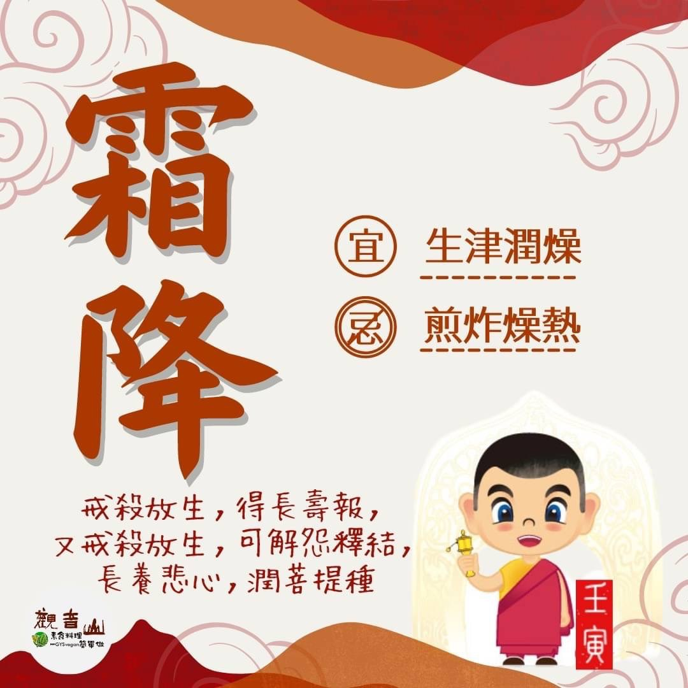

# 二十四節氣— 霜降

## 📋 基本資訊 / Recipe Overview
- **料理名稱**：二十四節氣— 霜降
- **原始標題**：二十四節氣—【霜降】
- **素食流派 / Diet**：全素 Vegan
- **來源平台 / Source**：[觀音山 · 素食料理簡單做](https://vegan.gys.org.tw/frostfall20221021/)

## 📖 食譜圖文詳情 (中英雙語對照)

二十四節氣—【霜降】
​
▏芒種黃豆夏至秧，想種好麥迎霜降
霜降，秋季最後一個節氣，表示天氣由涼轉冷，地面上的水氣凝結為霜。此時楓葉由綠轉紅🍁、芒花盛開，呈現出秋天的繽紛景色，農夫們依照前人的智慧，開始播種合適的作物，好不熱鬧；秋季乾燥易造成皮膚以及呼吸道疾病，應提前做好保護。
​
▏跟著節氣養生
霜降節氣的乾燥氣候，常出現口舌乾燥等秋燥症狀，中醫認為養生關鍵在於養肺與潤燥，建議多吃能生津潤燥的食材，📝如蓮藕、山藥、百合、蘿蔔、銀耳、蘋果、梨、柿子等，都是很適合的食物；忌辛辣刺激、煎炸燥熱，避免加劇秋燥的狀況。適當運動以提高肺部活力，才能抵抗感冒等疾病干擾。
​
▏跟著節氣戒殺護生
秋天陸地上花海盛開，是最適合賞景的季節；大海裡，魚兒為了避冬，開始覓食儲存能量，旺盛的活動力帶給大海一股能量🥰，此時正是「九孔螺」繁殖的季節，但捕撈以及環境污染等因素，造成九孔螺大量減少，而這只是其中的一例而已，海洋復育需要大家一同響應護持。
​
觀音山保育放流，與專業機構合作、遵守國家相關政策，依不同魚類的生長環境與條件，而進行魚苗的放流🐠，活化海洋生態，加入復育的行列，讓秋天的海洋更有生命力。
​
🐠 觀音山 2022秋季保育放流
➠
https://bit.ly/3AcPMVC
​
🥗跟著節氣養生──相關食譜推薦
➠
https://bit.ly/3EQ9N6Q
​
📣觀音山相關連結
➠
https://www.fazang.org/link/
​
—
👑歡迎轉載，請註明出處： ​ #觀音山素食料理簡單做 GYSVegan按讚、留言設定搶先看! 素食環保愛地球，健康營養無負擔，慈悲護生一起來~🥰

---
*食譜歸檔時間：2026-08-20 · 來源：觀音山素食料理簡單做 (vegan.gys.org.tw)*