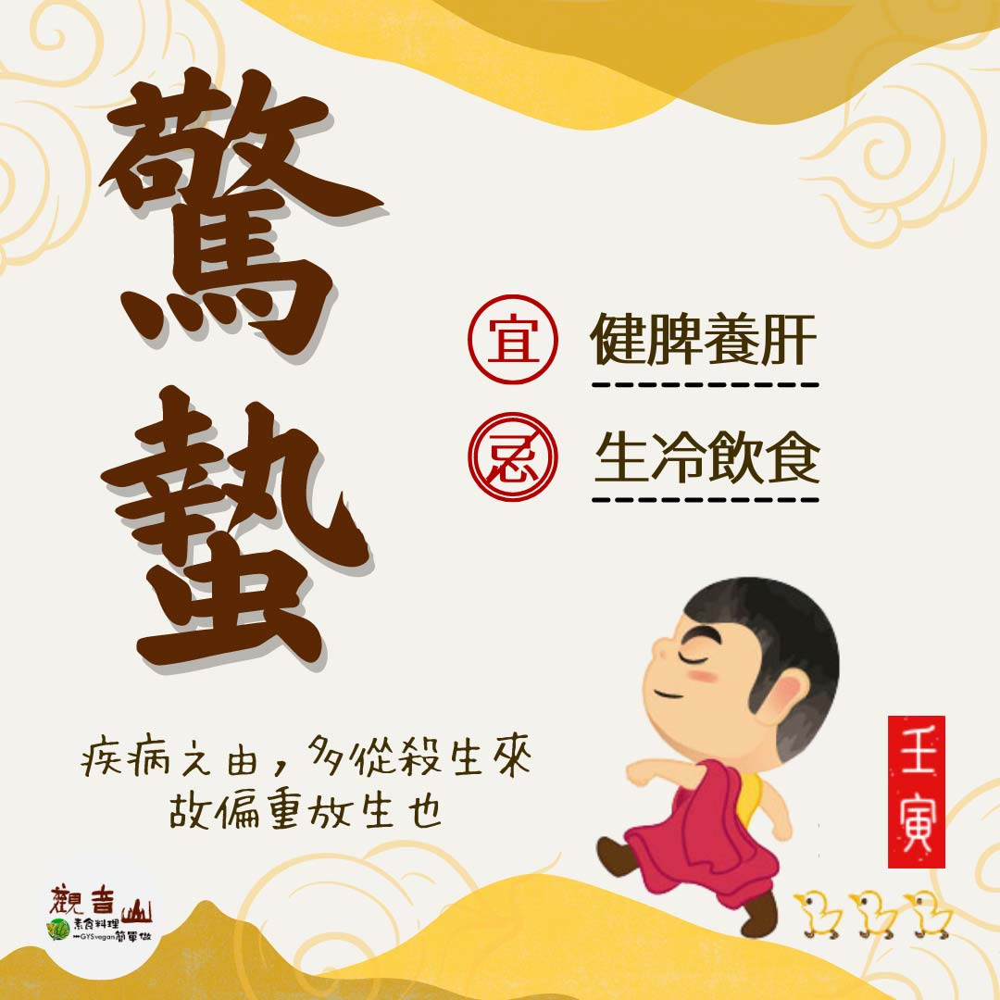

# 二十四節氣— 驚蟄

## 📋 基本資訊 / Recipe Overview
- **料理名稱**：二十四節氣— 驚蟄
- **原始標題**：二十四節氣—【驚蟄】
- **素食流派 / Diet**：全素 Vegan
- **來源平台 / Source**：[觀音山 · 素食料理簡單做](https://vegan.gys.org.tw/jingzhe20220304/)

## 📖 食譜圖文詳情 (中英雙語對照)

二十四節氣—【驚蟄】​
​
▏驚蟄春雷響，農夫閒轉忙​
春天的氣息逐漸濃厚，氣溫也日漸回暖，冬眠的昆蟲被春雷驚醒，萬物生機盎然，務農的人也進入了春耕季節。​
​
▏跟著節氣養生​
日夜早晚溫差大要注意保暖，可多吃溫熱健脾食物，如桂圓、南瓜、燕麥等， 養生要點著重在「養肝、健脾」，應多食用青花菜?、菠菜、花椰菜、山藥、香蕉?等，若要以中藥護肝，可考慮白芍、當歸、紅棗、枸杞等食材；心情保持平和以慈悲心看待萬物就是最好的養肝之法。​
​
▏跟著節氣戒殺護生​
​
驚蟄春雷初醒⚡️，打雷驚醒了蟄居動物的冬眠；有別於陸上的動物，在海底，小丑魚受到驚嚇就會躲進海葵裡，但您知道嗎? 有些小丑魚一輩子沒辦法受到海葵的保護、也一生都沒看過大海?。小丑魚和海葵具共生之行為，彼此互相保護不被天敵攝食，是維繫珊瑚礁生態系很重要的物種。​
​
臺灣的原生種小丑魚「克氏雙帶海葵魚」，因為人為及環境變化，數量不斷減少，需要復育以修復海洋生態系?，讓海洋復育發揮最大影響力！​
​
✨慈悲的龍德上師 成立「觀音山蔬食館」提倡健康素食、慈悲護生，以”觀音山素食料理簡單做”的理念，提供多款素食食譜，讓您一學就會！?​
​
​
共同拯救更多生靈?守護海洋平衡​
➠
https://bit.ly/33IiD5W​
(開放登記至3/4晚上12點前截止)​
​
【跟著節氣養生──相關食譜推薦】​
➠
https://vegan.gys.org.tw/veganblog/so…​
​
​
? 觀音山 素食料理簡單做 ?​
◎Facebook ｜好文按讚​
http://www.facebook.com/GYSVegan​
​
◎lnstagram ｜料理追蹤​
http://www.instagram.com/gysvegan/​
​
◎Youtube ｜加入訂閱​
https://reurl.cc/q8VEqy​
​
◎Telegram ｜頻道推薦​
https://t.me/GYSVegan​
​
—​
?歡迎轉載，請註明出處： 觀音山 素食料理簡單做 GYSVegan 素食環保愛地球，健康營養無負擔，慈悲護生一起來~?

---
*食譜歸檔時間：2026-08-20 · 來源：觀音山素食料理簡單做 (vegan.gys.org.tw)*