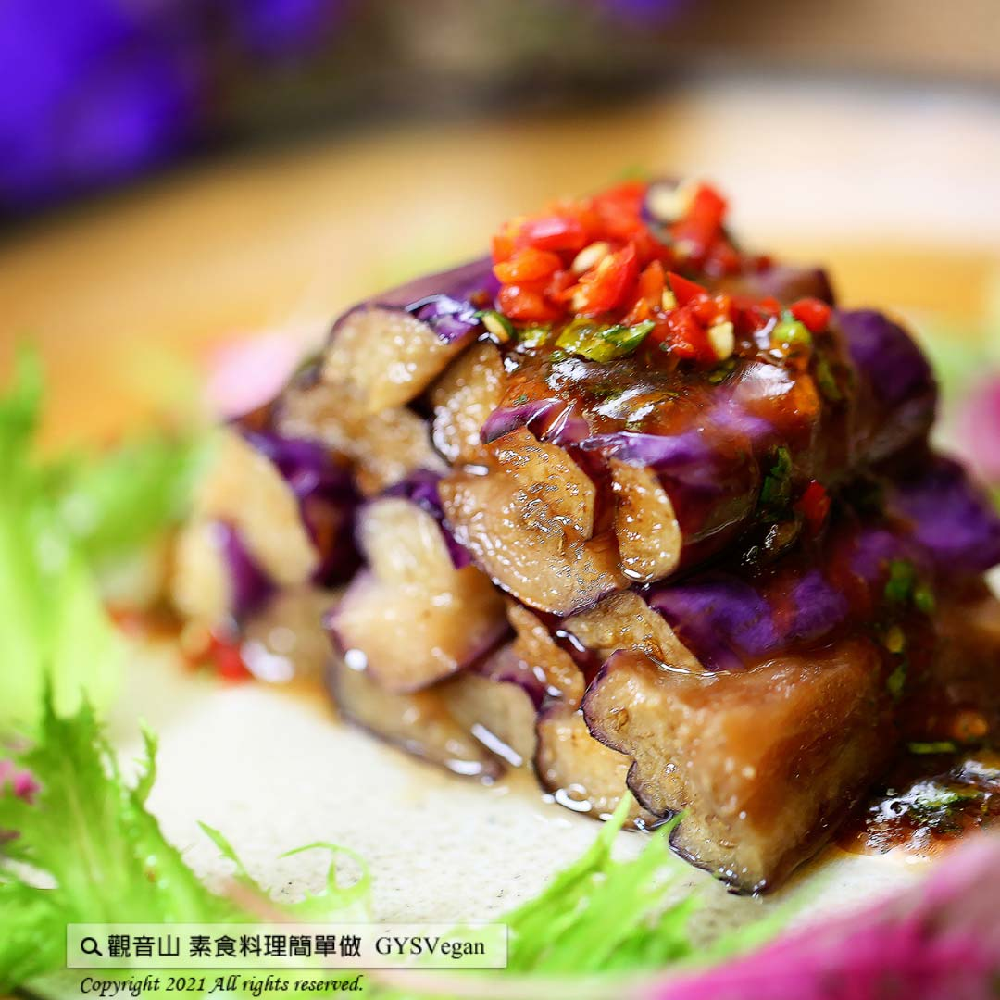

# 五味手撕茄子

## 📋 基本資訊 / Recipe Overview
- **料理名稱**：五味手撕茄子
- **原始標題**：五味手撕茄子｜全素
- **素食流派 / Diet**：全素 Vegan
- **來源平台 / Source**：[觀音山 · 素食料理簡單做](https://vegan.gys.org.tw/eggplant20210723/)

## 📖 食譜圖文詳情 (中英雙語對照)

顏色油亮的茄子，淋上酸甜開胃醬汁，一道下飯的料理即刻出爐，讓全家都愛上。茄子營養密度高、花青素抗發炎、護心、護眼一次攝取，快跟著觀音山主廚，一起素食料理簡單做吧！​
​
◎食材及佐料〔Ingredients〕：(5人份)​
▪茄子 ​ 4條​
▪薑末、香菜末 ​ 各5克​
▪白芝麻 ​ 適量​
▪番茄醬 ​ 3匙​
▪糖 ​ 1.5匙​
▪香椿醬 ​ 0.5匙​
▪素蠔油、香油、烏醋 ​ 各1匙​
​
◎烹飪步驟：​
【刀工/前處理】​
1.茄子切3公分段，炸熟放涼備用。​
​
【調理作法】​
1.五味醬:薑末、香菜、番茄醬、素蠔油、香椿醬、香油、烏醋及糖，混合拌勻備用。​
2.茄子撕成條狀，擺盤，淋上五味醬，最後灑上白芝麻，完成！​
​
​
本食譜提供：台中觀音山蔬食館 主廚 淨雅​
​
​
✨慈悲的 龍德上師成立「觀音山蔬食館」提倡健康素食、慈悲護生，以”觀音山素食料理簡單做”的理念，提供多款素食食譜，讓您一學就會！
​
​
★7月24日 「明淨月．無量光佛節日」：善惡業增長1000萬x100萬倍​
​
✨殊勝功德增長日✨​
觀音山邀請您於7月24日 響應素食、廣修供養、戒殺護生、誦經修法、行持諸種善行，獲福無量。​
​
​
【recipe】​
​
Oily eggplants dressed with sweet and sour appetizing sauces is perfect to be served over rice. This is a dish that the whole family would love. Eggplants are a high nutrient-density food especially containing anthocyanin which is effective at anti-inflammatory, heart and eye protection. Follow the chef of Guanyinshan and make vegetarian dishes together!​
​
◎ Instructions:​
【Cutting/PRE-Ahead】​
1.Cut eggplants into 3 sections, deep-fry and let cool for later use.​
​
【Cooking Steps】​
1. Five Spice sauce: mince ginger, coriander, and mix well with tomato sauce, vegetarian oyster sauce, toon sauce, sesame oil, black vinegar and sugar. Set aside.​
2. Tear eggplants into strips, place on a plate, drizzle with five-spice sauce, and sprinkle with white sesame seeds for the final touch.​
​
This recipe is provided by Chef Jing Ya, Taichung  Guanyinshan Green Restaurant
觀音山 素食料理簡單做 Follow us
Facebook ｜好文按讚
http://www.facebook.com/GYSVegan​
Instagram ｜料理追蹤
http://www.instagram.com/gysvegan/​
Youtube ​ ​ ​ ｜加入訂閱
https://reurl.cc/q8VEqy​
Telegram ​ ｜頻道推薦
https://t.me/GYSVegan​
​
​
♛歡迎轉載，請註明出處： ​ ​ 觀音山 素食料理簡單做 GYSVegan 素食環保愛地球，健康營養無負擔，慈悲護生一起來~

---
*食譜歸檔時間：2026-08-20 · 來源：觀音山素食料理簡單做 (vegan.gys.org.tw)*