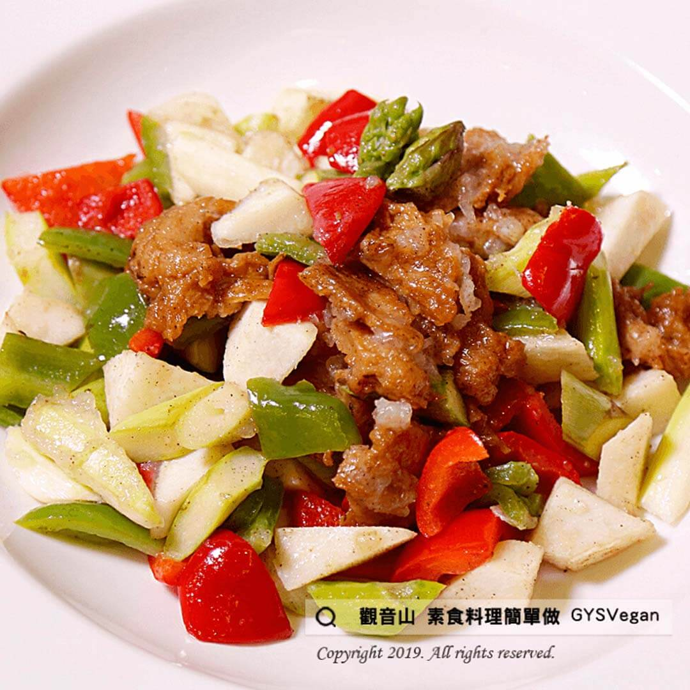

# 五彩素雞丁

## 📋 基本資訊 / Recipe Overview
- **料理名稱**：五彩素雞丁
- **原始標題**：五彩素雞丁｜全素
- **素食流派 / Diet**：全素 Vegan
- **來源平台 / Source**：[觀音山 · 素食料理簡單做](https://vegan.gys.org.tw/%e4%ba%94%e5%bd%a9%e7%b4%a0%e9%9b%9e%e4%b8%81/)

## 📖 食譜圖文詳情 (中英雙語對照)

餐桌上色香味俱全的素食料理，在色彩的搭配上絕對是不可忽視的重要環節，用青紅椒來增添視覺風味，鮮甜的蘆竹筍增加口感，和素雞丁翻炒裝盤上桌後，發現原來素雞也可以不再是一道黑白切的涼拌小菜！​
​
食材及佐料〔Ingredients〕：(4人份)​
▪素雞 200g​
▪青椒 1顆​
▪紅椒 1顆​
▪竹筍 50g​
▪蘆筍 50g​
▪胡椒粉 2g​
▪太白粉水 25g​
▪鹽 3g​
​
烹飪步驟：​
1. 青椒、紅椒、竹筍、盧筍切丁汆燙，備用​
2. 熱鍋，素雞丁、竹筍丁、窩筍丁煸炒。​
3. 加入鹽、胡椒粉、太白粉水勾芡調味。​
4. 續入青椒、紅椒翻炒拌勻，起鍋盛盤，完成!!!​
​
本食譜提供：台中 #觀音山蔬食館 主廚 樂卿​
​
慈悲的 龍德上師成立「觀音山蔬食館」提倡健康素食、慈悲護生，以”觀音山素食料理簡單做”的理念，提供多款素食食譜，讓您一學就會！?​
​
​
觀音山 素食料理簡單做 ​ Follow us
Facebook ｜好文按讚
http://www.facebook.com/GYSVegan​
Instagram ｜料理追蹤
http://www.instagram.com/gysvegan/​
Youtube ​ ​ ​ ｜加入訂閱
https://reurl.cc/q8VEqy​
Telegram ​ ｜頻道推薦
https://t.me/GYSVegan​
​
​
歡迎轉載，請註明出處： ​ ​ 觀音山 素食料理簡單做GYSVegan按讚、留言設定搶先看! 素食環保愛地球，健康營養無負擔，慈悲護生一起來~

---
*食譜歸檔時間：2026-08-20 · 來源：觀音山素食料理簡單做 (vegan.gys.org.tw)*