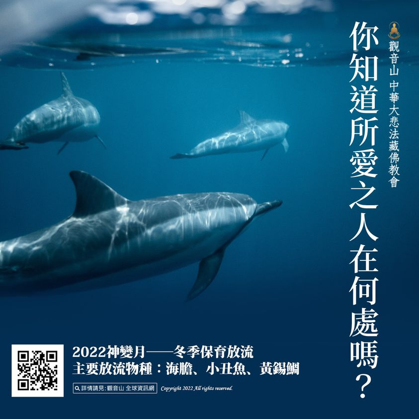

# 你知道所愛之人在何處嗎？

## 📋 基本資訊 / Recipe Overview
- **料理名稱**：你知道所愛之人在何處嗎？
- **原始標題**：【你知道所愛之人在何處嗎？】
- **素食流派 / Diet**：全素 Vegan
- **來源平台 / Source**：[觀音山 · 素食料理簡單做](https://vegan.gys.org.tw/somebody-to-love20220125/)

## 📖 食譜圖文詳情 (中英雙語對照)

十善之首是放生，十惡之首為殺生，放生的功德最大，既直接又快速，改變命運的力量最為顯著。佛陀所說諸法中，菩提心為根本，而一切有漏善法中，沒有能比放生的功德更大者。其他善業，若自心不淨，就會減損功德，但放生時，無論其心淨或不淨，都是直接對眾生有利，因此有不可思議的善果，哪怕是放一條生命的功德，也無法衡量。​
​
慈悲 龍德上師開示：「如果你有神通，你會知道這些生靈是你過去生的家親眷屬，你還會不在乎牠們的生死嗎？你會無視於牠們被任意宰殺、痛苦地死去嗎？答案當然是不忍心！非但是不忍心，還要加倍努力地救護牠們，這也就是我們今天大眾齊聚一堂的目的，救護更多的生靈！」​
​
無論你有無神通，能否親眼所見，那都不是最重要的事。最重要的是因果實有，輪迴實在，你看不見但的確真實地存在，古往今來，已經有無數具足證量的成就者證明了此事，我們需要做的就是真正地去解救這些生靈。​
​
慈悲是諸佛菩薩的體性，學佛的弟子們，所要學習的是佛菩薩的精神，以佛法對眾生廣結善緣，對於被釋放的生靈而言，放生的意義不僅止於拯救牠這一世的生命，而是在牠未來的生命裡，種下成佛的種子。況且，我們解救的還是生生世世與我們有情的親人們。​
​
✨慈悲的龍德上師 成立「觀音山蔬食館」提倡健康素食、慈悲護生，以”觀音山素食料理簡單做”的理念，提供多款素食食譜，讓您一學就會！?​
​
────────────────​
?觀音山 2022神變月──冬季保育放流​
主要放流物種：海膽、克氏雙帶海葵魚、黃錫鯛​
────────────────​
​
共同響應「保育放流」救護更多生靈：​
https://bit.ly/33IiD5W​
(開放登記至2/28晚上12點前截止)​
​
​
​
​
更多最新消息，請見「觀音山 全球資訊網」​
►
https://www.fazang.org/info/events.php​
​
▍觀音山中華大悲法藏佛教會​
►全球資訊網：
http://fazang.org/​
►吉祥洲LINE@：
https://line.me/ti/p/%40loc6698t​
​
▍觀音山素食料理簡單做​
►
https://vegan.gys.org.tw/​
​
▍龍德上師法語甘露​
►
https://video.gys.org.tw/​
​
​
? 觀音山 素食料理簡單做 ?​
◎Facebook ｜好文按讚​
http://www.facebook.com/GYSVegan​
​
◎lnstagram ｜料理追蹤​
http://www.instagram.com/gysvegan/
​
​
◎Youtube ｜加入訂閱​
https://reurl.cc/q8VEqy​
​
◎Telegram ｜頻道推薦​
https://t.me/GYSVegan​
​
—​
?歡迎轉載，請註明出處： 觀音山 素食料理簡單做 GYSVegan 素食環保愛地球，健康營養無負擔，慈悲護生一起來~?

---
*食譜歸檔時間：2026-08-20 · 來源：觀音山素食料理簡單做 (vegan.gys.org.tw)*