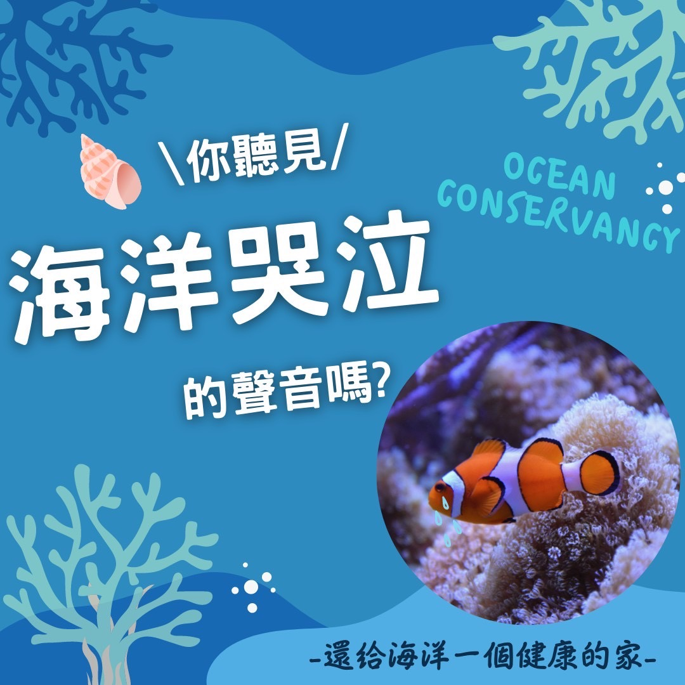

# 你聽見海洋哭泣的聲音嗎 海洋保育放流​

## 📋 基本資訊 / Recipe Overview
- **料理名稱**：你聽見海洋哭泣的聲音嗎 海洋保育放流​
- **原始標題**：你聽見海洋哭泣的聲音嗎｜海洋保育放流​
- **素食流派 / Diet**：全素 Vegan
- **來源平台 / Source**：[觀音山 · 素食料理簡單做](https://vegan.gys.org.tw/ocean-cry20220307/)

## 📖 食譜圖文詳情 (中英雙語對照)

台灣四面環海，原本擁有豐富的海洋生態，但是長期過度的捕撈、汙染等，從漁獲量銳減90%，就可以知道這些無數的海洋生命，因為人類而消失了。 ​ ​
​
天地萬物眾生皆有靈性，若不力行救贖放生，每一刻都有無數的生命被宰殺烹烤。放流可以拯救性命垂危、朝不保夕的眾多生命。 ​
​
龍德上師開示：「放生不只是單純做『放』這個動作，還須思考日後對施放處的環境、以及對當地居民造成的影響，甚至生靈在此處是否能快樂地生活。如果這些都能兼顧，才算是圓滿的放生。」​
​
我們不僅要響應吃素，更要積極的推動保育放流，還海洋一個健康的家。 ​
​
邀請十方善心人士，共同推動有智慧的「合法保育放流」，給生靈一次活命的機會！
​
✨慈悲的龍德上師 成立「觀音山蔬食館」提倡健康素食、慈悲護生，以”觀音山素食料理簡單做”的理念，提供多款素食食譜，讓您一學就會！?​
​
​
★神變月2022年3月3日~4月1日：十萬善惡業緣增盛月​
​
✨殊勝功德增長日✨​
觀音山邀請您於2022年3月3日~4月1日響應素食、廣修供養、戒殺護生、誦經修法、行持諸種善行，獲福無量。​
​
​
? 觀音山 素食料理簡單做 ?​
◎Facebook ｜好文按讚​
http://www.facebook.com/GYSVegan​
​
◎lnstagram ｜料理追蹤​
http://www.instagram.com/gysvegan/​
​
◎Youtube ｜加入訂閱​
https://reurl.cc/q8VEqy​
​
◎Telegram ｜頻道推薦​
https://t.me/GYSVegan​
​
—​
? 歡迎轉載，請註明出處： 觀音山 素食料理簡單做 GYSVegan 素食環保愛地球，健康營養無負擔，慈悲護生一起來~?

---
*食譜歸檔時間：2026-08-20 · 來源：觀音山素食料理簡單做 (vegan.gys.org.tw)*