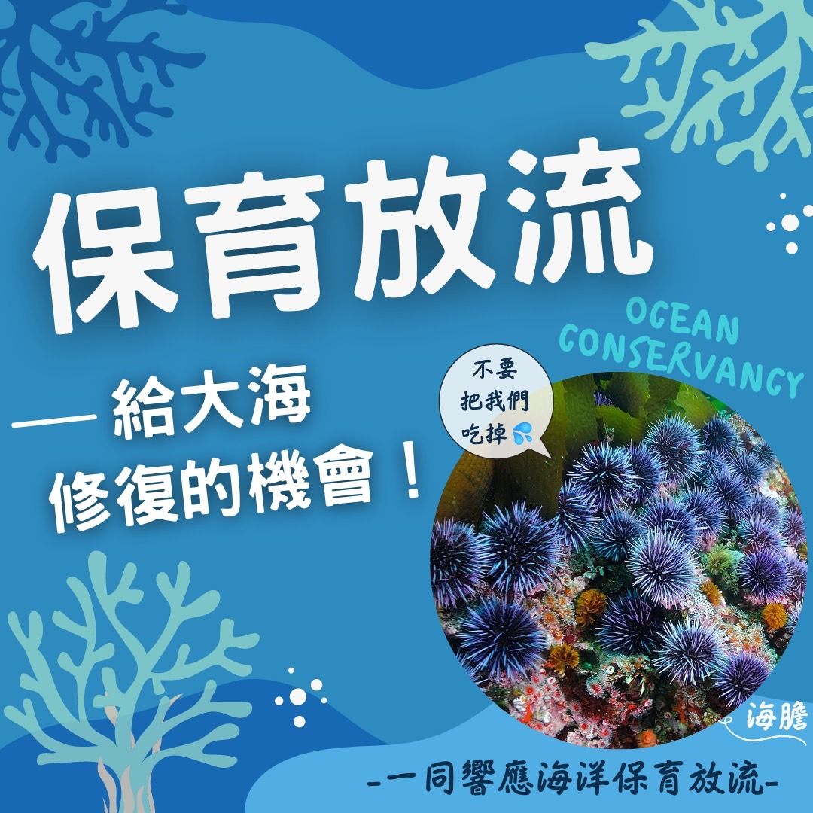

# 保育放流給大海修復的機會！ 海膽篇​

## 📋 基本資訊 / Recipe Overview
- **料理名稱**：保育放流給大海修復的機會！ 海膽篇​
- **原始標題**：保育放流給大海修復的機會！｜海膽篇​
- **素食流派 / Diet**：全素 Vegan
- **來源平台 / Source**：[觀音山 · 素食料理簡單做](https://vegan.gys.org.tw/sea-urchins20220221/)

## 📖 食譜圖文詳情 (中英雙語對照)

保育放流給大海修復的機會！｜海膽篇​
​
你吃過海膽嗎？海膽的主食是礁岩上的海藻，必須由牠們將海藻啃食乾淨，珊瑚的小寶寶才有空曠的礁岩能著苗生長。 如果海膽數量太少，藻類太多，會導致珊瑚礁消失。 然而，海膽卻被人們吃到快滅絕了…。 ​ ​
​
去年澎湖海域發現，9成的海膽都被人們吃下肚，這可怕的結果令人十分震驚‼️ 是否可以給海膽一個明天？ ​ ​
​
海洋保育放流，不只是讓生命免於被吃、被殺，而是應該擴大關注，對於生存者，我們應當為其建造一個適合生存的空間，讓牠們能幸福快樂地悠遊其中。 ​ ​
​
《楞嚴經》云：「殺彼身命，或食其肉，如是乃至經微塵劫，相食相誅猶如輪轉，互為高下無有休息。」 ​ ​
​
邀請十方善心人士，共同推動有智慧的「合法保育放流」，給生靈一次活命的機會！
​
​
✨慈悲的龍德上師 成立「觀音山蔬食館」提倡健康素食、慈悲護生，以”觀音山素食料理簡單做”的理念，提供多款素食食譜，讓您一學就會！?​
​
​
​
? 觀音山 素食料理簡單做 ?
◎Facebook ｜好文按讚​
http://www.facebook.com/GYSVegan​
​
◎lnstagram ｜料理追蹤​
http://www.instagram.com/gysvegan/​
​
◎Youtube ｜加入訂閱​
https://reurl.cc/q8VEqy​
​
◎Telegram ｜頻道推薦​
https://t.me/GYSVegan​
​
—​
?歡迎轉載，請註明出處： 觀音山 素食料理簡單做 GYSVegan 素食環保愛地球，健康營養無負擔，慈悲護生一起來~?

---
*食譜歸檔時間：2026-08-20 · 來源：觀音山素食料理簡單做 (vegan.gys.org.tw)*