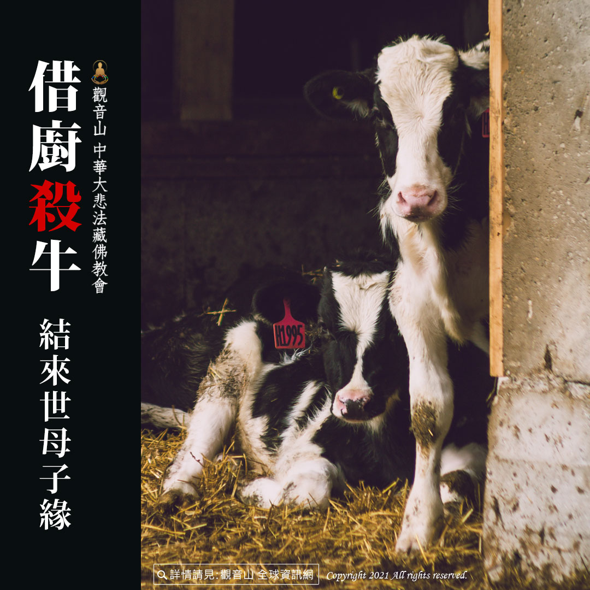

# 借廚殺牛──結來世母子緣

## 📋 基本資訊 / Recipe Overview
- **料理名稱**：借廚殺牛──結來世母子緣
- **原始標題**：借廚殺牛──結來世母子緣
- **素食流派 / Diet**：全素 Vegan
- **來源平台 / Source**：[觀音山 · 素食料理簡單做](https://vegan.gys.org.tw/cattle20210925/)

## 📖 食譜圖文詳情 (中英雙語對照)

密續典籍故事中，有一則可以來闡述因果輪迴的因緣。​
​
有一位太太，生了一個大胞胎，猶如一個肉球，剖腹生產時發現裡面竟然有三十個小孩，這是非常稀奇罕見的。三十個小孩都順利成長，身強體壯，而且同心協力，長大以後去工作、賺錢，都是三十個人一塊同行。​
​
有一天，三十個人在過橋的時候，遇到當時的王子，與其起了爭執，其中一個兄弟動手打了王子，王子回宮稟告國王，國王非常生氣，下令軍隊把三十個人統統抓起來，當天就處死這三十個人。​
​
有一些佛弟子聽到這樣情形，便開始口耳相傳，後來這件事情就這樣傳到佛陀耳中。有人請示佛陀，這三十個人一起受母胎，一同出生且健康長大，長大之後還同心協力做事，卻也因得罪了王子，一天之內就同時皆被處死，是什麼因緣讓他們發生這樣的生死之事？ ​
​
佛陀開示：「法界裡面的事，沒有一件不是有因有果的，皆有其因緣法則。這是因為過去世，這三十個人偷了人家一頭牛之後，突然大家肚子都感到飢餓，想要宰了這頭牛烹煮來吃，就牽著牛走著走著，正想著要到哪裡宰殺呢？​
​
這時候遇見一位老婦人，老婦人就說：『我有廚房，還有一把刀，就借你們用吧！』大家殺了牛後就吃了起來，老婦人在旁看著他們吃，並沒有跟著吃。​
​
後來因為因果業報，這頭牛來世投生為一位國王，這三十個人就投生為老婦人的三十個小孩，而三十個小孩一夕之間被國王殺掉，就是過去造業的關係，這就是共業的因緣。」​
​
「累劫因緣重，今來托母胎」，就因當初借把刀，就結下這樣來世母子緣，因果真的是不可不慎啊！如果現在可以開始懺悔所做的殺業，在有限的今生，開始茹素、戒殺、放生、護生，想盡辦法消自己深重的殺業，才有可能避免殺業報現前。​
​
​
? 觀音山 素食料理簡單做 ?​
Facebook ｜好文按讚
http://www.facebook.com/GYSVegan​
Instagram ｜料理追蹤
http://www.instagram.com/gysvegan/​
Youtube ｜加入訂閱
https://reurl.cc/q8VEqy​
Telegram ｜頻道推薦
https://t.me/GYSVegan​
​
​
—​
? 歡迎轉載，請註明出處： 觀音山素食料理簡單做 GYSVegan 素食環保愛地球，健康營養無負擔，慈悲護生一起來~?

---
*食譜歸檔時間：2026-08-20 · 來源：觀音山素食料理簡單做 (vegan.gys.org.tw)*