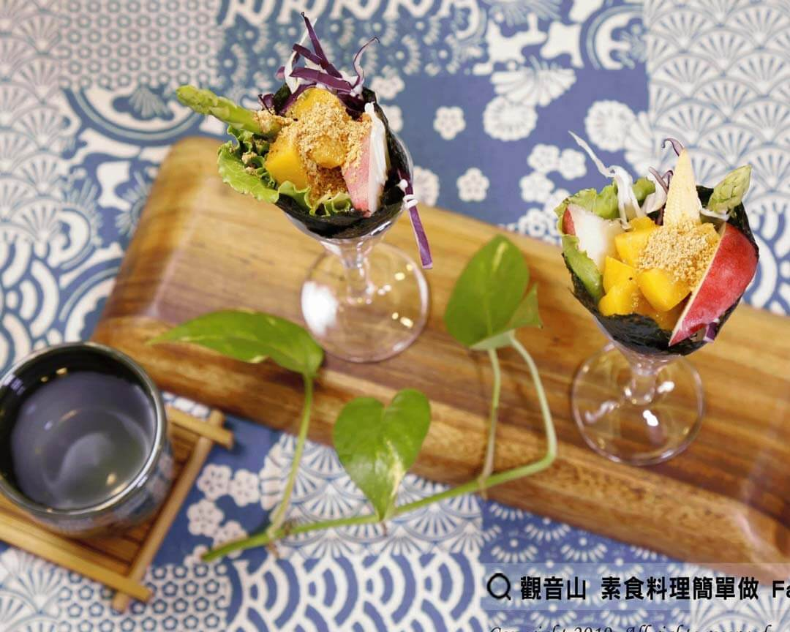

# 優格沙拉手捲

## 📋 基本資訊 / Recipe Overview
- **料理名稱**：優格沙拉手捲
- **原始標題**：優格沙拉手捲｜奶素
- **素食流派 / Diet**：奶素 Lacto-Vegetarian
- **料理分類 / Category**：輕食點心
- **來源平台 / Source**：[觀音山 · 素食料理簡單做](https://vegan.gys.org.tw/%e5%84%aa%e6%a0%bc%e6%b2%99%e6%8b%89%e6%89%8b%e6%8d%b2%ef%bd%9c%e5%a5%b6%e7%b4%a0/)

## 📖 食譜圖文詳情 (中英雙語對照)

低熱量的優格搭配鮮甜清脆的蘆筍?及香甜水果，這道優格沙拉手捲美味爽口的搭配，讓人忍不住一口接著一口！​
蘆筍有「蔬菜之王?」的美稱，含有豐富維生素、礦物質和多種營養成分，是一種很好的抗氧化食物，非常適合親子全家一起享用?‍?‍?‍?​
​
?準備食材與佐料?(5人份)​
海苔 5片、玉米筍5條、美生菜5葉、花生粉50克、蘋果1/2顆、蘆筍5支、水蜜桃罐1罐、高麗菜絲100克、優格(素)100克、美奶滋50ml​
​
?#素食料理簡單做，開始：​
1. 將優格與美奶滋混合攪拌均勻，製成沙拉醬，倒入袋子中備用。​
2. 蘆筍、玉米筍洗淨川燙，再放入冰水中冰鎮 ; 美生菜洗淨瀝乾 ; 高麗菜洗淨切絲，備用。​
3. 蘋果洗淨，切成5小片；水蜜桃罐中取出水蜜桃切成5小片，備用。​
4. 海苔對半切，製成手捲用海苔片。​
5. 海苔片依序放上美生菜、蘆筍、玉米筍、水蜜桃片、蘋果片、高麗菜絲，再淋上沙拉醬。​
6. 將所有食材包起來，捲成甜筒狀。​
7. 最後依個人喜好，撒上適量的花生粉，就完成啦~~?✨​
​
?特別說明：​
1. 美生菜也可以使用大陸妹或其他生菜來替代。​
2. 蘋果切片或是切丁皆可。​
3. 蘆筍依長度建議切成2至3段。​
4. 食譜為5人份的參考份量，可依個人口味和人數調整?​
​
?‍?本食譜提供：台中 #觀音山蔬食館 主廚 樂敏​
​
✨慈悲的 龍德上師成立「觀音山蔬食館」提倡健康素食、慈悲護生，以”觀音山素食料理簡單做”的理念，提供多款素食食譜，讓您一學就會！?​
​
​
?觀音山 素食料理簡單做 ​ Follow us?​
Facebook ｜好文按讚
http://www.facebook.com/GYSVegan​
Instagram ｜料理追蹤
http://www.instagram.com/gysvegan/​
Youtube ​ ​ ​ ｜加入訂閱
https://reurl.cc/q8VEqy​
Telegram ​ ｜頻道推薦
https://t.me/GYSVegan​
​
​
? 歡迎轉載，請註明出處： ​ ​ 觀音山 素食料理簡單做GYSVegan按讚、留言設定搶先看! 素食環保愛地球，健康營養無負擔，慈悲護生一起來~?​

---
*食譜歸檔時間：2026-08-20 · 來源：觀音山素食料理簡單做 (vegan.gys.org.tw)*