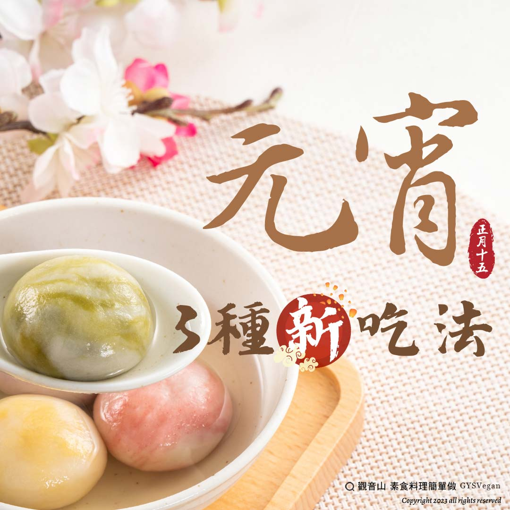

# 元宵 3種新吃法

## 📋 基本資訊 / Recipe Overview
- **料理名稱**：元宵 3種新吃法
- **原始標題**：元宵｜3種新吃法｜全素
- **素食流派 / Diet**：全素 Vegan
- **來源平台 / Source**：[觀音山 · 素食料理簡單做](https://vegan.gys.org.tw/lantern-festival20230203/)

## 📖 食譜圖文詳情 (中英雙語對照)

元宵 3種新吃法
農曆年後的第一個月圓日，就是元宵節，象徵著閤家團圓，對未來有著一切圓滿的期許，除了賞花燈、猜燈謎之外，最應景的就是吃元宵啦，『觀音山素食料理簡單做』特別推出三種元宵創意吃法，動手做出精巧造型的「黃金酥皮元宵」、美式咖啡+湯圓撞出絕配新吃法「咖啡元宵」以及簡易方便好上手的「熱壓吐司元宵」，想讓親友們嚐到令人驚喜的元宵吃法嗎？趕快跟著觀音山主廚動手做！
​
❶✼黃金酥皮元宵✼全素
❒食材及佐料〔Ingredients〕：(5人份)
▪️冷凍包餡湯圓 5顆
▪️冷凍全素酥皮 ​ 3-5片
▪️防潮糖粉 ​ 適量
​
❒烹飪步驟：
【刀工/前處理】
冷凍包餡湯圓，不需要解凍 。
​
【調理作法】
1.冷凍酥皮取出放室溫約5分鐘，稍微軟化，方便塑型，將1大片切為4小片。
2.取一小片酥皮，放上湯圓 ，用酥皮完全包覆。
3.酥皮湯圓擺上烤盤，間隔擺放，預留膨脹的空間
4.烤箱180度預熱，將烤盤放入，烤10分鐘上色。
5.將酥皮湯圓擺盤，撒上糖粉即可享用。
​
【特別說明】
可以依自己的喜好變化酥皮包法形狀，及湯圓口味。
—
​
❷✼熱壓吐司元宵✼全素
❒食材及佐料〔Ingredients〕：(5人份)
▪️冷凍芝麻湯圓 ​ 10顆
▪️吐司 ​ 10片
▪️花生醬 ​ 適量
​
❒烹飪步驟：
【調理作法】
1.準備一鍋水，煮滾後將湯圓放入煮熟，撈起來瀝乾備用。
2.取2片吐司抹上花生醬，備用。
3.將抹好花生醬的吐司，依序組合:吐司→湯圓→吐司。
4.熱壓吐司機預熱後，依作法3.熱壓3-5分鐘。
5.熱壓完成後，取出吐司切對半即可享用。
​
【特別說明】
可依喜好調整湯圓、抹醬口味。
—
​
❸✼咖啡元宵✼全素
❒食材及佐料〔Ingredients〕：(3人份)
▪️冷凍甜湯圓 9顆
▪️美式咖啡 450cc
​
❒烹飪步驟：
1.準備一鍋水，煮滾後將湯圓放入煮熟，撈起來瀝乾備用。
2.將煮好的湯圓，放入碗中將咖啡倒入，即完成。
​
【特別說明】
1.湯汁、甜度可依喜好變化，可自行調整。(加入牛奶、豆漿、燕麥奶皆可)
​
本食譜提供：台中 觀音山蔬食館
​
​
​
✼慈悲的龍德上師 成立「觀音山蔬食館」提倡健康素食、慈悲護生，以”觀音山素食料理簡單做”的理念，提供多款素食食譜，讓您一學就會！
​
觀音山相關連結
➠
https://www.fazang.org/link/
​
​
​
▌觀音山近期活動 ▌
2月4日 三寶總集薈供法會
①登記「除障祿位」、「超薦蓮位」
►
https://bit.ly/3HXmCO7
②護持「薈供供品」供養三寶·愛心公益
►
https://bit.ly/3zrdxYm
​
​
—
歡迎轉載，請註明出處： 觀音山素食料理簡單做 GYSVegan 素食環保愛地球，健康營養無負擔，慈悲護生一起來~

---
*食譜歸檔時間：2026-08-20 · 來源：觀音山素食料理簡單做 (vegan.gys.org.tw)*