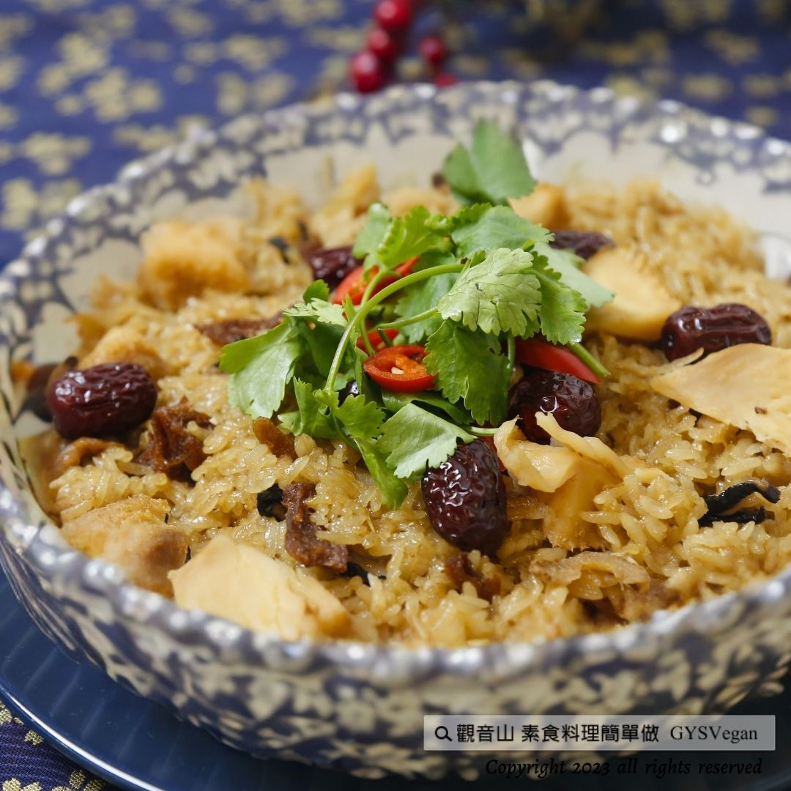

# 八寶麻油薑飯 (Eight Treasures Sesame Oil and Ginger Rice)

## 📋 基本資訊 / Recipe Overview
- **料理名稱 (繁體)**：八寶麻油薑飯
- **料理名称 (简体)**：八宝麻油姜饭
- **English Title**：Eight Treasures Sesame Oil and Ginger Rice
- **素食流派 / Diet**：全素 Vegan
- **料理分類 / Category**：米食料理 / 主食 (Rice & Staple Food)
- **份量 / Servings**：3 人份 (3 Servings)
- **準備時間 / Prep Time**：10 分鐘 (10 mins)
- **烹飪時間 / Cook Time**：10 分鐘 (10 mins)
- **總計耗時 / Total Time**：20 分鐘 (20 mins)
- **來源平台 / Source**：[觀音山 · 素食料理簡單做](https://vegan.gys.org.tw/babao-sesame-oil-and-ginger-rice20231013/)
- **食譜提供**：台中 觀音山蔬食館

---

## 🍲 食譜介紹 / Introduction

秋冬暖身的麻油薑料理—八寶麻油薑飯，八寶豆扎實的口感充滿豆香，有豐富的膳食纖維；生薑的辛辣成分可以提升體溫，加速血液循環，可改善秋冬初期易感冒的症狀；麻油更是秋冬季節交替時，暖心又暖胃不可或缺的好油之一，快跟著觀音山主廚，一起素食料理簡單做吧！

---

## 🌿 食材及佐料清單 / Ingredients

| 食材 / 調料名稱 | 規格 / 份量 | 備註說明 |
| :--- | :--- | :--- |
| **熱白飯** | 3 碗 (約 450~500g) | 剛煮好熱騰騰的白米飯最佳 |
| **市售熟八寶豆** | 1 包 (約 150~200g) | 內含雪蓮子/鷹嘴豆、花豆、紅豆、黑豆等綜合熟豆 |
| **老薑末** | 30 克 | 洗淨切碎成細末 |
| **黑芝麻油** | 30 克 (約 2 大匙) | 純黑芝麻油，香氣醇厚 |

---

## 🔪 刀工與前處理 / Prep-Ahead & Cutting

1. **生薑前處理**：取新鮮老薑約 30g，洗淨後（可保留薑皮以增添香氣與溫補效果），使用菜刀細細切成均勻的細薑末備用。
2. **八寶豆加熱**：將市售熟八寶豆拆袋，倒入乾淨耐熱容器中，放入電鍋或蒸鍋加熱蒸透，去除冷藏豆腥氣並激發豆香。
3. **白飯準備**：準備剛起鍋的熱白飯 3 碗，保持溫熱以利均勻拌入麻油香氣。

---

## 🍳 烹飪步驟 / Step-by-Step Cooking Instructions

1. **蒸熱八寶豆**：將熟八寶豆倒在耐熱容器中，放入電鍋或蒸鍋中加熱保溫備用。
2. **小火煸香麻油薑**：冷鍋倒入黑芝麻油 30g，開小火加熱，隨即加入切好的薑末 30g，以小火耐心慢煸，直至煸出濃郁的薑香與芝麻油香氣（薑末邊緣微捲金黃即可關火，切勿大火過焦）。
3. **拌勻盛盤**：取一個較大的乾淨拌飯容器，依序倒入熱白飯 3 碗、蒸熱的八寶豆 1 包、以及剛煸好的麻油薑末與芝麻油。
4. **輕拌融合**：用飯勺由下往上輕柔翻拌均勻，使每一粒白米都均勻裹附上黑麻油的油亮金澤與薑香，即可盛入碗中熱騰騰享用！

---

## 💡 大廚美味秘訣 / Chef's Tips & Secrets

1. **小火慢煸防焦苦**：黑芝麻油的發煙點較低，在高溫下易變苦並破壞營養成分。煸炒薑末時務必使用小火慢煸，將薑的辛香緩緩融入油中，達到溫而不燥的效果。
2. **趁熱拌飯最入味**：拌飯時米飯與八寶豆必須保持熱度，高溫能瞬間吸附麻油與薑末的精華香氣，讓米粒既軟Q又粒粒分明、油亮誘人。
3. **豐富變化與調味**：市售八寶豆若為原味，可依個人口味在拌飯時酌量撒入少許海鹽、白胡椒粉或白芝麻增香；亦可添加少許熟毛豆仁、枸杞或香菇丁點綴，視覺與營養更加分。
4. **秋冬養生功效**：生薑含薑辣素能活血驅寒、提升體溫；八寶豆富含植物性蛋白質與多種膳食纖維；黑芝麻油富含不飽和脂肪酸與維生素E，是秋冬進補、元氣滿滿的經典全素溫養主食。

---

## 🌍 English Version (Recipe & Instructions)

### Eight Treasures Sesame Oil and Ginger Rice (Vegan)

A heartwarming and nourishing staple dish perfect for autumn and winter—**Eight Treasures Sesame Oil and Ginger Rice**. The solid and tender texture of the eight-treasure mixed beans is rich in bean aroma and dietary fiber. The gingerol in fresh ginger helps raise body temperature, accelerate blood circulation, and prevent seasonal colds. Pure black sesame oil is an indispensable healthy oil during seasonal transitions to warm the heart and stomach. Follow the chef of Guanyinshan and make delicious vegan food with ease!

#### 📋 Ingredients (For 3 Servings)
- **Steamed Hot White Rice**: 3 bowls (approx. 450–500g)
- **Cooked Eight Treasures Mixed Beans** (commercially prepared): 1 pack (approx. 150–200g)
- **Minced Ginger**: 30g
- **Pure Black Sesame Oil**: 30g (approx. 2 tablespoons)

#### 🔪 Prep-Ahead & Cutting
1. Wash fresh old ginger and mince finely into 30g of minced ginger.
2. Unpack the cooked eight-treasure beans, place them in a heatproof bowl, and steam thoroughly in an electric steamer.
3. Keep 3 bowls of cooked white rice warm and ready.

#### 🍳 Cooking Steps
1. Place the eight-treasure beans in a container and heat in an electric steamer/cooker until thoroughly warm.
2. Heat a pan over low heat, pour in the black sesame oil and minced ginger. Sauté slowly over low heat until the fragrant ginger aroma and sesame oil aroma are fully released (do not burn).
3. Take a large clean mixing bowl, add the hot white rice, warmed eight-treasure beans, and the freshly sautéed sesame oil with ginger.
4. Gently toss and fold with a rice spatula until every grain of rice is evenly coated with the fragrant sesame oil and ginger. Serve warm and enjoy!

#### 💡 Chef's Tips
1. **Low Heat Sautéing**: Black sesame oil has a lower smoke point. Always use gentle low heat to sauté the minced ginger slowly to avoid bitterness and preserve delicate nutrients.
2. **Toss While Hot**: Mix the ingredients while the rice and beans are steaming hot; the heat allows the grains to absorb the aromatic sesame oil deeply.
3. **Nutritional Benefits**: Ginger promotes blood circulation and warms the body; eight-treasure beans provide plant protein and dietary fiber; pure black sesame oil provides wholesome warmth, making this an ideal revitalizing vegan meal for cooler months.

---

本食譜提供：台中 觀音山蔬食館  
✨ 慈悲的 龍德上師 成立「觀音山蔬食館」提倡健康素食、慈悲護生，以「觀音山素食料理簡單做」的理念，提供多款素食食譜，讓您一學就會！  

📣 觀音山相關連結：[https://www.fazang.org/link/](https://www.fazang.org/link/)  
歡迎轉載，請註明出處：觀音山素食料理簡單做 GYSVegan 素食環保愛地球，健康營養無負擔，慈悲護生一起來~

---
*食譜歸檔時間：2026-08-20 · 來源：觀音山素食料理簡單做 (vegan.gys.org.tw)*
