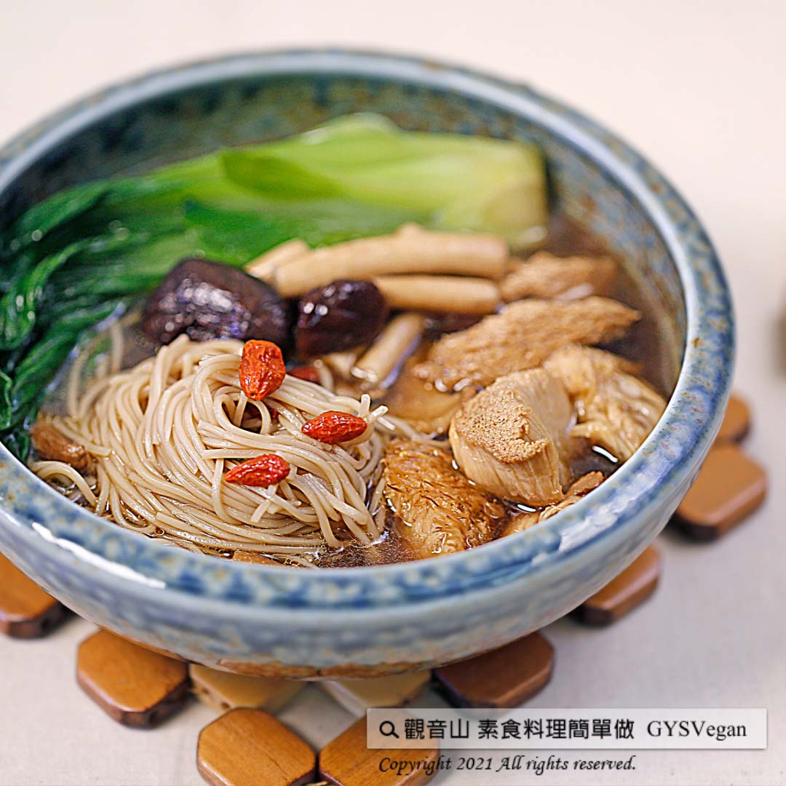

# 八珍猴頭菇麵線

## 📋 基本資訊 / Recipe Overview
- **料理名稱**：八珍猴頭菇麵線
- **原始標題**：八珍猴頭菇麵線 ｜全素
- **素食流派 / Diet**：全素 Vegan
- **料理分類 / Category**：主食種類
- **來源平台 / Source**：[觀音山 · 素食料理簡單做](https://vegan.gys.org.tw/123-2/)

## 📖 食譜圖文詳情 (中英雙語對照)

麵線從古至今約有兩千多年的歷史，台灣早期農業社會，是婦女煮給農耕者的點心～麵線羹，演變至今已成為台灣極具特色的小吃。​
觀音山主廚利用食材變化，料理出色香味俱全，養身又美味的八珍猴頭菇麵線料理，讓您一學就上手！​快跟著觀音山蔬食館主廚，一起素食料理簡單做吧!​
​
食材及佐料〔Ingredients〕：(3人份)​
▪麻油猴頭菇料理包 1包​
▪青江菜 3株​
▪柳松菇 100克​
▪枸杞 適量​
▪麵線 1束​
▪八珍藥包 1包​
​
烹飪步驟：​
1.將青江菜剖半，青江菜和麵線先燙半熟。​
2.八珍藥包加入適量的水，中小火煮20分鐘。​
3.猴頭菇料理包，加入燉好的八珍湯，加入柳松菇煮熟，適量鹽調味即可。​
4.將麵線燙熟後，加入完成的湯。​
5.最後，擺上燙熟的青江菜及適量枸杞，完成！​
​
本食譜提供：台中 #觀音山蔬食館 主廚 樂卿​
​
慈悲的 龍德上師成立「觀音山蔬食館」提倡健康素食、慈悲護生，以”觀音山素食料理簡單做”的理念，提供多款素食食譜，讓您一學就會
​
​
觀音山 素食料理簡單做 ​ Follow us
Facebook ｜好文按讚
http://www.facebook.com/GYSVegan​
Instagram ｜料理追蹤
http://www.instagram.com/gysvegan/​
Youtube ​ ​ ​ ｜加入訂閱
https://reurl.cc/q8VEqy​
Telegram ​ ｜頻道推薦
https://t.me/GYSVegan​
​
​
歡迎轉載，請註明出處： ​ ​ 觀音山 素食料理簡單做GYSVegan按讚、留言設定搶先看! 素食環保愛地球，健康營養無負擔，慈悲護生一起來~

---
*食譜歸檔時間：2026-08-20 · 來源：觀音山素食料理簡單做 (vegan.gys.org.tw)*